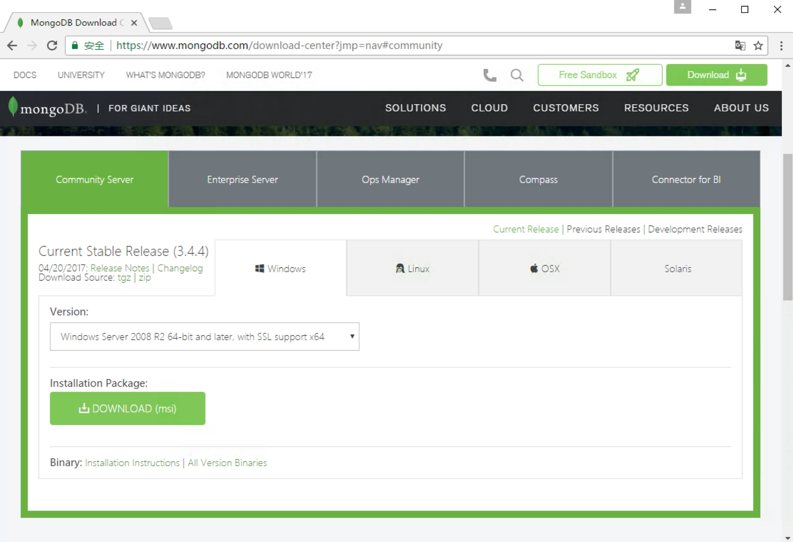
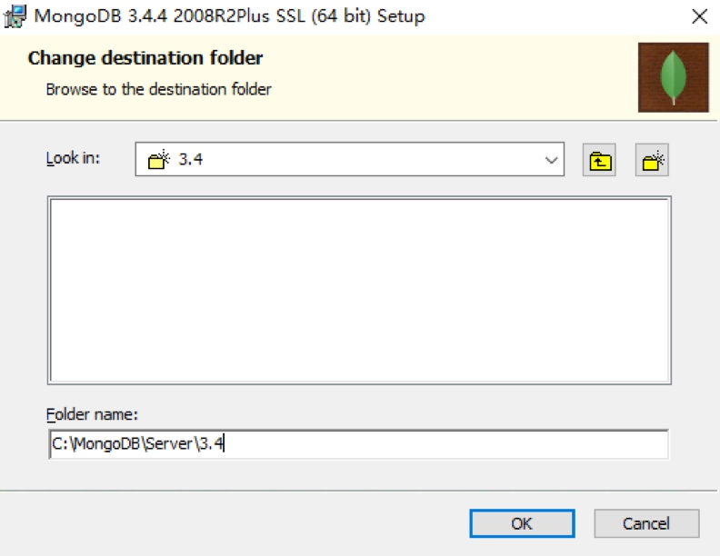
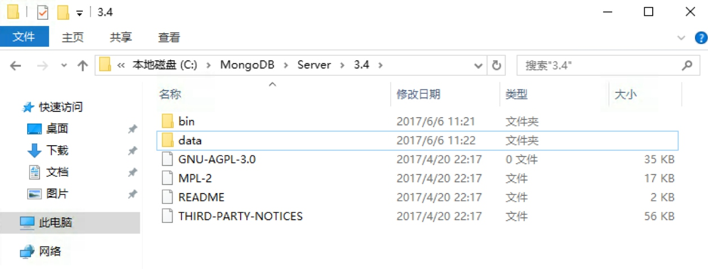
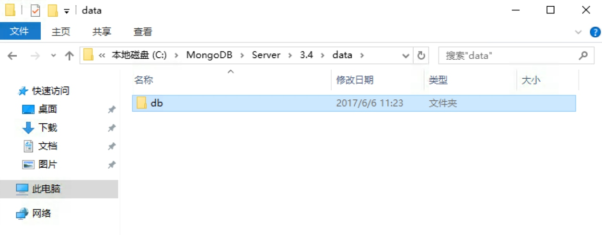
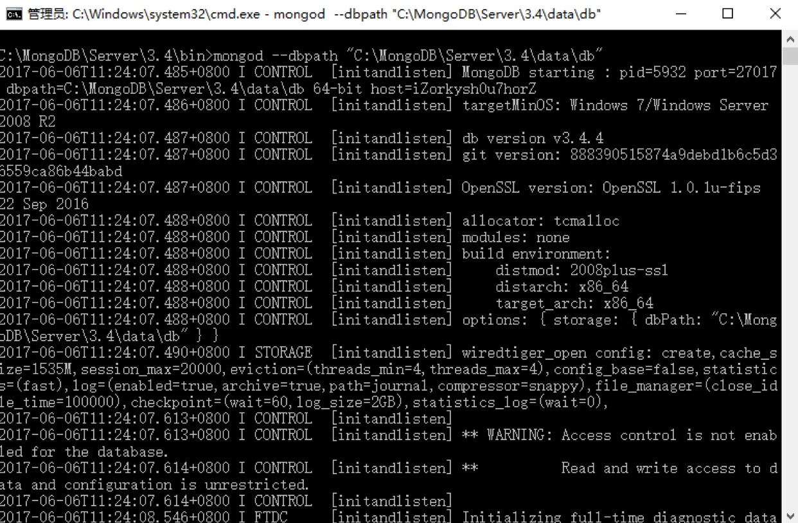
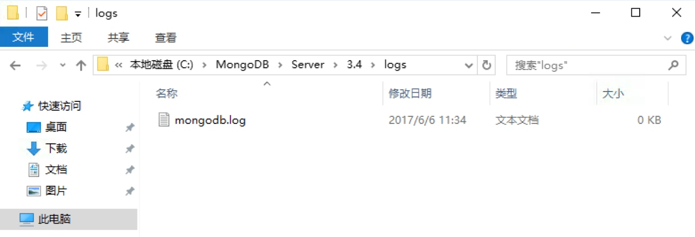
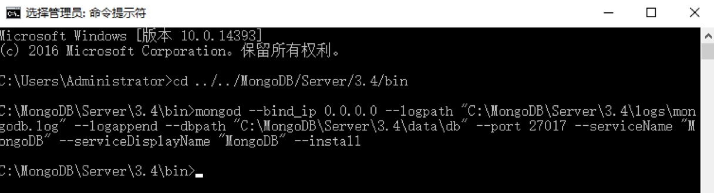
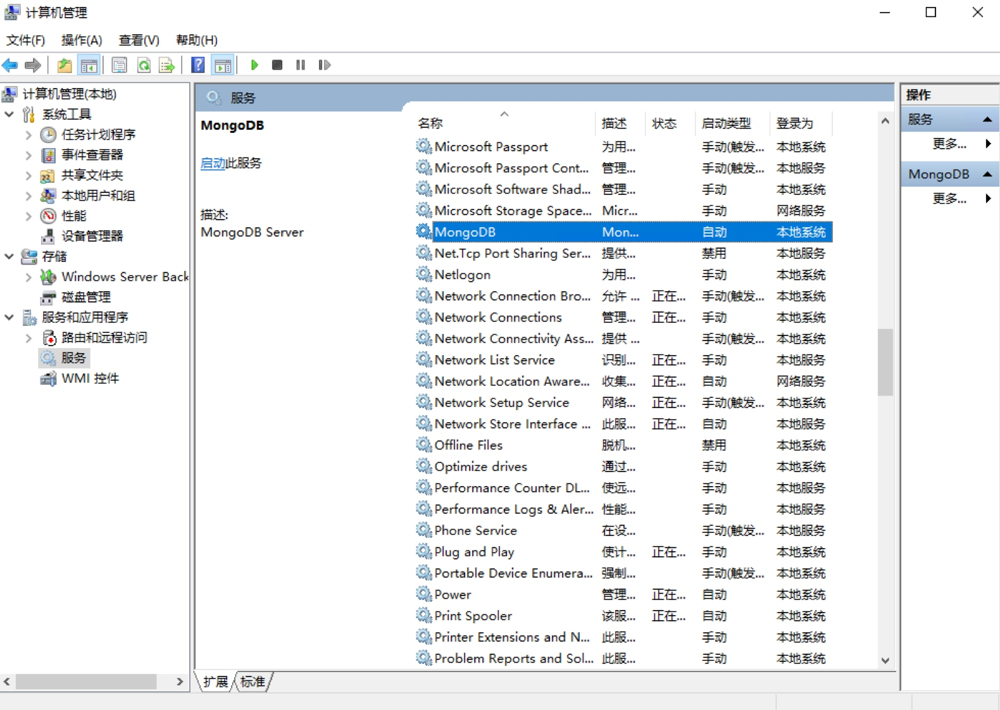
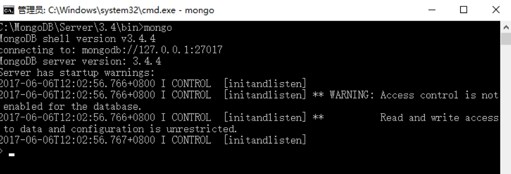

## MongoDB

### 相关&安装

#### PyMongo安装

##### 相关链接

- GitHub：https://github.com/mongodb/mongo-python-driver
- 官方文档：https://api.mongodb.com/python/current/
- PyPi：https://pypi.python.org/pypi/pymongo

##### 安装

```
pip install pymongo
```

##### 验证安装

```
python3
>>> import pymongo>>> pymongo.version'3.7.0'
```

如果输出类似上面的内容，就代表pymongo安装成功

#### MongoDB的安装

MongoDB 是由 C++ 语言编写的非关系型数据库，是一个基于分布式文件存储的开源数据库系统，其内容存储形式类似 Json 对象，它的字段值可以包含其他文档，数组及文档数组，非常灵活。

MongoDB 支持多种平台，包括 Windows、Linux、Mac OS、Solaris 等，在其官方网站均可找到对应的安装包，https://www.mongodb.com/download-center

本节来看下它的安装过程。

##### **相关链接**

- 官方网站：[https://www.mongodb.com](https://www.mongodb.com/)
- 官方文档：[https://docs.mongodb.com](https://docs.mongodb.com/)
- GitHub：https://github.com/mongodb
- 中文教程：http://www.runoob.com/mongodb/mongodb-tutorial.html

##### **Windows下的安装**

目前最新版本的MongoDB，不用这么麻烦的配置服务和日志了

直接在官网下载安装包即可，链接为：https://www.mongodb.com/download-center#community



直接点击 Download 下载 msi 安装包即可。

下载完成之后双击开始安装，指定 MongoDB 的安装路径，例如在此处我指定安装路径为 C:\MongoDB\Server\3.4，当然路径可以自行选择



点击下一步执行安装即可。

安装成功之后，进入 MongoDB 的安装目录，在此处所在路径是 C:\MongoDB\Server\3.4，在 bin 目录下新建同级目录 data



然后进入 data 文件夹新建子文件夹 db，作为数据目录存储的文件夹



之后打开命令行，进入 MongoDB 安装目录的 bin 目录下，运行 MongoDB 服务：

```
mongod --dbpath "C:\MongoDB\Server\3.4\data\db"
```

此处的路径替换成你的主机 MongoDB 安装路径。



如果想一直使用 MongoDB 就不能关闭此命令行，如果意外关闭或重启 MongoDB 服务就不能使用了，这显然不是想要的，所以接下来还需将 MongoDB 配置成系统服务。

首先要以管理员模式运行命令行，注意此处一定要是管理员模式运行，否则可能配置失败：


开始菜单搜索 cmd，找到命令行，然后右键以管理员身份运行即可。

随后新建一个日志文件，在 bin 目录同级目录新建 logs 文件夹，进入之后新建一个 mongodb.log 文件，用于保存 MongoDB 运行的日志。



在命令行下输入如下内容：

```
mongod --bind_ip 0.0.0.0 --logpath "C:\MongoDB\Server\3.4\logs\mongodb.log" --logappend --dbpath "C:\MongoDB\Server\3.4\data\db" --port 27017 --serviceName "MongoDB" --serviceDisplayName "MongoDB" --install
```

这里的意思是绑定 IP 为 0.0.0.0，即任意 IP 均可访问，指定日志路径、数据库路径、端口，指定服务名称，注意这里依然需要把路径替换成你的 MongoDB 安装路径，运行此命令后即可安装服务。



如果没有出现错误提示，则证明 MongoDB 服务已经安装成功。



可以设置它的开机启动方式，如自动启动或手动启动等。这样就可以非常方便地管理 MongoDB 服务了。

启动服务之后在命令行下就可以利用 mongo 命令进入 MongoDB 命令交互环境。



这样 Windows 下 MongoDB 配置就完成了。

##### **Linux下的安装**

在这里以 MongoDB 3.4 为例说明 MongoDB 的安装过程。

###### **Ubuntu**

首先导入 MongoDB 的 GPG Key：

```
sudo apt-key adv --keyserver hkp://keyserver.ubuntu.com:80 --recv 0C49F3730359A14518585931BC711F9BA15703C6
```

随后创建 apt-get 源列表，各个系统版本对应的命令如下：

- Ubuntu 12.04

```
echo "deb [ arch=amd64 ] http://repo.mongodb.org/apt/ubuntu precise/mongodb-org/3.4 multiverse" | sudo tee /etc/apt/sources.list.d/mongodb-org-3.4.list
```

- Ubuntu 14.04

```
echo "deb [ arch=amd64 ] http://repo.mongodb.org/apt/ubuntu trusty/mongodb-org/3.4 multiverse" | sudo tee /etc/apt/sources.list.d/mongodb-org-3.4.list
```

- Ubuntu 16.04

```
echo "deb [ arch=amd64,arm64 ] http://repo.mongodb.org/apt/ubuntu xenial/mongodb-org/3.4 multiverse" | sudo tee /etc/apt/sources.list.d/mongodb-org-3.4.list
```

随后更新 apt-get 源：

```
sudo apt-get update
```

之后安装 MongoDB 即可：

```
sudo apt-get install -y mongodb-org
```

安装完成之后运行 MongoDB，命令如下：

```
mongod --port 27017 --dbpath /data/db
```

运行命令之后 MongoDB 就在 27017 端口上运行了，数据文件会保存在 /data/db 路径下。

一般在 Linux 上配置 MongoDB 都是为了远程连接使用的，所以在这里还需要配置一下 MongoDB 的远程连接和用户名密码：

接着进入到 MongoDB 命令行：

```
mongo --port 27017
```

现在就已经进入到 MongoDB 的命令行交互模式下了，在此模式下运行如下命令：

```
>use admin
switched to db admin

>db.createUser({user: 'admin', pwd: 'admin123', roles: [{role: 'root', db: 'admin'}]})
Successfully added user: {
        "user" : "admin",
        "roles" : [
                {
                        "role" : "root",
                        "db" : "admin"
                }
        ]
}
```

这样就创建了一个用户名为 admin，密码为 admin123 的用户，赋予最高权限。

随后需要修改 MongoDB 的配置文件，

执行如下命令：

```
sudo vi /etc/mongod.conf
```

修改 net 部分为：

```
net:
  port: 27017
  bindIp: 0.0.0.0
```

这样配置后 MongoDB 可被远程访问。

另外还需要添加如下权限认证配置，直接添加如下内容到配置文件：

```
security:
 authorization: enabled
```

配置完成之后需要重新启动 MongoDB 服务，命令如下：

```
sudo service mongod restart
```

这样远程连接和权限认证就配置完成了。

###### **CentOS、RedHat**

首先添加 MongoDB 源：

```
sudo vi /etc/yum.repos.d/mongodb-org.repo
```

修改为如下内容保存：

```
[mongodb-org-3.4]
name=MongoDB Repository
baseurl=https://repo.mongodb.org/yum/redhat/$releasever/mongodb-org/3.4/x86_64/
gpgcheck=1
enabled=1
gpgkey=https://www.mongodb.org/static/pgp/server-3.4.asc
```

然后执行 yum 命令安装：

```
sudo yum install mongodb-org
```

启动 MongoDB 服务：

```
sudo systemctl start mongod
```

停止和重新加载 MongoDB 服务：

```
sudo systemctl stop mongod
sudo systemctl reload mongod
```

有关远程连接和认证配置可以参考上文，方式是相同的。

更多 Linux 发行版的 MongoDB 安装方式可以参考官方文档：https://docs.mongodb.com/manual/adminiation/install-on-linux/。

##### **Mac下的安装**

推荐使用 Homebrew 安装，执行 brew 命令即可：

```
brew install mongodb
```

然后创建一个新文件夹 /data/db，用于存放 MongoDB 数据。

启动 MongoDB 服务：

```
brew services start mongodb
sudo mongod
```

这样就启动了 MongoDB 服务。

停止、重启 MongoDB 服务的命令：

```
brew services stop mongodb
brew services restart mongodb
```

##### **使用docker安装**

1. 查找docker中的mongo

```
sudo docker search mongo
```

2. 拉取镜像

```
sudo docker pull mongo:3.6
```

3. 查看是否已经下载下来

```
sudo docker images
```

4. 运行mongo镜像

```
sudo docker run -p 27917:27017 -e $PWD/db:/data/db -d mongo:3.6
```

5. 查看容器启动情况

```
sudo docker ps
```

##### **可视化工具**

RoboMongo/Robo 3T，官方网站：https://robomongo.org/，下载链接：https://robomongo.org/download。

Studio 3T，官方网站：[https://studio3t.com](https://studio3t.com/)，下载链接：https://studio3t.com/download/。

### 连接数据库

通过pymongo库中的MongoClient，连接MongoDB数据库，有两种连接方式:

第一种:

```
import pymongo
client = pymongo.MongoClient(host='localhost',port=27017)
```

第二种:

```
import pymongo
client = pymongo.MongoClient('mongodb://localhost:27017')
```

### 指定数据库

```
# 在MongoDB中不需要去创建数据库，指定数据库名称，调用会自定生成相应的数据库
db = client.test
# 等价于
# db = client["test"]
```

### 指定集合

MongoDB 的每个数据库包含了许多集合 Collection，类似与关系型数据库中的表

指定集合和指定数据库的操作是一样的


```
collection = db.students
# collection = db["students"]
```

### 插入数据

```
student = {
    "name":"angle",
    "age":20,
}
# 通过调用集合的insert()方法插入数据
result = collection.insert(student)
print(result)
```

insert() 方法会在执行后返回的 _id 值，_id值是每一条数据的唯一标识，如果没有显示指明_id，MongoDB会自动产生一个ObjectId类型的_id属性

运行结果:


```
5b684a54bd880b468471dccf
```

如果有多个值，可以以列表形式写入


```
import pymongo
client = pymongo.MongoClient(host='localhost',port=27017)# 在MongoDB中不需要去创建数据库，指定数据库名称，调用会自定生成相应的数据库db = client.test# db = client["test"]
collection = db.students# collection = db["students"]
student1 = {    "name":"angle",    "age":20,}
student2 = {    "name":"angle",    "age":20,}result = collection.insert([student1,student2])print(result)
```

运行结果:


```
[ObjectId('5b684e83bd880b4408713464'), ObjectId('5b684e83bd880b4408713465')]
```

注意在python3中，insert()方法已经不再被推荐使用，现在官方推荐使用insert_one()和insert_many()方法

- insert_one():插入一条数据
- insert_many():插入多条数据


```
# 插入单挑数据
result = collection.insert_one(student)
print(result)
```

运行结果:


```
<pymongo.results.InsertOneResult object at 0x000002744113BF48>
```

返回结果和 insert() 方法不同，返回的是InsertOneResult 对象，可以调用其 inserted_id 属性获取 _id


```
# 插入多条数据
result = collection.insert_many([student1,student2])
print(result)
# 通过调用inserted_ids属性获取插入数据的_id的列表
print(result.inserted_ids)
```

运行结果:


```
<pymongo.results.InsertManyResult object at 0x000001BBFFE2AF88>
[ObjectId('5b684f75bd880b2228c1fd23'), ObjectId('5b684f75bd880b2228c1fd24')]
```

### 查询

- find_one():查询得到单个结果
- find():返回一个生成器对象

```
result = collection.find_one({"name":"angle"})
print(type(result))
print(result)
```

运行结果:

```
<class 'dict'>
{'_id': ObjectId('5b684a54bd880b468471dccf'), 'name': 'angle', 'age': 20}
```

可以根据ObjectId查询，但是需要导入bson库的ObjectId

```
from bson.objectid import ObjectId
result = collection.find_one({'_id': ObjectId('5b684a54bd880b468471dccf')})
print(type(result))
print(result)
```

运行结果:

```
<class 'dict'>
{'_id': ObjectId('5b684a54bd880b468471dccf'), 'name': 'angle', 'age': 20}
```

对于多条数据的查询

```
results = collection.find({"name":"angle"})
print(results)
for result in results:
    print(result)
```

运行结果:

```
<pymongo.cursor.Cursor object at 0x0000022AED824518>
{'_id': ObjectId('5b684a54bd880b468471dccf'), 'name': 'angle', 'age': 20}
{'_id': ObjectId('5b684e83bd880b4408713464'), 'name': 'angle', 'age': 20}
{'_id': ObjectId('5b684e83bd880b4408713465'), 'name': 'angle', 'age': 20}
{'_id': ObjectId('5b684f1dbd880b49a85d9e9e'), 'name': 'angle', 'age': 20}
{'_id': ObjectId('5b684f75bd880b2228c1fd23'), 'name': 'angle', 'age': 20}
{'_id': ObjectId('5b684f75bd880b2228c1fd24'), 'name': 'angle', 'age': 20}
```

在查询时，可以使用条件查询，例如:查询age小于20的数据

```
# 添加数据
student= {    "name":"miku",    "age":18,}
result = collection.insert_one(student)
```

条件语句通过以字典形式书写:

```
{'$lt':20}
```

```
results = collection.find({'age':{'$lt':20}})
for result in results:
    print(result)
```

运行结果:

```
{'_id': ObjectId('5b68513cbd880b4dd0e128c7'), 'name': 'miku', 'age': 18}
```

比较符号

| 符号   | 含义       | 示例                                              |
| ------ | ---------- | ------------------------------------------------- |
| $lt    | 小于       | `{'age': {'$lt': 20}}`                            |
| $gt    | 大于       | `{'age': {'$gt': 20}}`                            |
| $lte   | 小于等于   | `{'age': {'$lte': 20}}`                           |
| $gte   | 大于等于   | `{'age': {'$gte': 20}}`                           |
| $ne    | 不等于     | `{'age': {'$ne': 20}}`                            |
| $in    | 在范围内   | `{'age': {'$in': [20, 23]}}`                      |
| $nin   | 不在范围内 | `{'age': {'$nin': [20, 23]}}`                     |
| $regex | 正则匹配   | {'name':{'$regex':'^a.*'}}（匹配以a开头的字符串） |

更详细的官方文档:https://docs.mongodb.com/manual/reference/operator/query/

功能符号

| 符号    | 含义         | 示例                                                | 示例含义                          |
| ------- | ------------ | --------------------------------------------------- | --------------------------------- |
| $regex  | 匹配正则     | `{'name': {'$regex': '^M.*'}}`                      | name 以 M开头                     |
| $exists | 属性是否存在 | `{'name': {'$exists': True}}`                       | name 属性存在                     |
| $type   | 类型判断     | `{'age': {'$type': 'int'}}`                         | age 的类型为 int                  |
| $mod    | 数字模操作   | `{'age': {'$mod': [5, 0]}}`                         | 年龄模 5 余 0                     |
| $text   | 文本查询     | `{'$text': {'$search': 'Mike'}}`                    | text 类型的属性中包含 Mike 字符串 |
| $where  | 高级条件查询 | `{'$where': 'obj.fans_count == obj.follows_count'}` | 自身粉丝数等于关注数              |
| $inc    | 加法         | {'$inc':{'age':1}}                                  | 自身年龄加1                       |

### 计数

统计查询结有多少条数据，可以调用count()方法

```
# 统计所有数据数目
count = collection.find().count()
print(count)
```

可以统计符合某个条件的数据有多少条数目

```
count = collection.find({'age':{'$lt':20}}).count()
print(count)
```

### 排序

可以调用sort()方法进行排序，并传入如下参数可指定升序或降序

- pymongo.ASCENDING:升序
- pymongo,DESCENDING:降序

```
# 升序
results = collection.find().sort('name',pymongo.ASCENDING)
print([result['name'] for result in results])
```

运行结果:

```
['angle', 'angle', 'angle', 'angle', 'angle', 'angle', 'miku', 'miku']
```

### 偏移

skip(n)方法:向后偏移n个，获取第n+1及其后的数据

```
results = collection.find().sort('name',pymongo.ASCENDING).skip(2)
print([result['name'] for result in results])
```

运行结果:

```
['angle', 'angle', 'angle', 'angle', 'miku', 'miku']
```

使用limit()限制指定要取的结果个数

limit(n):限制只取n个数据

```
results = collection.find().sort('name',pymongo.ASCENDING).skip(2).limit(3)
print([result['name'] for result in results])
```

运行结果:

```
['angle', 'angle', 'angle']
```

注意:在数据超多时，不要使用偏移量，应该使用_id来进行筛选

```
from bson.objectid import ObjectId
collection.find({'_id': {'$gt': ObjectId('5b684a54bd880b468471dccf')}})
```

### 更新

update()方法:指定更新条件和更新的数据，对数据进行更新

```
# 根据条件先筛选出数据
condition = {"age":{"$lt":20}}
student = collection.find_one(condition)
# 修改数据
student['age'] = 100
# 把原条件和修改后的数据传入，完成数据的更新
result = collection.update(condition,student)
print(result)
```

运行结果:

```
{'n': 1, 'nModified': 1, 'ok': 1.0, 'updatedExisting': True}
```

返回结果为字典形式，ok为执行成，nModified:为影响的数据条数

使用$set操作符对数据进行更新，$set操作符，只更新student字典内存在的字段，如果student原还有其他字段则不会更新，也不会删除，如果不用$set操作符的话，之前的数据全部被student字典替换，如果原先存在其他的字段则会被删除

```
result = collection.update(condition,{'$set':student})
```

注意update()方法已经不再被推荐使用了，目前推荐使用update_one()和update_many()方法，用法更加严格，第二个参数需要使用$类型操作符作为字典的键名

```
condition = {"name":"miku"}
student = collection.find_one(condition)
student['age'] = 50
result = collection.update_one(condition,{'$set':student})
print(result)
# matched_count:获取匹配的数据条数
# modified_count:获取影响的数据条数
print(result.matched_count, result.modified_count)
```

运行结果:

```
<pymongo.results.UpdateResult object at 0x0000028E1A94AE88>
1 1
```

更新多条数据

```
# 所有符合年龄大于20的，筛选出来后，再加上10，然后更新age字段数据
condition = {"age":{"$gt":20}}
result = collection.update_many(condition,{'$inc':{'age':10}})
print(result)
print(result.matched_count,result.modified_count)
```

### 删除

remove(condition)方法:指定删除条件，所有符合的数据都会被删除数据

```
condition = {"age":{"$gt":20}}
result = collection.remove(condition)
print(result)
```

运行结果:

```
{'n': 2, 'ok': 1.0}
```

n:表示删除逇数目，ok表示删除成功

和上面一样remove()已经不被推荐使用，目前使用delete_one()和delete_many()方法

- delete_one():删除一条数据
- delete_many():删除多条数据

```
result = collection.delete_one({'name':'angle'})
print(result)
print(result.deleted_count)
result = collection.delete_many({'name':'angle'})
print(result.deleted_count)
```

运行结果:

```
<pymongo.results.DeleteResult object at 0x0000024241D3AE88>
1
4
```

### 更多

另外 PyMongo 还提供了一些组合方法，如find_one_and_delete()、find_one_and_replace()、find_one_and_update()，就是查找后删除、替换、更新操作，用法与上述方法基本一致。

另外还可以对索引进行操作，如 create_index()、create_indexes()、drop_index() 等。

详细用法可以参见官方文档：http://api.mongodb.com/python/current/api/pymongo/collection.html。

另外还有对数据库、集合本身以及其他的一些操作，在这不再一一讲解，可以参见官方文档：http://api.mongodb.com/python/current/api/pymongo/。