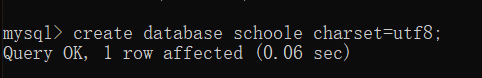
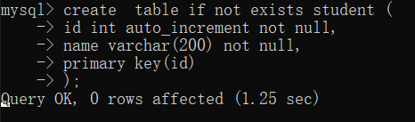
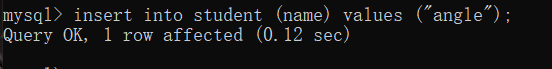

## 介绍

mysql数据库是为了方便对数据进行存储以及管理的。

## 术语

```
数据库：数据库是一些关联表的集合
数据表：表是数据的矩阵。
列：一列包含了相同类型的数据。
行：一行是一组相关的数据。
主键：主键是唯一的，可以由一列或者多列构成关键字。
外键：外键是用于关联两个表。
```

## 特性

```
原子性是指事务包含的所有操作要么全部成功，要么全部失败回滚。失败回滚的操作事务，将不能对事务有任何影响。

一致性是指事务必须使数据库从一个一致性状态变换到另一个一致性状态，也就是说一个事务执行之前和执行之后都必须处于一致性状态。

隔离性是指当多个用户并发访问数据库时，比如同时访问一张表，数据库每一个用户开启的事务，不能被其他事务所做的操作干扰
(也就是事务之间的隔离)，多个并发事务之间，应当相互隔离。

持久性是指事务的操作，一旦提交，对于数据库中数据的改变是永久性的，即使数据库发生故障也不能丢失已提交事务所完成的改变。
```

## 安装

### windows 上安装Mysql

[下载地址](https://www.mysql.com/cn/downloads/)

## Mysql命令

### 进入mysql

```
mysql -u root -p

-u root 其中 root为用户名
```

### 显示数据库

```
show databases;
```

### 删除数据库

```
drop database 数据库名;
```

### 创建数据库

```
create database 数据库名 charset=utf8;
```



### 选择数据库

```
use 数据库名;
```

### 显示当前数据库的数据表

```
show tables;
```

### 数据库类型

| 类型 | 大小 | 用途 |
| :--- | :--- | :--- |
| TINYINT | 1 byte | 小整数值 |
| SMALLINT | 2 bytes | 大整数值 |
| MEDIUMINT | 3 bytes | 大整数值 |
| INT或INTEGER | 4 bytes | 大整数值 |
| BIGINT | 8 bytes | 极大整数值 |
| FLOAT | 4 bytes | 单精度 浮点数值 |
| DOUBLE | 8 bytes | 双精度 浮点数值 |
| DECIMAL | 对DECIMAL\(M,D\) ，如果M&gt;D，为M+2否则为D+2 | 小数值 |

| 字符串类型 | 0-255 bytes | 定长字符串 |
| :--- | :--- | :--- |
| VARCHAR | 0-65535 bytes | 变长字符串 |
| TINYBLOB | 0-255 bytes | 不超过 255 个字符的二进制字符串 |
| TINYTEXT | 0-255 bytes | 短文本字符串 |
| BLOB | 0-65 535 bytes | 二进制形式的长文本数据 |
| TEXT | 0-65 535 bytes | 长文本数据 |
| MEDIUMBLOB | 0-16 777 215 bytes | 二进制形式的中等长度文本数据 |
| MEDIUMTEXT | 0-16 777 215 bytes | 中等长度文本数据 |
| LONGBLOB | 0-4 294 967 295 bytes | 二进制形式的极大文本数据 |
| LONGTEXT | 0-4 294 967 295 bytes | 极大文本数据 |

### 创建数据表

```
create table 表名 (
    列名 列类型 AUTO_INCREMENT,
    列名 列类型 not null,
    PRIMART KEY(列名)
)ENGINE=InnoDB DEFAULT CHARSET=utf8;

###　判断表是否存在，不存在则创建
create table if not exists 表名(
列名 列类型 AUTO_INCREMENT,
列名 列类型 not null,
PRIMARR KEY('列名')
)ENGINE=InnoDB DEFAULT CHARSET=utf8;


如果你不想字段为 NULL 可以设置字段的属性为 NOT NULL， 在操作数据库时如果输入该字段的数据为NULL ，就会报错。
AUTO_INCREMENT定义列为自增的属性，一般用于主键，数值会自动加1。
PRIMARY KEY关键字用于定义列为主键。 您可以使用多列来定义主键，列间以逗号分隔。
ENGINE 设置存储引擎，CHARSET 设置编码。
```



### 删除数据表

```
drop table 表名;
```

### 插入数据表

```
insert into 表名(列名1,,列名2,...,列名n) values (值1,值2,...,值n)
```



### 查询数据

```
select 列名1,列名2 from 表名[ where 条件] [LIMIT N] [OFFSET M]

limit 返回的记录数
offset 偏移量
```

### 更新数据

```
update 表名 set 列名1=值1,列名2=值2 [where 条件]
```

### 删除数据

```
delete from 表名 [where 条件]
```

### 模糊查询

```
select * from 表名 where 列名 like '%值%'

%是匹配多个字符
```

### 排序

```
select * from order by 列名 [ASC [DESC][默认 ASC]]

ASC:升序
DESC:降序
```

### 分组

```
select * from 表名 where 条件 group by 列名;
```

> 在分组的列上可以使用 COUNT, SUM, AVG,等函数。

### 连接

```
INNER JOIN（内连接,或等值连接）：获取两个表中字段匹配关系的记录。
LEFT JOIN（左连接）：获取左表所有记录，即使右表没有对应匹配的记录。
RIGHT JOIN（右连接）： 与 LEFT JOIN 相反，用于获取右表所有记录，即使左表没有对应匹配的记录。


select * from 表名 inner join 表名.列名=表名.列名;
```

### 修改数据

```
alter table 表名 drop i;
alter table 表名 add i tnt first;
alter table 表名 drop i;
alter table 表名 add i tnt after c;


alter table 表名 MODIFY 字段名 字段类型;
alter table 表名 CHANGE 字段名 新字段名 字段类型;

alter table 表名 alter 字段名 set default 默认值;
```

### 修改

```
update 表名 set 字段名= '新的字段值' where 字段名='旧字段值';
```

## pymyql

### 安装

[安装地址](https://github.com/CoderAngle/jyNotebook/tree/9dec06bc4c9347b9c572147943b9593cd72d82ca/1.kaifahuanjing/15-cun-chu-ku-de-an-zhuang/151-pymysqlde-an-zhuang.md)

### 连接数据库

在连接数据库之前，确保mysql已经打开了

```
import pymysql

# pymysql使用connect()方法连接数据库
db = pymysql.connect(host='127.0.0.1',user='root',password='123456',port=3306)
# 获取mysql的操作游标
cursor = db.cursor()
# 使用execute()方法执行sql语句
cursor.execute('select version()')
# 使用fetchone()方法来获得第一条数据
# fetchall()获取全部数据
data = cursor.fetchone()
print("database version:",data)
# 创建数据库并设置默认编码为utf-8
cursor.execute("create database spiders DEFAULT CHARACTER  set utf8")
db.close()
```

### 创建表结构

| 字段名 | 含义 | 类型    |
| ------ | ---- | ------- |
| name   | 名字 | varchar |
| age    | 年龄 | int     |

```
import pymysql

db = pymysql.connect(host='localhost',user='root',password='123456',port=3306,db='spiders')
cursor = db.cursor()
# 判断在数据库是否存在students表并创建name和age两个字段
# create table if not exists students(name varchar(255) not null,age int not null,primary key(name))
sql = 'create table if not exists students (name VARCHAR(255) not null,age int NOT NULL,PRIMARY KEY (NAME ))'
cursor.execute(sql)
db.close()
```

### 插入数据

```
mysql插入语句:insert into students(name,age) values('miku',18);
```

```
import pymysql

# 定义数据
name = 'miku'
age = 18

db = pymysql.connect(host='localhost',user='root',password='123456',port=3306,db='spiders')
cursor = db.cursor()
sql = 'insert into students(name,age) VALUES (%s,%s)'
try:
    cursor.execute(sql,(name,age))
    # 提交
    db.commit()
except:
    # 回滚
    db.rollback()
db.close()
```

根据字典动态构造sql语句

```
import pymysql

data = {
    'name':'angle',
    'age':18,
}

db = pymysql.connect(host='localhost',user='root',password='123456',port=3306,db='spiders')
cursor = db.cursor()

table = "students"
keys = ','.join(data.keys())
values = ','.join(["%s"] * len(data))
sql = "insert into {table}({keys}) VALUES ({values})".format(table=table,keys=keys,values=values)

try:
    if cursor.execute(sql,tuple(data.values())):
        print("成功")
        db.commit()
except:
    print("失败")
    db.rollback()
db.close()
```

### 更新数据

更新name字段值为angle的age字段，更改为235

```
import pymysql

db = pymysql.connect(host='localhost',user='root',password='123456',port=3306,db='spiders')
cursor = db.cursor()

sql = "update students set age = %s where name = %s"
try:
    cursor.execute(sql,('235','angle'))
    db.commit()
except:
    db.rollback()
db.close()
```

根据字典动态构造sql更新语句


```
import pymysql

data = {
    "name":"angle",
    "age":18,
}
table = "students"
keys = ','.join(data.keys())
values = ','.join(["%s"]*len(data))

db = pymysql.connect(host='localhost',user='root',password='123456',port=3306,db='spiders')
cursor = db.cursor()

# insert into students(name,age) VALUES (%s,%s) ON DUPLICATE KEY UPDATE name = %s, age = %s
# ON DUPLICATE KEY UPDATE:如果主键存在就执行更新操作
sql = "insert into {table}({keys}) VALUES ({values}) ON DUPLICATE KEY UPDATE".format(table=table,keys=keys,values=values)
update = ",".join([" {key} = %s".format(key=key) for key in data])
sql += update
print(sql)
try:
    if cursor.execute(sql,tuple(data.values())*2):
        print("成功")
        db.commit()
except:
    print("失败")
    db.rollback()
db.close()
```

### 删除数据

mysql语句：

```
delete from table where 条件
```

实现：

```
import pymysql

db = pymysql.connect(host='localhost',user='root',password='123456',port=3306,db='spiders')
cursor = db.cursor()

table = "students"
condition = "age = 18"
sql = "delete from {table} where {condition}".format(table=table,condition=condition)

try:
    cursor.execute(sql)
    db.commit()
except:
    db.rollback()
db.close()
```

### 查询数据

查询：

```
手动添加两条数据
mysql> insert into students values("angle",18);
Query OK, 1 row affected (0.06 sec)

mysql> insert into students values("miku",18);
Query OK, 1 row affected (0.09 sec)
```

实现：

```
import pymysql

db = pymysql.connect(host='localhost',user='root',password='123456',port=3306,db='spiders')
cursor = db.cursor()

table = "students"
condition = "age = 18"
sql = "select * from students where age = 18"

try:
    cursor.execute(sql)
    # 获取数据的数目
    print("count:",cursor.rowcount)
    # fetchone()方法获取第一条数据
    one = cursor.fetchone()
    print("one data:",one)
    # 调用fecthall()方法获取所有数据
    results = cursor.fetchall()
    print("results:",results)
    print("results type:",type(results))
    for row in results:
        print(row)
    db.commit()
except:
    print("error")
    # db.rollback()
db.close()
```

可以使用fetchone()循环获取所有数据，注意fetchone()方法，获取一条数据后，当前的第一条数据被取出来了就没有了，数据的指针会指向下一条数据。