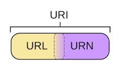
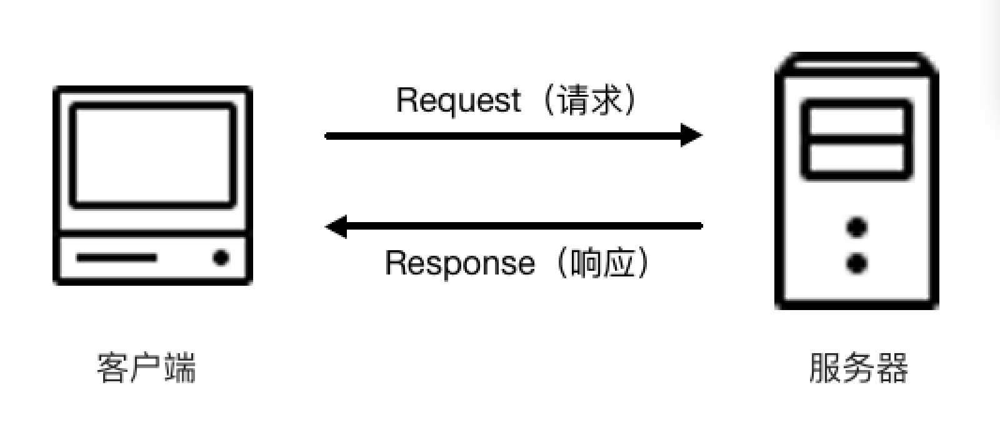
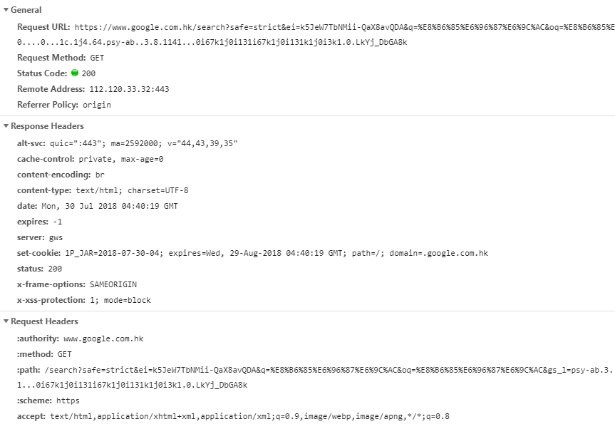

## 准备工作

### 前提

默认已经安装好[python](../1.基础篇/1.配置环境.md)

### 用途

| python库                  | 说明                         |
| ------------------------- | ---------------------------- |
| **请求模块**              | 用于模拟用户请求网页获取数据 |
| requests                  | 用于模拟请求                 |
| selenium                  | 模拟用户打开浏览器获取数据   |
| chromeDriver              | selenium的chrome驱动         |
| GeckoDriver               | selenium的firefox驱动        |
| PhantomJS                 | selenium的无界面浏览器驱动   |
| **解析模块**              | 用于解析网页数据             |
| Beautiful Soup            |                              |
| **pyquery**               |                              |
| tesserocr                 | 用于解析验证码图片           |
| **数据库**                | 存储数据                     |
| MySQL                     |                              |
| MongoDB                   |                              |
| Redis                     |                              |
| **存储模块**              | 连接数据库的python库         |
| PyMySQL                   | 用于连接mysql                |
| PyMongo                   | 用于连接MongoDB              |
| redis-py                  | 用于连接redis                |
| RedisDump                 | 图形化redis工具              |
| Sqlalchemy                | orm，更为方便的操作数据库    |
| **抓包工具/模拟请求工具** | 用于抓取app以及网页数据      |
| Charles                   |                              |
| Wireshark                 |                              |
| mitmproxy                 |                              |
| Appinum                   |                              |
| fillder                   |                              |
| postman                   | 用于模拟请求                 |
| **爬虫框架**              |                              |
| pyspider                  |                              |
| Scrapy                    |                              |
| Scrapy-Splash             |                              |
| ScrapyRedis               |                              |
| **部署模块**              |                              |
| Docker                    |                              |
| Scrapyd                   |                              |
| ScrapyClient              |                              |
| ScrapydAPI                |                              |
| Scrapyrt                  |                              |
| Gerapy                    |                              |

### 概念

#### HTTP基本原理

##### URI和URL


URI可被视为定位符（URL），名称（URN）或两者兼备。 统一资源标识符（URI）用于标识某一互联网资源，而统一资源定位符（URL）表示资源的地点（互联网上所处的位置）。 所以URL 是URI 的子集。



##### 超文本

网页的源代码便可称为超文本。

##### HTTP和HTTPS

HTTP 的全称是 Hyper Text Transfer Protocol，中文名叫做超文本传输协议，HTTP 协议是用于从网络传输超文本数据到本地浏览器的传送协议，它能保证传送高效而准确地传送超文本文档。

HTTPS 的全称是 Hyper Text Transfer Protocol over Secure Socket Layer，是以安全为目标的 HTTP 通道，简单讲是 HTTP 的安全版，即 HTTP 下加入 SSL 层，简称为 HTTPS。

HTTPS 的安全基础是 SSL，因此通过它传输的内容都是经过 SSL 加密的，它的主要作用可以分为两种：

- 是建立一个信息安全通道，来保证数据传输的安全。
- 确认网站的真实性，凡是使用了 https 的网站，都可以通过点击浏览器地址栏的锁头标志来查看网站认证之后的真实信息，也可以通过 CA 机构颁发的安全签章来查询。

而某些网站虽然使用了 HTTPS 协议还是会被浏览器提示不安全，所以这里证书验证就不会通过而提示这样的话，但是实际上它的数据传输依然是经过 SSL 加密的。如果要爬取这样的站点就需要设置忽略证书的选项，否则会提示 SSL 链接错误。

##### HTTP请求过程

当在浏览器输入一个url，回车后，便可看到该网页的内容，实际上过程是浏览器向该网站的服务器发送一个Request(请求)，网站的服务器接收之后，然后返回与之对应的一个Response(响应)，然后返回给浏览器，response响应中包含了页面的源代码等内容，浏览器解析会后便将网页给呈现出来




按下F12，然后点击network面板，便可看到一次发送请求和接收响应之间的过程。

一个条目的名称及含义：

- `Name`，即 Request 的名称。
- `Status`，即 Response 的状态码。通过状态码可以判断发送了 Request 之后是否得到了正常的 Response。
- `Type`，即 Request 请求的文档类型。
- `Initiator`，即请求源。
- `Size`，即从服务器下载的文件和请求的资源大小。
- `Time`，即发起 Request 到获取到 Response 所用的总时间。
- `Timeline`，即网络请求的可视化瀑布流。

点击某条目可以看到更详细的信息



`General`部分中属性的含义:

- Request URL 为 Request 的 URL
- Request Method 为请求的方法
- Status Code 为响应状态码
- Remote Address 为远程服务器的地址和端口
- Referrer Policy 为 Referrer 判别策略

Response Headers 和一个 Request Headers，这分别代表响应头和请求头，请求头里面带有许多请求信息，例如浏览器标识、Cookies、Host 等信息，这是 Request 的一部分，服务器会根据请求头内的信息判断请求是否合法，进而作出对应的响应，返回 Response，那么在图中看到的 Response Headers 就是 Response 的一部分，例如其中包含了服务器的类型、文档类型、日期等信息，浏览器接受到 Response 后，会解析响应内容，进而呈现网页内容。

##### 请求

###### **Request**

Request，即请求，由客户端向服务端发出。

Request 有四部分内容：

```
- Request Method(请求方式)
- Request URL(请求链接)
- Request Headers(请求头)
- Request Body(请求体)
```

1. **Request Method**

请求方式中有两种常见的类型:GET和POST

*GET:*从指定的资源请求数据。比如在谷歌中直接搜索花，这便发起了一个get请求，请求的参数会直接包含到url中，如:https://www.google.com.hk/search?q=花&oq=花&aqs=chrome..69i57j69i60l4.5466j0j7&sourceid=chrome&ie=UTF-8，url中包含了请求的参数信息，这里的参数q就是搜索的关键字

*POST:*向指定的资源提交要被处理的数据。POST 请求大多为表单提交发起，如一个登录表单，输入用户名密码，点击登录按钮，这通常会发起一个 POST 请求，其数据通常以 Form Data 即表单的形式传输，不会体现在 URL 中。

GET 和 POST 请求方法有如下区别：

- GET 方式请求中参数是包含在 URL 里面的，数据可以在 URL 中看到，而 POST 请求的 URL 不会包含这些数据，数据都是通过表单的形式传输，会包含在 Request Body 中。
- GET 方式请求提交的数据最多只有 1024 字节，而 POST 方式没有限制。

请求方式以及描述

方法

|         | 描述                                                         |
| ------- | ------------------------------------------------------------ |
| GET     | 请求指定的页面信息，并返回实体主体。                         |
| HEAD    | 类似于 GET 请求，只不过返回的响应中没有具体的内容，用于获取报头。 |
| POST    | 向指定资源提交数据进行处理请求，数据被包含在请求体中。       |
| PUT     | 从客户端向服务器传送的数据取代指定的文档的内容。             |
| DELETE  | 请求服务器删除指定的页面。                                   |
| CONNECT | HTTP/1.1 协议中预留给能够将连接改为管道方式的代理服务器。    |
| OPTIONS | 允许客户端查看服务器的性能。                                 |
| TRACE   | 回显服务器收到的请求，主要用于测试或诊断。                   |

本表参考：http://www.runoob.com/http/http-methods.html

2. **Request** **URL**

请求的网址，即统一资源定位符，用 URL 可以唯一确定想请求的资源。

3. **Request** **Headers**

请求头，用来说明服务器要使用的附加信息，比较重要的信息有 Cookie、Referer、User-Agent 等，下面将一些常用的头信息说明如下：

- Accept，请求报头域，用于指定客户端可接受哪些类型的信息。
- Accept-Language，指定客户端可接受的语言类型。
- Accept-Encoding，指定客户端可接受的内容编码。
- Host，用于指定请求资源的主机 IP 和端口号，其内容为请求 URL 的原始服务器或网关的位置。从 HTTP 1.1 版本开始，Request 必须包含此内容。
- Cookie，也常用复数形式 Cookies，是网站为了辨别用户进行 Session 跟踪而储存在用户本地的数据。Cookies 的主要功能就是维持当前访问会话。
- Referer，此内容用来标识这个请求是从哪个页面发过来的，服务器可以拿到这一信息并做相应的处理，如做来源统计、做防盗链处理等。
- User-Agent，简称 UA，它是一个特殊字符串头，使得服务器能够识别客户使用的操作系统及版本、浏览器及版本等信息。在做爬虫时加上此信息可以伪装为浏览器，如果不加很可能会被识别出为爬虫。
- Content-Type，即 Internet Media Type，互联网媒体类型，也叫做 MIME 类型，在 HTTP 协议消息头中，使用它来表示具体请求中的媒体类型信息。例如 text/html 代表 HTML 格式，image/gif 代表 GIF 图片，application/json 代表 Json 类型，更多对应关系可以查看此对照表：http://tool.oschina.net/commons。

Request Headers 是 Request 等重要组成部分，在写爬虫的时候大部分情况都需要设定 Request Headers。

4. **Request Body**

即请求体，一般承载的内容是 POST 请求中的 Form Data，即表单数据，而对于 GET 请求 Request Body 则为空。

下面列出了 Content-Type 和 POST 提交数据方式的关系：

| Content-Type                      | 提交数据方式         |
| --------------------------------- | -------------------- |
| application/x-www-form-urlencoded | Form 表单提交        |
| multipart/form-data               | 表单文件上传提交     |
| application/json                  | 序列化 Json 数据提交 |
| text/xml                          | XML 数据提交         |

在爬虫中如果要构造 POST 请求需要注意这几种 Content-Type，了解各种请求库的各个参数设置时使用的是哪种 Content-Type，不然可能会导致 POST 提交后得不到正常的 Response。


##### 响应

Response，即响应，由服务端返回给客户端。Response 可以划分为三部分，Response Status Code、Response Headers、Response Body。

###### **Response Status Code**

响应状态码，此状态码表示了服务器的响应状态，如 200 则代表服务器正常响应，404 则代表页面未找到，500 则代表服务器内部发生错误。在爬虫中，可以根据状态码来判断服务器响应状态，如判断状态码为 200，则证明成功返回数据，再进行进一步的处理，否则直接忽略。

下面用表格列出了常见的错误代码及错误原因：

| 状态码 | 说明            | 详情                                                         |
| ------ | --------------- | ------------------------------------------------------------ |
| 100    | 继续            | 请求者应当继续提出请求。服务器已收到请求的一部分，正在等待其余部分。 |
| 101    | 切换协议        | 请求者已要求服务器切换协议，服务器已确认并准备切换。         |
| 200    | 成功            | 服务器已成功处理了请求。                                     |
| 201    | 已创建          | 请求成功并且服务器创建了新的资源。                           |
| 202    | 已接受          | 服务器已接受请求，但尚未处理。                               |
| 203    | 非授权信息      | 服务器已成功处理了请求，但返回的信息可能来自另一来源。       |
| 204    | 无内容          | 服务器成功处理了请求，但没有返回任何内容。                   |
| 205    | 重置内容        | 服务器成功处理了请求，内容被重置。                           |
| 206    | 部分内容        | 服务器成功处理了部分请求。                                   |
| 300    | 多种选择        | 针对请求，服务器可执行多种操作。                             |
| 301    | 永久移动        | 请求的网页已永久移动到新位置，即永久重定向。                 |
| 302    | 临时移动        | 请求的网页暂时跳转到其他页面，即暂时重定向。                 |
| 303    | 查看其他位置    | 如果原来的请求是 POST，重定向目标文档应该通过 GET 提取。     |
| 304    | 未修改          | 此次请求返回的网页未修改，继续使用上次的资源。               |
| 305    | 使用代理        | 请求者应该使用代理访问该网页。                               |
| 307    | 临时重定向      | 请求的资源临时从其他位置响应。                               |
| 400    | 错误请求        | 服务器无法解析该请求。                                       |
| 401    | 未授权          | 请求没有进行身份验证或验证未通过。                           |
| 403    | 禁止访问        | 服务器拒绝此请求。                                           |
| 404    | 未找到          | 服务器找不到请求的网页。                                     |
| 405    | 方法禁用        | 服务器禁用了请求中指定的方法。                               |
| 406    | 不接受          | 无法使用请求的内容响应请求的网页。                           |
| 407    | 需要代理授权    | 请求者需要使用代理授权。                                     |
| 408    | 请求超时        | 服务器请求超时。                                             |
| 409    | 冲突            | 服务器在完成请求时发生冲突。                                 |
| 410    | 已删除          | 请求的资源已永久删除。                                       |
| 411    | 需要有效长度    | 服务器不接受不含有效内容长度标头字段的请求。                 |
| 412    | 未满足前提条件  | 服务器未满足请求者在请求中设置的其中一个前提条件。           |
| 413    | 请求实体过大    | 请求实体过大，超出服务器的处理能力。                         |
| 414    | 请求 URI 过长   | 请求网址过长，服务器无法处理。                               |
| 415    | 不支持类型      | 请求的格式不受请求页面的支持。                               |
| 416    | 请求范围不符    | 页面无法提供请求的范围。                                     |
| 417    | 未满足期望值    | 服务器未满足期望请求标头字段的要求。                         |
| 500    | 服务器内部错误  | 服务器遇到错误，无法完成请求。                               |
| 501    | 未实现          | 服务器不具备完成请求的功能。                                 |
| 502    | 错误网关        | 服务器作为网关或代理，从上游服务器收到无效响应。             |
| 503    | 服务不可用      | 服务器目前无法使用。                                         |
| 504    | 网关超时        | 服务器作为网关或代理，但是没有及时从上游服务器收到请求。     |
| 505    | HTTP 版本不支持 | 服务器不支持请求中所用的 HTTP 协议版本。                     |

###### **Response Headers**

响应头，其中包含了服务器对请求的应答信息，如 Content-Type、Server、Set-Cookie 等，下面将一些常用的头信息说明如下：

- Date，标识 Response 产生的时间。
- Last-Modified，指定资源的最后修改时间。
- Content-Encoding，指定 Response 内容的编码。
- Server，包含了服务器的信息，名称，版本号等。
- Content-Type，文档类型，指定了返回的数据类型是什么，如text/html 则代表返回 HTML 文档，application/x-javascript 则代表返回 JavaScript 文件，image/jpeg 则代表返回了图片。
- Set-Cookie，设置Cookie，Response Headers 中的 Set-Cookie即告诉浏览器需要将此内容放在 Cookies 中，下次请求携带 Cookies 请求。
- Expires，指定 Response 的过期时间，使用它可以控制代理服务器或浏览器将内容更新到缓存中，如果再次访问时，直接从缓存中加载，降低服务器负载，缩短加载时间。

###### **Resposne Body**

即响应体，最重要的当属响应体内容了，响应的正文数据都是在响应体中，如请求一个网页，它的响应体就是网页的 HTML 代码，请求一张图片，它的响应体就是图片的二进制数据。所以最主要的数据都包含在响应体中了，做爬虫请求网页后要解析的内容就是解析响应体


在浏览器开发者工具中点击 Preview，就可以看到网页的源代码，这也就是响应体内容，是解析的目标。

在做爬虫时主要解析的内容就是 Resposne Body，通过 Resposne Body 可以得到网页的源代码、Json 数据等等，然后从中做相应内容的提取。

#### 网页基础

了解网页的基本组成、结构、节点等内容。

##### 网页的组成

**HTML**

HTML 是用来描述网页的一种语言，其全称叫做 Hyper Text Markup Language，即超文本标记语言。网页包括文字、按钮、图片、视频等各种复杂的元素，其基础架构就是 HTML。不同类型的文字通过不同类型的标签来表示，如图片用 img 标签表示，视频用 video 标签来表示，段落用 p 标签来表示，它们之间的布局又常通过布局标签 div 嵌套组合而成，各种标签通过不同的排列和嵌套才形成了网页的框架。

**CSS**

CSS，全称叫做 Cascading Style Sheets，即层叠样式表。“层叠”是指当在 HTML 中引用了数个样式文件，并且样式发生冲突时，浏览器能依据层叠顺序处理。“样式”指网页中文字大小、颜色、元素间距、排列等格式。

**JavaScript**

JavaScript，简称为 JS，是一种脚本语言，HTML 和 CSS 配合使用，提供给用户的只是一种静态的信息，缺少交互性。在网页里可能会看到一些交互和动画效果，如下载进度条、提示框、轮播图等，这通常就是 JavaScript 的功劳。它的出现使得用户与信息之间不只是一种浏览与显示的关系，而是实现了一种实时、动态、交互的页面功能。

##### 网页的结构

网页的一般结构，都是 html 标签内嵌套 head 和 body 标签，head 内定义网页的配置和引用，body 内定义网页的正文。

```
<!DOCTYPE html>
<html>
    <head>
        <meta charset="UTF-8">
        <title>This is a test</title>
    </head>
    <body>
        <div id="header">
           header
        </div>    
        <div id="container">
            <div class="wrapper">
                <h2 class="title">Hello World</h2>
                <p class="text">Hello, this is a paragraph.</p>
            </div>
        </div>
        <div id="footer">
            footer
        </div>
    </body>
</html>
```

##### 节点树及节点间的关系

在 HTML DOM 中，所有事物都是节点。DOM 是被视为节点树的 HTML。

**DOM 节点**

根据 W3C 的 HTML DOM 标准，HTML 文档中的所有内容都是节点：

- 整个文档是一个文档节点
- 每个 HTML 元素是元素节点
- HTML 元素内的文本是文本节点
- 每个 HTML 属性是属性节点
- 注释是注释节点

**HTML DOM 节点树**

HTML DOM 将 HTML 文档视作树结构。这种结构被称为*节点树*：

**HTML DOM Tree 实例**


通过 HTML DOM，树中的所有节点均可通过 JavaScript 进行访问。所有 HTML 元素（节点）均可被修改，也可以创建或删除节点。

**节点父、子和同胞**

节点树中的节点彼此拥有层级关系。

父（parent）、子（child）和同胞（sibling）等术语用于描述这些关系。父节点拥有子节点。同级的子节点被称为同胞（兄弟或姐妹）。

- 在节点树中，顶端节点被称为根（root）
- 每个节点都有父节点、除了根（它没有父节点）
- 一个节点可拥有任意数量的子
- 同胞是拥有相同父节点的节点

下面的图片展示了节点树的一部分，以及节点之间的关系：


本段参考:http://www.w3school.com.cn/htmldom/dom_nodes.asp

##### **选择器**

CSS 选择器的语法规则：

| 选择器               | 例子               | 例子描述                                          |
| -------------------- | ------------------ | ------------------------------------------------- |
| .class               | .intro             | 选择 class="intro" 的所有节点。                   |
| #id                  | #firstname         | 选择 id="firstname" 的所有节点。                  |
| *                    | *                  | 选择所有节点。                                    |
| element              | p                  | 选择所有 p 节点。                                 |
| element,element      | div,p              | 选择所有 div 节点和所有 p 节点。                  |
| element element      | div p              | 选择 div 节点内部的所有 p 节点。                  |
| element>element      | div>p              | 选择父节点为 div 节点的所有 p 节点。              |
| element+element      | div+p              | 选择紧接在 div 节点之后的所有 p 节点。            |
| [attribute]          | [target]           | 选择带有 target 属性所有节点。                    |
| [attribute=value]    | [target=blank]     | 选择 target="blank" 的所有节点。                  |
| [attribute~=value]   | [title~=flower]    | 选择 title 属性包含单词 "flower" 的所有节点。     |
| :link                | a:link             | 选择所有未被访问的链接。                          |
| :visited             | a:visited          | 选择所有已被访问的链接。                          |
| :active              | a:active           | 选择活动链接。                                    |
| :hover               | a:hover            | 选择鼠标指针位于其上的链接。                      |
| :focus               | input:focus        | 选择获得焦点的 input 节点。                       |
| :first-letter        | p:first-letter     | 选择每个 p 节点的首字母。                         |
| :first-line          | p:first-line       | 选择每个 p 节点的首行。                           |
| :first-child         | p:first-child      | 选择属于父节点的第一个子节点的每个 p 节点。       |
| :before              | p:before           | 在每个 p 节点的内容之前插入内容。                 |
| :after               | p:after            | 在每个 p 节点的内容之后插入内容。                 |
| :lang(language)      | p:lang             | 选择带有以 "it" 开头的 lang 属性值的每个 p 节点。 |
| element1~element2    | p~ul               | 选择前面有 p 节点的每个 ul 节点。                 |
| [attribute^=value]   | a[src^="https"]    | 选择其 src 属性值以 "https" 开头的每个 a 节点。   |
| [attribute$=value]   | a[src$=".pdf"]     | 选择其 src 属性以 ".pdf" 结尾的所有 a 节点。      |
| [attribute*=value]   | a[src*="abc"]      | 选择其 src 属性中包含 "abc" 子串的每个 a 节点。   |
| :first-of-type       | p:first-of-type    | 选择属于其父节点的首个 p 节点的每个 p 节点。      |
| :last-of-type        | p:last-of-type     | 选择属于其父节点的最后 p 节点的每个 p 节点。      |
| :only-of-type        | p:only-of-type     | 选择属于其父节点唯一的 p 节点的每个 p 节点。      |
| :only-child          | p:only-child       | 选择属于其父节点的唯一子节点的每个 p 节点。       |
| :nth-child(n)        | p:nth-child        | 选择属于其父节点的第二个子节点的每个 p 节点。     |
| :nth-last-child(n)   | p:nth-last-child   | 同上，从最后一个子节点开始计数。                  |
| :nth-of-type(n)      | p:nth-of-type      | 选择属于其父节点第二个 p 节点的每个 p 节点。      |
| :nth-last-of-type(n) | p:nth-last-of-type | 同上，但是从最后一个子节点开始计数。              |
| :last-child          | p:last-child       | 选择属于其父节点最后一个子节点每个 p 节点。       |
| :root                | :root              | 选择文档的根节点。                                |
| :empty               | p:empty            | 选择没有子节点的每个 p 节点（包括文本节点）。     |
| :target              | #news:target       | 选择当前活动的 #news 节点。                       |
| :enabled             | input:enabled      | 选择每个启用的 input 节点。                       |
| :disabled            | input:disabled     | 选择每个禁用的 input 节点                         |
| :checked             | input:checked      | 选择每个被选中的 input 节点。                     |
| :not(selector)       | p:not              | 选择非 p 节点的每个节点。                         |
| ::selection          | ::selection        | 选择被用户选取的节点部分。                        |

#### 爬虫的基本原理

##### 什么是爬虫?

爬虫，即网络爬虫，可以把互联网就比作一张大网，而爬虫便是在网上爬行的蜘蛛，可以把网的节点比做一个个网页，爬虫爬到这就相当于访问了该页面获取了其信息，节点间的连线可以比做网页与网页之间的链接关系，这样蜘蛛通过一个节点后可以顺着节点连线继续爬行到达下一个节点，即通过一个网页继续获取后续的网页，这样整个网的节点便可以被蜘蛛全部爬行到，这样网站的数据就可以被抓取下来了。

##### 爬虫操作步骤

爬虫就是获取网页并提取和保存信息的自动化程序的操作步骤:

###### **获取网页**

爬虫首先要做的工作就是获取网页，在这里获取网页即获取网页的源代码，源代码里面必然包含了网页的部分有用的信息，所以只要把源代码获取下来了，就可以从中提取想要的信息了。

###### **提取信息**

在第一步获取了网页源代码之后，接下来的工作就是分析网页源代码，从中提取想要的数据。

###### **保存数据**

提取信息之后一般会将提取到的数据保存到某处以便后续数据处理使用。保存形式有多种多样，如可以简单保存为 TXT 文本或 Json 文本，也可以保存到数据库，如 MySQL、MongoDB 等，也可保存至远程服务器，如借助 Sftp 进行操作等。

##### 能抓怎样的数据

在网页中能看到各种各样的信息，最常见的便是常规网页，其都对应着 HTML 代码，而最常见的抓取便是抓取 HTML 源代码。

另外可能有些网页返回的不是 HTML 代码，而是返回一个 Json 字符串，API 接口大多采用这样的形式，方便数据的传输和解析，这种数据同样可以抓取，而且数据提取更加方便。

此外还可以看到各种二进制数据，如图片、视频、音频等等，可以利用爬虫将它们的二进制数据抓取下来，然后保存成对应的文件名即可。

另外还可以看到各种扩展名的文件，如 CSS、JavaScript、配置文件等等，这些其实也是最普通的文件，只要在浏览器里面访问到，就可以将其抓取下来。

以上的内容其实都对应着各自的URL，是基于 HTTP 或 HTTPS 协议的，只要是这种数据爬虫都可以进行抓取。

**自动化程序**

说到自动化程序，意思即是说爬虫可以代替人来完成这些操作。首先手工当然是可以提取这些信息的，但是当量特别大或者想快速获取大量数据的话，肯定还是借助于程序。所以爬虫就是代替来完成这份爬取数据的工作的自动化程序，它可以在抓取过程中进行各种异常处理、错误重试等操作，确保爬取持续高效地运行。

#####  javascript渲染的页面

有时候在用 Urllib 或 Requests 抓取网页时，得到的源代码实际和浏览器中看到的是不一样的。

这个问题是一个非常常见的问题，现在网页越来越多地采用 Ajax、前端模块化工具来构建网页，整个网页可能都是由 JavaScript 渲染出来的，意思就是说原始的 HTML 代码就是一个空壳，例如：

```
<!DOCTYPE html>
<html>
    <head>
        <meta charset="UTF-8">
        <title>This is a Demo</title>
    </head>
    <body>
        <div id="container">
        </div>
    </body>
    <script src="app.js"></script>
</html>
```

body 节点里面只有一个 id 为 container 的节点，但是注意到在 body 节点后引入了一个 app.js，这个便负责了整个网站的渲染。

在浏览器打开这个页面时，首先会加载这个 HTML 内容，接着浏览器会发现其中里面引入了一个 app.js 文件，然后浏览器便会接着去请求这个文件，获取到该文件之后便会执行其中的 JavaScript 代码，而 JavaScript 则会改变 HTML 中的节点，向内添加内容，最后得到完整的页面。

但是在用 Urllib 或 Requests 等库来请求当前页面时，得到的只是这个 HTML 代码，它不会帮助去继续加载这个 JavaScript 文件，这样也就看不到浏览器中看到的内容了。

这也解释了为什么有时得到的源代码和浏览器中看到的是不一样的。

所以使用基本 HTTP 请求库得到的结果源代码可能跟浏览器中的页面源代码不太一样。对于这样的情况，可以分析其后台 Ajax 接口，也可使用 Selenium、Splash 这样的库来实现模拟 JavaScript 渲染，这样便可以爬取 JavaScript 渲染的网页的内容了。

#### 会话与cookies

##### 介绍

[Session与Cookie文档](../5.web/flask/7.session与cookie.md)。

cookie属性：

- Name，即该 Cookie 的名称。
- Value，即该 Cookie 的值。如果值为 Unicode 字符，需要为字符编码。如果值为二进制数据，则需要使用 BASE64 编码。
- Max Age，即该 Cookie 失效的时间，单位秒，也常和 Expires 一起使用，通过它可以计算出其有效时间。Max Age 如果为正数，则该Cookie 在 Max Age 秒之后失效。如果为负数，则关闭浏览器时Cookie 即失效，浏览器也不会以任何形式保存该 Cookie。
- Path，即该 Cookie 的使用路径。如果设置为 /path/，则只有路径为 /path/ 的页面可以访问该 Cookie。如果设置为 /，则本域名下的所有页面都可以访问该 Cookie。
- Domain，即可以访问该 Cookie 的域名。例如如果设置为 .zhihu.com，则所有以 zhihu.com，结尾的域名都可以访问该Cookie。
- Size字段，即此 Cookie 的大小。
- Http字段，即 Cookie 的 httponly 属性。若此属性为 true，则只有在 HTTP Headers 中会带有此 Cookie 的信息，而不能通过 document.cookie 来访问此 Cookie。
- Secure，即该 Cookie 是否仅被使用安全协议传输。安全协议。安全协议有 HTTPS，SSL 等，在网络上传输数据之前先将数据加密。默认为 false。

##### 静态网页和动态网页

静态网页是相对于动态网页而言，是指没有后台数据库、不含程序和不可交互的网页。静态网页相对更新起来比较麻烦，适用于一般更新较少的展示型网站。容易误解的是静态页面都是htm这类页面，实际上静态也不是完全静态，也可以出现各种动态的效果，如GIF格式的动画、FLASH、滚动字幕等。

##### 无状态HTTP

HTTP 的无状态是指 HTTP 协议对事务处理是没有记忆能力的，也就是说服务器不知道客户端是什么状态。当向服务器发送一个 Requset 后，服务器解析此 Request，然后返回对应的 Response，服务器负责完成这个过程，而且这个过程是完全独立的，服务器不会记录前后状态的变化，也就是缺少状态记录，这意味着如果后续需要处理需要前面的信息，则它必须要重传，这也导致了需要额外传递一些前面的重复 Request 才能获取后续 Response，然而这种效果显然不是想要的。为了保持前后状态，肯定不能将前面的请求全部重传一次，这太浪费资源了，对于这种需要用户登录的页面来说，更是棘手。

用于保持 HTTP 连接状态的技术，它们分别是 Session 和 Cookies，Session 在服务端，也就是网站的服务器，用来保存用户的会话信息，Cookies 在客户端，用于保存登录的一些凭证信息。

#####  常见误区

在谈论 Session 机制的时候，常常听到这样一种误解“只要关闭浏览器，Session 就消失了”，这种理解是错误的，可以想象一下会员卡的例子，除非顾客主动对店家提出销卡，否则店家绝对不会轻易删除顾客的资料。对 Session 来说也是一样的，除非程序通知服务器删除一个 Session，否则服务器会一直保留，比如程序一般都是在做注销操作的时候才去删除 Session。

但是当关闭浏览器时，浏览器不会主动在关闭之前通知服务器它将要关闭，所以服务器根本不会有机会知道浏览器已经关闭，之所以会有这种错觉，是大部分 Session 机制都使用会话 Cookie 来保存 Session ID 信息，而关闭浏览器后 Cookies 就消失了，再次连接服务器时也就无法找到原来的 Session。如果服务器设置的 Cookies 被保存到硬盘上，或者使用某种手段改写浏览器发出的 HTTP 请求头，把原来的 Cookies 发送给服务器，则再次打开浏览器仍然能够找到原来的 Session ID，依旧还是可以保持登录状态的。

而且恰恰是由于关闭浏览器不会导致 Session 被删除，这就需要服务器为 Seesion 设置一个失效时间，当距离客户端上一次使用 Session 的时间超过这个失效时间时，服务器就可以认为客户端已经停止了活动，才会把 Session 删除以节省存储空间。

**参考资料**

- [Session和几种状态保持方案理解](http://www.mamicode.com/info-detail-46545.html)

#### 代理

##### 介绍

在做爬虫的过程中经常会遇到这样的情况，最初爬虫正常运行，正常抓取数据，一切看起来都是那么的美好，然而一杯茶的功夫可能就会出现错误，比如 403 Forbidden，这时候打开网页一看，可能会看到“IP 访问频率太高”这样的提示。出现这样的现象的原因是网站采取了一些反爬虫的措施，比如服务器会检测某个 IP 在单位时间内的请求次数，如果超过了这个阈值，那么会直接拒绝服务，返回一些错误信息，这种情况可以称之为封 IP，于是乎就成功把我爬虫禁掉了。

既然服务器检测的是某个 IP 单位时间的请求次数，那么借助某种方式来伪装的 IP，让服务器识别不出是由本机发起的请求，不就可以成功防止封 IP 了吗？

那么在这里一种有效的方式就是使用代理，使用它可以成功伪装 IP，避免本机 IP 被封禁的情况。

##### 基本原理

代理服务器，英文叫做 Proxy Server，它的功能是代理网络用户去取得网络信息。形象地说，它是网络信息的中转站。在正常请求一个网站时，是发送了 Request 给 Web 服务器，Web 服务器把 Response 传回来。如果设置了代理服务器，实际上就是在本机和服务器之间搭建了一个桥，此时本机不是直接向 Web 服务器发起请求，而是向代理服务器发出请求， Request 会发送给代理服务器，然后由代理服务器再发送给 Web 服务器，然后由代理服务器再把 Web 服务器返回的 Response 转发给本机，这样同样可以正常访问网页，但这个过程 Web 服务器识别出的真实的 IP 就不再是本机的 IP 了，就成功实现了 IP 伪装，这就是代理的基本原理。

##### 代理的用途

- 访问一些单位或团体内部资源
- 提高访问速度
- 隐藏真实 IP
- 突破自身 IP 访问限制，访问一些平时不能访问的站点

##### 爬虫代理

对于爬虫来说，由于爬虫爬取速度过快，在爬取过程中可能遇到同一个 IP 访问过于频繁的问题，网站就会让输入验证码或登录或者直接封锁 IP，这样会给爬取带来极大的不便。

所以使用代理隐藏真实的 IP，让服务器误以为是代理服务器在请求自己。这样在爬取过程中通过不断更换代理，就不会被封锁，可以达到很好的爬取效果。

##### 代理的类别

###### 类别

根据代理的协议区分，代理可以分为如下类别：

- FTP 代理服务器，主要用于访问 FTP 服务器，一般有上传、下载以及缓存功能，端口一般为 21、2121 等。
- HTTP 代理服务器，主要用于访问网页，一般有内容过滤和缓存功能，端口一般为 80、8080、3128 等。
- SSL/TLS 代理，主要用于访问加密网站，一般有 SSL 或 TLS 加密功能（最高支持 128 位加密强度），端口一般为 443。
- RTSP 代理，主要用于 Realplayer 访问 Real 流媒体服务器，一般有缓存功能，端口一般为 554。
- Telnet代理，主要用于 telnet 远程控制（黑客入侵计算机时常用于隐藏身份），端口一般为23。
- POP3/SMTP 代理，主要用于 POP3/SMTP 方式收发邮件，一般有缓存功能，端口一般为 110/25。
- SOCKS代理，只是单纯传递数据包，不关心具体协议和用法，所以速度快很多，一般有缓存功能，端口一般为1080。SOCKS 代理协议又分为 SOCKS4 和 SOCKS5，SOCKS4 协议只支持 TCP，而 SOCKS5 协议支持 TCP 和 UDP，还支持各种身份验证机制、服务器端域名解析等。简单来说，SOCK4能做到的SOCKS5都可以做到，但SOCKS5能做到的SOCK4不一定能做到。

###### 根据匿名程度区分

根据代理的匿名程度划分，代理可以分为如下类别：

- 高度匿名代理，高度匿名代理会将数据包原封不动的转发，在服务端看来就好像真的是一个普通客户端在访问，而记录的 IP 是代理服务器的 IP。
- 普通匿名代理，普通匿名代理会在数据包上做一些改动，服务端上有可能发现这是个代理服务器，也有一定几率追查到客户端的真实 IP。代理服务器通常会加入的 HTTP 头有 HTTP_VIA 和 HTTP_X_FORWARDED_FOR。
- 透明代理，透明代理不但改动了数据包，还会告诉服务器客户端的真实 IP。这种代理除了能用缓存技术提高浏览速度，能用内容过滤提高安全性之外，并无其他显著作用，最常见的例子是内网中的硬件防火墙。
- 间谍代理，间谍代理指组织或个人创建的，用于记录用户传输的数据，然后进行研究、监控等目的代理服务器。

##### 常见的代理设置

- 使用网上的免费代理，最好使用高匿代理，使用前抓取下来筛选一下可用代理，也可以进一步维护一个代理池。
- 使用付费代理服务，互联网上存在许多代理商，可以付费使用，质量比免费代理好很多。
- ADSL拨号，拨一次号换一次 IP，稳定性高，也是一种比较有效的解决方案。

### 测试工具

#### postman

[postman](https://www.postman.com/)用于进行模拟请求的工具。

### 解析规则

#### XPATH

##### 安装

```
pip install lxml
```

##### 用法

| 表达式           | 描述                                       |
| ---------------- | ------------------------------------------ |
| nodename         | 选取此节点的所有子节点                     |
| /                | 从当前节点选取直接子节点                   |
| //               | 从当前节点选取子孙节点                     |
| .                | 选取当前节点                               |
| ..               | 选取当前节点的父节点                       |
| @                | 选取属性                                   |
| *                | 通配符，选择所有元素节点与元素名           |
| @*               | 选取所有属性                               |
| [@attrib]        | 选取具有给定属性的所有元素                 |
| [@attrib='value] | 选取给定属性具有给定值的所有元素           |
| [tag]            | 选取所有具有指定元素的直接子节点           |
| [tag="text"]     | 选取所有具有指定元素并且文本内容是text节点 |