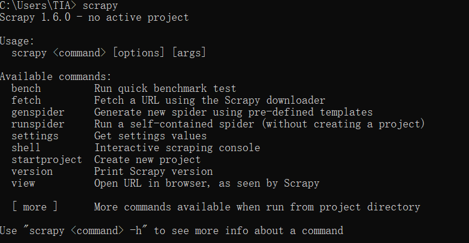
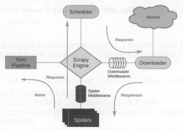
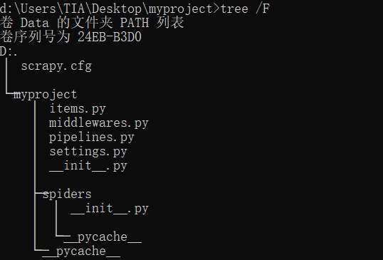
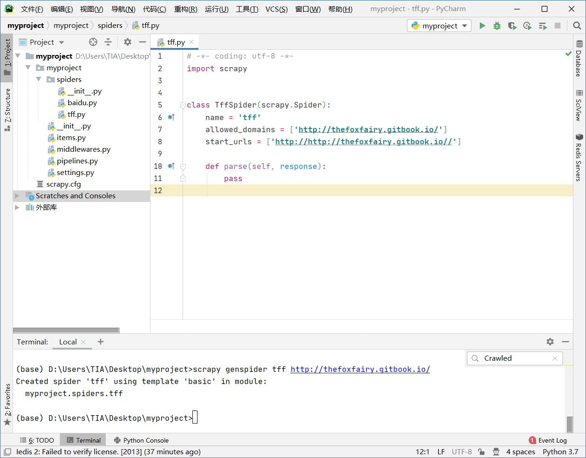
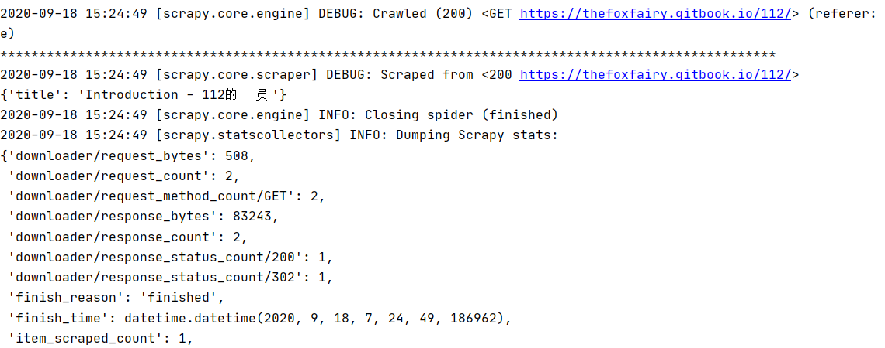
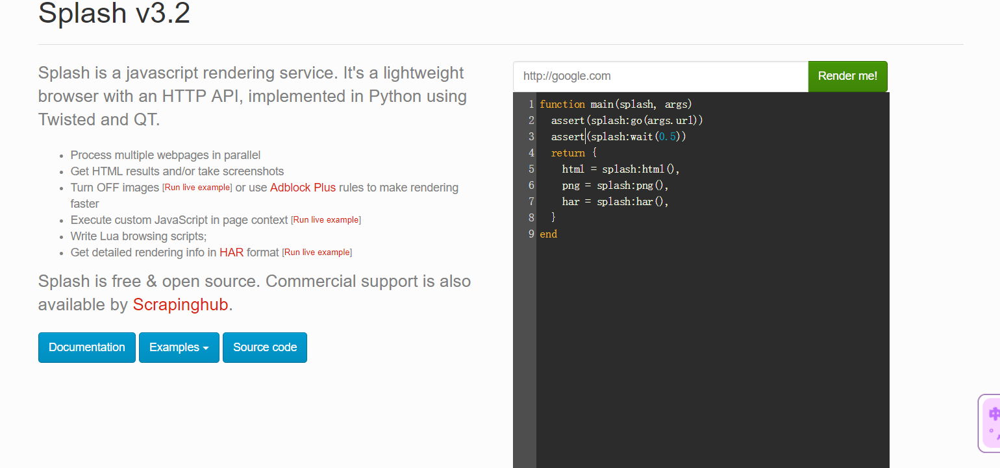

## 爬虫框架

### Scrapy

#### 安装

##### anaconda安装

如果已经安装好了 Anaconda，那么可以通过 conda 命令安装 Scrapy，安装命令如下：

```
conda install Scrapy
```

运行之后便可以完成 Scrapy 的安装。

##### 其他安装

```
pip install scrapy
```

##### 验证



#### 用途

适用于抓取大量数据的时候。

#### 文档

[中文文档](http://scrapy-chs.readthedocs.io)

[官方文档](https://docs.scrapy.org)

#### 框架介绍

##### 架构



scrapy架构可分为如下部分:

- Engine 引擎，处理整个系统的数据流处理、触发事务，是整个框架的核心
- Item 项目，它定义了爬取结果的数据结构，爬取的数据会被赋值成该 Item 对象
- Scheduler 调度器，接受引擎发过来的请求并将其放在队列中，在引擎再次请求的时候将请求提供给引擎
- Downloader 下载器，下载网页内容，并将网页内容返回给蜘蛛
- Spiders 蜘蛛，其内定义了爬取的逻辑和网页 解析规 ，它主要负责解析响应并生成提取结果和新的请求
- Item Pipeline 项目管道，负责处理由蜘蛛从网页中 取的项目，它的主要任务是清洗、验证和存储数据
- Downloader Middlewares 下载器中间件，位于引擎和下载器之 的钩子框架，主要处理引擎与下载器之间的请求及响应
- Spide Middlewares 蜘蛛中间件，位于引擎和蜘蛛之 的钩子框架，主要处理蜘蛛输入的响应和输出的结果及新的请求

##### 数据流

Scrapy 中的数据流由引擎控制，数据流的过程如下

- Engine 引擎，处理整个系统的数据流处理、触发事务，是整个框架的核心
- Item 项目，它定义了爬取结果的数据结构，爬取的数据会被赋值成该 Item 对象
- Scheduler 调度器，接受引擎发过来的请求并将其 列中 在引擎再次请求的时候将请求提供给引擎
- Downloader 下载器，下载网页内容，并将网页 容返回给蜘蛛
- Spiders 蜘蛛，其内定义了爬取的逻辑和网页 解析规 ，它主要负责解析响应并生成提取结果和新的请求
- Item Pipeline 项目管道，负责处理由蜘蛛从网页中获取的项目，它的主要任务是清洗、验证和存储数据
- Downloader Middlewares 下载器中间件，位于引擎和下载器之 的钩子框架，主要处理引擎与下载器之间的请求及响应
- Spide Middlewares 蜘蛛中间件，位于引擎和蜘蛛之 的钩子框架，主要处理蜘蛛输入的响应和输出的结果及新的请求

##### 项目结构

Scrapy 框架和pyspider不同，它是通过命令行来 建项目的，代码 编写还是需要 IDE, 项目

建之后，项目文件结构如下所示

- scrapy.cfg
  - project
    - init.py
    - items.py
    - pipelines.py 
    - settings.py
    - middlewares.py
    - spiders/
      - init .py
      - spider1.py
      - spider2.py

这里各个文件的功能描述如下:

- scrapy.cfg: 它是Scrapy项目的配置文件，其内定义了项目的配置文件路径 部署相关信息等内容
- items.py :它定义Item 数据结构，所有的 Item 的定义都可以放这里
- pipelines.py: 它定义Item Pipeline 的实现，所有的 Item Pipeline 实现都可以放这里
- settings.py: 它定义项目的全局配置
- middlewares.py: 它定义 Spider Middlewares Downloader Middlewares
- spiders: 其内包含 Spider 的实现，每个 Spider 都有一个文件

#### 入门

##### 创建项目

创建 Scrapy 项目，项目文件可以直接用 scrapy 命令生成

```
scrapy startproject myproject
```

文件夹结构如下所示：



```
scrapy. cfg 		# Scrapy 部署时的配置文件
myproject 			#项目的模块 需要从这里引入
    _init_.py
    items.py 		# Items 的定义，定义爬取的数据结构
    middlewares.py 	# Middlewares 的定义，定义爬取时的中间件
    pipelines.py 	# Pipelines 的定义，定义数据管道
    settings.py 	#配置文件
   	spiders 		#放置 Spider 的文件夹
    	_init_ py
```

##### 创建spider

Spider 是自定义的类， Scrapy 用它来从网页里抓取内容，并解析抓取的结果 不过这个类必须继承 Scrapy 提供的 Spider类 scrapy.Spider ，还要定义 Spider 的名称和起始请求，以及怎样处理爬取后的结果的方法。

使用命令行创建一个 Spider：

```
cd myproject
scrapy genspider tff http://thefoxfairy.gitbook.io/
```




进入刚才创建的 myproject文件夹，然后执行 genspider 命令 第一个参数是 Spider 名称，第二个参数是网站域名 执行完毕之后， spiders 文件夹中多了一个 tff.py ，就是刚刚创建的 Spider。

```
# -*- coding: utf-8 -*-
import scrapy


class TffSpider(scrapy.Spider):
    name = 'tff'
    allowed_domains = ['thefoxfairy.gitbook.io']
    start_urls = ['http://thefoxfairy.gitbook.io']

    def parse(self, response):
    	pass
```

这里有四个属性：`name、allowed_domains 和 start_urls `，还有一个方法 `parse`。

- `name `：是每个项目唯一的名字，用来区分不同的 Spider。
- `allowe_domains  `：是允许爬取的域名，如果初始或后续的请求链接不是这个域名下的，则请求链接会被过滤掉。
- `start_urls  `：包含了 Spider 在启动时爬取的 url 列表，初始请求是由它来定义的。
- `parse  `：是 Spider 一个方法 默认情况下，被调用时 start_urls 里面的链接构成的请求完成下载执行后，`返回的响应就会作为唯一的参数传递给这个函数` ，该方法负责解析返回的响应、提取数据或者进一步生成要处理的请求。

##### 定义item

Item 是保存爬取数据的容器，使用方法和字典类似 不过，相比字典， Item 多了额外的保护机制，可以避免拼写错误或者定义字段错误。

创建 Item 需要继承 scrapy.Item 类，并且定义类型为 scrapy.Field 字段。

```
import scrapy

class BaiduItem(scrapy.Item):
    title = scrapy.Field()
```

##### 解析Response

 parse()方法的参数resposne是start_urls 里面的链接爬取后的结果，所以在parse()方法中，可以直接对 response 变量包含的内容进行解析，比如浏览请求结果的网页源代码，或者进一步分析源代码内容，或者找出结果中的链接而得到下一个请求。

提取的方式能够采用 css 选择器或 XPath 选择器。

```
class TffSpider(scrapy.Spider):
    name = 'tff'
    allowed_domains = ['thefoxfairy.gitbook.io']
    start_urls = ['http://thefoxfairy.gitbook.io']

    def parse(self, response):
		title = response.css("title::text").extract_first()
        print("*"*100)
        return title
```

- `::text`：获取节点的正文内容
- `extract_ first()`：获取第一个元素
- `extract()`：获取所有元素，返回列表

##### 使用item

 Item可以理解为一个字典，不过在声明的时候需要实例，然后依次用刚才解析的结果赋值Item的每一个字 段， 后将Item返回即可。

```
from ..items import TffItem

class TffSpider(scrapy.Spider):
    name = 'tff'
    allowed_domains = ['thefoxfairy.gitbook.io']
    start_urls = ['http://thefoxfairy.gitbook.io']

    def parse(self, response):
        item = TffItem()
        item["title"] = response.css("title::text").extract_first()
        print("*"*100)
        return item
```

##### 运行爬虫

格式：

```
scrapy crawl 爬虫名称
```

如下：

```
scrapy crawl tff
```



#### scrapy终端(scrapy shell)

scrapy shell能够很方便的进行调试代码，可以预先通过scrapy shell根据选择器来获取数据。

格式：

```
scrapy shell <url>
```

`<url>` 是要爬取的网页的地址

如下：

```
scrapy shell https://thefoxfairy.gitbook.io/
```

#### selectors选择器

这里选择采用xpath

##### xpath用法

| 表达式           | 描述                                       |
| ---------------- | ------------------------------------------ |
| nodename         | 选取此节点的所有子节点                     |
| /                | 从当前节点选取直接子节点                   |
| //               | 从当前节点选取子孙节点                     |
| .                | 选取当前节点                               |
| ..               | 选取当前节点的父节点                       |
| @                | 选取属性                                   |
| *                | 通配符，选择所有元素节点与元素名           |
| @*               | 选取所有属性                               |
| [@attrib]        | 选取具有给定属性的所有元素                 |
| [@attrib='value] | 选取给定属性具有给定值的所有元素           |
| [tag]            | 选取所有具有指定元素的直接子节点           |
| [tag="text"]     | 选取所有具有指定元素并且文本内容是text节点 |

##### 构造选择器

使用python shell交互模式。

###### 导入模块

```
>>> from scrapy.selector import Selector
>>> from scrapy.http import HtmlResponse
```

###### 构造数据

* 以字符串构造

```
>>> body = '<html><body><span>good</span></body></html>'
>>> Selector(text=body).xpath('//span/text()').extract()
['good']
```

* 以reponse构造

```
>>> response = HtmlResponse(url='http://example.com', body=body,encoding="utf-8")
>>> Selector(response=response).xpath('//span/text()').extract()
['good']
```

可以通过response对象以`.selector`属性方法，达到同样效果

```
>>> response.selector.xpath('//span/text()').extract()
['good']
```

##### 使用选择器

###### 打开shell

```
scrapy shell http://doc.scrapy.org/en/latest/_static/selectors-sample1.html
```

网站源码

```
<html>
 <head>
  <base href='http://example.com/' />
  <title>Example website</title>
 </head>
 <body>
  <div id='images'>
   <a href='image1.html'>Name: My image 1 <br /></a>
   <a href='image2.html'>Name: My image 2 <br /></a>
   <a href='image3.html'>Name: My image 3 <br /></a>
   <a href='image4.html'>Name: My image 4 <br /></a>
   <a href='image5.html'>Name: My image 5 <br /></a>
  </div>
 </body>
</html>
```

###### 提取数据

* 提取所有数据

获取属性id下的所有a标签的文本内容

```
>>> response.xpath('//div[@id="images"]/a/text()').extract()
['Name: My image 1 ',
 'Name: My image 2 ',
 'Name: My image 3 ',
 'Name: My image 4 ',
 'Name: My image 5 ']
```

* 提取第一个匹配的数据

获取属性id下的第一个a标签的文本内容

```
>>> response.xpath('//div[@id="images"]/a/text()').extract_first()
'Name: My image 1 '
```

* 获取属性值

获取a标签的属性href的值

```
>>> response.xpath('//div[@id="images"]//@href').extract()
['image1.html', 'image2.html', 'image3.html', 'image4.html', 'image5.html']
```

* 匹配内容

含有属性值href中值有"image"的所有标签下的href属性值

```
>>> response.xpath('//a[contains(@href, "image")]/@href').extract()
['image1.html', 'image2.html', 'image3.html', 'image4.html', 'image5.html']
```

##### 嵌套选择器

选择器方法( `.xpath()`  )返回相同类型的选择器列表，因此可以对这些选择器调用选择器方法。

```
>>> links = response.xpath('//a[contains(@href, "image")]')
>>> links.extract()
[u'<a href="image1.html">Name: My image 1 <br></a>',
 u'<a href="image2.html">Name: My image 2 <br></a>',
 u'<a href="image3.html">Name: My image 3 <br></a>',
 u'<a href="image4.html">Name: My image 4 <br></a>',
 u'<a href="image5.html">Name: My image 5 <br></a>']

>>> for index, link in enumerate(links):
        args = (index, link.xpath('@href').extract(), link.xpath('img/@src').extract())
        print 'Link number %d points to url %s and image %s' % args

Link number 0 points to url [u'image1.html'] and image [u'image1_thumb.jpg']
Link number 1 points to url [u'image2.html'] and image [u'image2_thumb.jpg']
Link number 2 points to url [u'image3.html'] and image [u'image3_thumb.jpg']
Link number 3 points to url [u'image4.html'] and image [u'image4_thumb.jpg']
Link number 4 points to url [u'image5.html'] and image [u'image5_thumb.jpg']
```

##### 结合正则表达式使用选择器(selectors)

`Selector` 也有一个 `.re()` 方法，用来通过正则表达式来提取数据。然而，不同于使用 `.xpath()` 或者 `.css()` 方法, `.re()` 方法返回unicode字符串的列表。所以无法构造嵌套式的 `.re()` 调用。

```
>>> response.xpath('//a[contains(@href, "image")]/text()').re("Name:\s(.*)\s")
['My image 1', 'My image 2', 'My image 3', 'My image 4', 'My image 5']
```

#### Spiders用法

##### 介绍

Spider类定义了如何爬取某个(或某些)网站。包括了爬取的动作以及如何从网页的内容中提取结构化数据(爬取item)。

爬取步骤：

1. 以初始的URL初始化Request，并设置回调函数。 当该request下载完毕并返回时，将生response，并作为参数传给该回调函数。
2.  spider中初始的request是通过调用 `start_requests()` 来获取的。 `start_requests()` 读取 `start_urls` 中的URL， 并以 `parse `为回调函数生成 `Request `。
3.  在回调函数内分析返回的(网页)内容，返回 `Item `对象、`dict`、 `Request `或者一个包括三者的可迭代容器。 返回的Request对象之后会经过Scrapy处理，下载相应的内容，并调用设置的callback函数(函数可相同)。 在回调函数内，可以使用 选择器(Selectors) (也可以使用BeautifulSoup, pyquery或者想用的任何解析器) 来分析网页内容，并根据分析的数据生成item。 
4. 最后，由spider返回的item将被存到数据库(由某些 Item Pipeline 处理)或使用 Feed exports 存入到文件中。

##### scrapy.Spider

Spider是最简单的spider。每个其他的spider必须继承自该类(包括Scrapy自带的其他spider以及自己编写的spider)。 Spider并没有提供什么特殊的功能。 其仅仅提供了 `start_requests()` 的默认实现，读取并请求spider属性中的 `start_urls`, 并根据返回的结果(resulting responses)调用spider的 `parse `方法。


### Splash

#### 安装

* [docker已安装](../../linux/1.配置篇/安装docker.md)
* 安装Splash

```
docker pull scrapinghub/splash
```

ScrapySplash 会使用 Splash 的 HTTP API 进行页面渲染，所以需要安装 Splash 来提供渲染服务，安装是通过Docker进行安装，在这之前请确保已经正确安装好了 Docker。

安装命令如下：

```
docker run -p 8050:8050 scrapinghub/splash
```

安装完成之后会有类似的输出结果：

```
2020-09-18 14:53:05+0000 [-] Log opened.
2020-09-18 14:53:05.621345 [-] Xvfb is started: ['Xvfb', ':363443614', '-screen', '0', '1024x768x24', '-nolisten', 'tcp']
QStandardPaths: XDG_RUNTIME_DIR not set, defaulting to '/tmp/runtime-splash'
2020-09-18 14:53:06.495091 [-] Splash version: 3.5
2020-09-18 14:53:06.585932 [-] Qt 5.14.1, PyQt 5.14.2, WebKit 602.1, Chromium 77.0.3865.129, sip 4.19.22, Twisted 19.7.0, Lua 5.2
2020-09-18 14:53:06.586182 [-] Python 3.6.9 (default, Jul 17 2020, 12:50:27) [GCC 8.4.0]
2020-09-18 14:53:06.586284 [-] Open files limit: 1048576
2020-09-18 14:53:06.586339 [-] Can't bump open files limit
2020-09-18 14:53:06.629053 [-] proxy profiles support is enabled, proxy profiles path: /etc/splash/proxy-profiles
2020-09-18 14:53:06.629299 [-] memory cache: enabled, private mode: enabled, js cross-domain access: disabled
2020-09-18 14:53:06.836124 [-] verbosity=1, slots=20, argument_cache_max_entries=500, max-timeout=90.0
2020-09-18 14:53:06.836423 [-] Web UI: enabled, Lua: enabled (sandbox: enabled), Webkit: enabled, Chromium: enabled
2020-09-18 14:53:06.836844 [-] Site starting on 8050
2020-09-18 14:53:06.836932 [-] Starting factory <twisted.web.server.Site object at 0x7f75940815c0>
2020-09-18 14:53:06.837234 [-] Server listening on http://0.0.0.0:8050

```

这样就证明 Splash 已经在 8050 端口上运行了。

这时打开：[http://localhost:8050](http://localhost:8050/)即可看到 Splash 的主页



当然 Splash 也可以直接安装在远程服务器上，在服务器上运行以守护态运行 Splash 即可，命令如下：

```
docker run -d -p 8050:8050 scrapinghub/splash
```

在这里多了一个 -d 参数，它代表将 Docker 容器以守护态运行，这样在中断远程服务器连接后不会终止 Splash 服务的运行。

#### 用途

一个页面渲染服务器，返回渲染后的页面，便于爬取，便于规模应用。

#### 文档

[splash官方文档](https://splash.readthedocs.io/en/stable/scripting-ref.html)

[lua中文文档](https://www.runoob.com/lua/lua-basic-syntax.html)

[lua下载](https://github.com/rjpcomputing/luaforwindows/releases)

### Pyspider

#### 安装

```
pip install pyspider
```

验证，启动pyspider

```
pyspider all
```

控制平台如下输出：

```
D:\>pyspider all
Traceback (most recent call last):
  File "d:\programdata\anaconda3\lib\runpy.py", line 193, in _run_module_as_main
    "__main__", mod_spec)
  File "d:\programdata\anaconda3\lib\runpy.py", line 85, in _run_code
    exec(code, run_globals)
  File "D:\ProgramData\Anaconda3\Scripts\pyspider.exe\__main__.py", line 4, in <module>
  File "d:\programdata\anaconda3\lib\site-packages\pyspider\run.py", line 231
    async=True, get_object=False, no_input=False):
        ^
SyntaxError: invalid syntax
```

报错，接下来，进行解决这个问题。

解决方法：按照报错的路径，找到`anaconda\lib\site-packages\pyspider`，进入后将`run.py`中的`async`查找，全部替换为`async_new`。之后对同目录下其他文件夹中的py文件执行相同的操作。替换时要注意大小写，只替换async单个单词为`async_new`。

```
1、\Lib\site-packages\pyspider\run.py 
2、\Lib\site-packages\pyspider\fetcher\tornado_fetcher.py 3、\Lib\site-packages\pyspider\webui\app.py
```

在替换是要注意：**只替换名为async 的变量或参数名。不要图省事选择“全部替换”**

重新运行，发现报如下错误：

```
    from werkzeug.wsgi import DispatcherMiddleware
ImportError: cannot import name 'DispatcherMiddleware' from 'werkzeug.wsgi'
```

发现主要是werkzeug版本不对的问题

```
python -m pip uninstall werkzeug
python -m pip install werkzeug==0.16.0
```

#### 用途

#### 文档

[官方文档](http://docs.pyspider.org/en/latest/)

