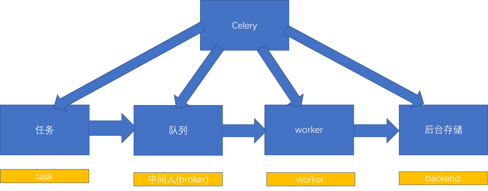

## Flask+Celery

### 安装

```
pip install celery
pip install eventlet
pip install -U "celery[redis]"
```

> 在Windows操作系统上，还需要安装另外一个东西,eventlet

### 相关文档

[celery文档](https://docs.celeryproject.org/en/latest/getting-started/first-steps-with-celery.html)

### 关系



