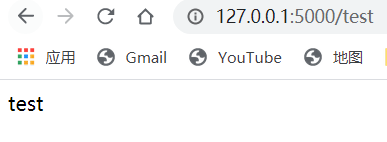
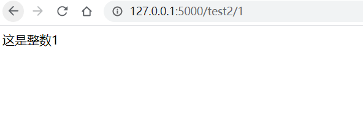
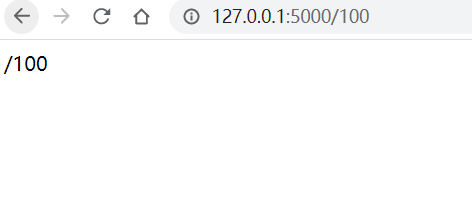
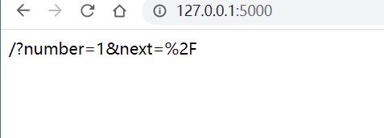
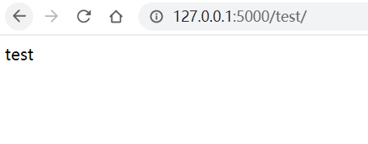
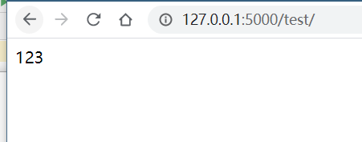
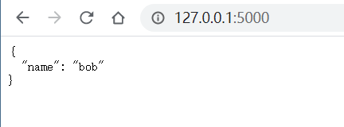

## 路由

### URL与视图函数的映射

#### 传递参数

传递参数的语法是:**<参数名>**,然后在视图函数中，也要定义同名的参数<type: variable>，其中type就是类型名称

* string:默认的数据类型，接受没有任何斜杠"\/"的文本

* int:接受整型

* float:接受浮点类型

* path:和string的类似，但是接受斜杠

* uuid:只接受uuid字符串(唯一,长度过长)。'uuid'只能接受符合'uuid'的字符擦混，'uuid'是一个唯一的字符串，用于做表的主键

* any:可以指定多种路径。'any'数据类型可以在一个"url"中的指定多个路径。

  ```
  import uuid
  print(uuid.uuid4())
  ```

#### 设置参数

1. 固定参数

```
@app.route('/test')
def test():
    return "test"
```




2. 不固定参数，定义参数类型

```
@app.route('/test2/<int:number>')
def test2(number):
    return "这是整数{}".format(number)

@app.route('/test3/<uuid:id>')
def test3(id):
	# uuid测试值：086bbc87-2bcd-4c81-b83d-9c58a306dc7c
    return "这是uuid{}".format(id)
```




3. 多个路径

```
@app.route('/test4/<any(a,b):url_path>/<id>')
def test4(url_path,id):
    if url_path == 'a':
        return "这是{}:{}".format(url_path,id)
    else:
        return"这是{}:{}".format(url_path, id)
```


### 接收用户传递的参数

* 第一种:使用path的形式(将参数嵌入到路径中)，如上

* 第二种:使用查询字符串的方式，传递的参数值形式类似url?key=value

```
from flask import Flask,request

app = Flask(__name__)

@app.route('/test5/')
def test5():
    wd = request.args.get("wd")
    return "查询字符串参数:%s" % wd

if __name__ == '__main__':
    app.run(debug=True)

```

通过request.args.get()获取用户端传递过来的参数值

* 如果页面要做"SEO"优化,推荐使用"path"形式，如果不在搜索引擎优化，就是用查询字符串

### url_for（反转url）

#### url_for的基本使用

```
url_for的第一个参数为视图函数的名字，后面的参数都是进行传递的参数，例如
url_for(view_name,arg1=1,arg2=2),view_name为视图函数名称，arg1与arg2则是进行传递的参数。
```

如下：

```
from flask import Flask,url_for

app = Flask(__name__)

@app.route('/<int:number>')
def index(number):
    return url_for("index",number=number)

if __name__ == '__main__':
    app.run(debug=True)

```




#### 为什么需要用url_for

* 更方便地获取url地址，如果url函数名被改变了，也不会到处去修改

* 'url_for'会自动的处理那些特殊的字符，不需要手动去处理

```
from flask import Flask,url_for

app = Flask(__name__)

@app.route('/')
def index():
    return url_for("index",number=1,next="/")

if __name__ == '__main__':
    app.run(debug=True)

```




> tips：在使用url的时候，不要直接url，应该配合url_for使用，来进行使用url地址

### 自定义url转换器

1.实现一个类，继承自"BaseConverter"

2.在自定义的类中，重写"regex"，也就是这个变量的正则表达式

3.将自定义的类，映射到"app.url_map.Converters"

* 判断path路径是否符合

```
from flask import Flask,url_for
from werkzeug.routing import BaseConverter

app = Flask(__name__)

# 创建一个关于满足于手机号码格式的类
class TelephoneConverter(BaseConverter):
    regex = r"1[34578]\d{9}"

app.url_map.converters["te1"] = TelephoneConverter

@app.route('/phone/<te1:phone>')
def my_phone(phone):
    return "我的手机号码:{}".format(phone)

if __name__ == '__main__':
    app.run(debug=True)

```


> 其中TelephoneConverter为自定义类，app.url_map.converters["te1"] = TelephoneConverter，将自定义类的映射到app.url_map.converters中

* 自定义参数

```
from flask import Flask
from werkzeug.routing import BaseConverter
app = Flask(__name__)

# 创建一个关于满足于手机号码格式的类
class TestConverter(BaseConverter):
    def to_python(self,value):
        return value

    def to_url(self,value):
        return value

app.url_map.converters["test1"] = TestConverter

@app.route('/test/<test1:value>')
def test(value):
    value = str(value).split('+')
    return "{}".format(value)

if __name__ == '__main__':
    app.run(debug=True)

```


比如，想要将"a+b"字符串解析成“a”和“b”两个字符，通过split函数来进行解析，但是有很多函数都有这样的要求的话，每个函数都需要写上这一句，有点小麻烦，可以通过自定义类来机芯解决。

如下，看TestConvert类

```
from flask import Flask
from werkzeug.routing import BaseConverter
app = Flask(__name__)

# 创建一个关于满足于手机号码格式的类
class TestConverter(BaseConverter):
    def to_python(self,value):
        print(value)
        return str(value).split('+')

    def to_url(self,value):
        print(value)
        return '+'.join(value)

app.url_map.converters["test1"] = TestConverter

@app.route('/test/<test1:value>')
def test(value):
    return "{}".format(value)

if __name__ == '__main__':
    app.run(debug=True)
```


其中

* ’to_python‘的作用:这个方法的返回值，将会传递到view函数中作为参数

* 'to_url'的作用:这个方法的返回值，将会在调用url_for函数的时候生成符合要求的URL形式

### 访问

#### 让其他电脑访问我的网站

如果想在同一个局域网下的其他电脑访问自己的电脑上的Flask网站，那么可以设置'host="0.0.0.0"'才能访问得到

```
if __name__ == '__main__':
    app.run(host="0.0.0.0")
```

#### 指定端口号

Flask项目，默认使用'5000'端口，如果想要更换端口，那么可以设置'port=9000'

```
if __name__ == '__main__':
    app.run(port=5001)
```

#### url唯一

在定义url的时候，一定要记住在最后加一个斜杠

1.如果不加斜杠，那么在浏览器中访问这个url的时候，如果最后加了斜杠，那么就访问不到，这样用户体验不太好

2.搜索引擎会将不加斜杠的和加斜杠的示为两个不同的url，而其实加和不加斜杠的都是同一个url，那么就会搜索引擎造成一个误解，加了斜杠，就不会出现没有斜杠的情况

如下：


#### 'GET'请求和'POST'请求

'GET'在网络请求中有许多请求方式，比如'GET'，'POST'，DELETE,PUT请求等，那么最常用的就是'GET'和'POST'请求

1. 'GET'请求:只会在服务上获取资源，不会更改服务器的状态。这种请求方式推荐使用'GET'请求

2. 'POST'请求：会给服务器提交一些数据或者文件，一般POST请求是会对服务器的状态产生影响,那么这种请求推荐使用post请求

3. 关于参数传递:

   * 'GET'请求把参数放到'url'中，通过'?xx=xxx'的形式传递，因为会把参数放到url中，这样会不很安全

   * 'POST'请求:把参数放到'Form Data'中，会把参数放到Form Data中，避免了被偷瞄的风险。可以通过抓包的形式进行分析，因为POST请求可以提交一些数据给服务器，比如可以发送文件，那么就增加了很大的风险。所以POST请求，对于那些有经验的黑客来讲，其实是更不安全

4. 在'Flask'中,'route'方法，默认将只能使用'GET'的方式请求这个url，如果想要设置自己的请求方式，那么应该传递一个'POST'请求

### 重定向

#### 介绍

**重定向**分为**永久性重定向**和**暂时性重定向**，在页面上体现的操作就是浏览器会重一个页面自动跳转另外一个页面，比如用户访问了一个需要权限的页面，但是该用户当前并没有登录，因此我们给它重定向到登录页面

**永久性重定向**:http的状态码是301，多用于旧网址就废弃了要转到一个新的网址确保用户的访问 `www.jingdong.com` ---> `www.jd.com`

**暂时性重定向**:http的状态码是302，表示页面的暂时性跳转。比如访问一个需要权限的网址，如果用户没有登录，应该重定向到登录页面，这种情况下，应该用暂时性重定向

在flask中，重定向是通过flask.redirect(location,code=302)这个函数来实现，location表示需要重定向的url，应该配合之前将的url_for()函数来使用，code表示采用那个重定向，默认是302即暂时性重定向，可以修改成301来实现永久性重定向

#### 函数

```
redirect(location,code)
```

* location：跳转的url地址
* code：状态码

> 配合url_for使用

```
from flask import Flask, redirect, url_for

app = Flask(__name__)

@app.route('/test/')
def test():
    return "test"

@app.route('/test1/')
def test1():
    return redirect(url_for("test"))

if __name__ == '__main__':
    app.run(debug=True)

```



### 视图函数Response

#### 关于响应

视图函数的返回值会被自动转换一个响应对象，flask的转换逻辑如下:

- 如果返回的是一个合法的响应对象，则直接返回
- 如果返回的是一个字符串，那么flask会重新创建一个werkzeug.wrappers.Response对象，Response将给字符串作为主体，状态码是200，MIME类型为text/html,然后返回该Response对象
- 如果返回的是一个元组，元组中的数据类型是(response.status.headers)。status值会覆盖默认的200状态码，headers可以是一个列表或者字典，作为额外的消息头
- 如果以上条件都不满足，Flask会假设返回值是一个合法的wsgi应用程序

#### 自定义响应

自定义响应必须满足三个条件:

- 必须继承自Response类
- 必须实现类方法force_type(cls,rv,environ=None)
- 必须制定app.response_clss为自定义的Response

#### Response函数

##### 返回类型

* 可以返回字符串:返回的字符串其实是底层将这个字符串包装成了一个'Response'对象

* 可以返回元组:元组的形式是(响应体，状态码，头部信息，返回的元组在底层包装成了一个'Response'对象)

* 可以返回'Reponse'及其子类

例如：

```
# 返回内容
@app.route('/test/')
def test():
    return Response("123",status=200,mimetype='text/html')

# 设置cookie
@app.route('/list1/')
def list1():
    # return {"username":"miku"}
    # return ['a','b']
    # 以上数据不接回调，会报错
    resp = Response("list1")
    resp.set_cookie("miku","angle")
    return resp

# 添加响应头
@app.route('/list2/')
def list2():
    return "list2",200,{"X-NAME":"MIKU","Server":"windows2003"}
```



#### 自定义Reponse对象

1. 继承'Response'类

2. 实现方法'force_type(cls,rv,envison=None)'

3. 指定'app.response_class'为自定义的'Response'对象

4. 如果视图返回的数据，不是字符串，也不是元组，也不是Response，那么就会将返回值传给'force_type',然后'force_type'的返回值返回给前端

```
from flask import Flask, Response, jsonify

app = Flask(__name__)

class JsonResponse(Response):

    @classmethod
    def force_type(cls,response,environ=None):
        """
        这个方法只有视图函数返回非字符，非元组，非Response对象才会调用
        :param response:
        :param environ:
        :return:
        response，视图函数的返回值
        """
        # 判断response是否为字典类型
        if isinstance(response,dict):
            response = jsonify(response)

        return super(JsonResponse,cls).force_type(response,environ)

# 添加response类，一定要添加
app.response_class = JsonResponse

# json，非字符，非元组
@app.route('/')
def test():
    return {"name":"bob"}

if __name__ == '__main__':
    app.run(debug=True)

```

