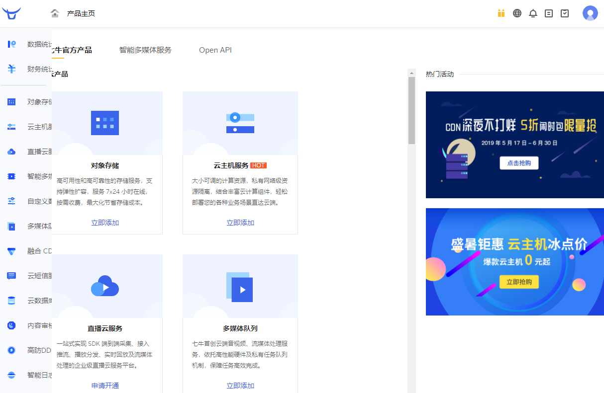
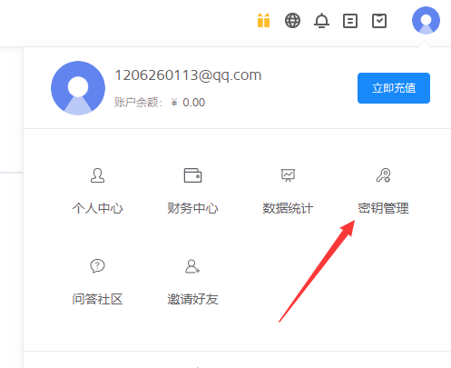
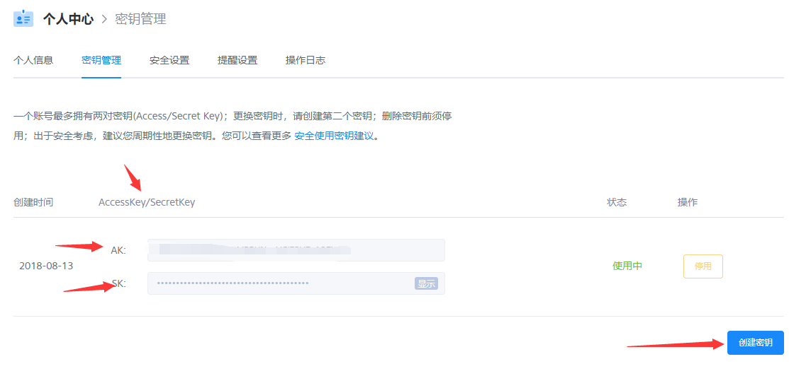
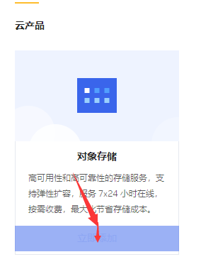
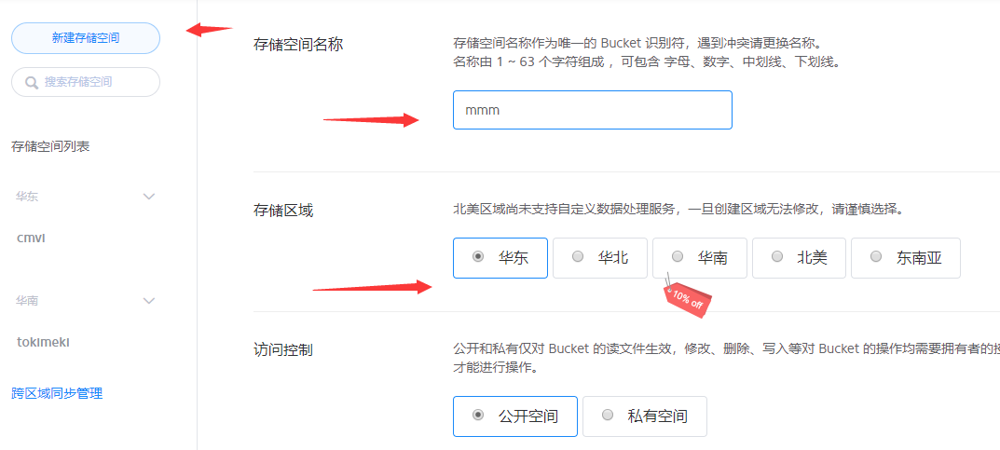
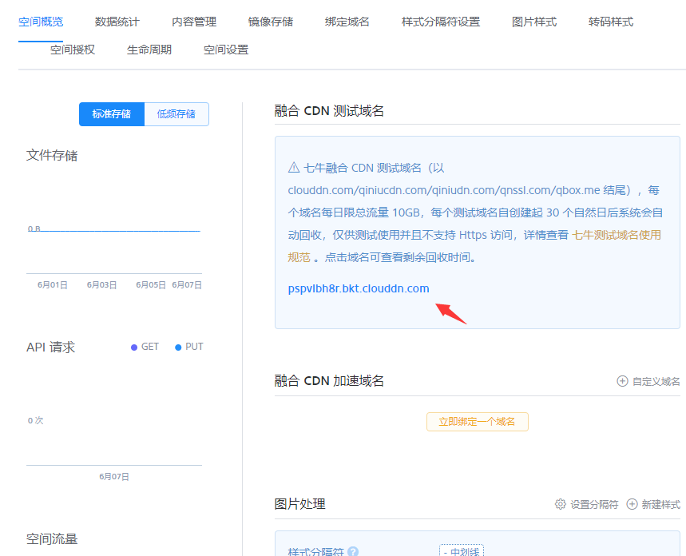
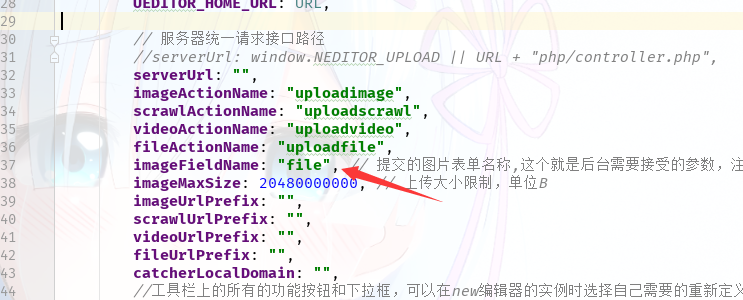
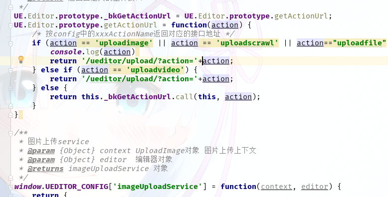

## flask 上传到第三方

### 前言

使用flask搭建，富文本编辑器采用[neditor](https://github.com/notadd/neditor)，neditor是基于[ueditor](http://ueditor.baidu.com)开发的，markdown采用[editor.md](https://pandao.github.io/editor.md/)

一般需求有两种

* 配置富文本编辑器进行图片上传
* 单独实现图片上传

[[完整实例]](../../../data/qiniu_demo.zip)

### 使用七牛云

#### [注册账号](https://sso.qiniu.com/)


#### 主页



#### 获取密钥



#### 创建密钥

在后面会用到密钥



#### 创建存储对象









这是测试域名，后面会用到。

### 如何使用js和七牛云返回的token进行图片上传

#### 生成token

```
# 获取七牛云token
@app.route('/uptoken/')
def uptoken():
    # AK
    access_key = config.UEDITOR_QINIU_ACCESS_KEY
    # SK
    secret_key = config.UEDITOR_QINIU_SECRET_KEY
    # 验证
    q = qiniu.Auth(access_key,secret_key)
    # 储存空间名字
    bucket = config.UEDITOR_QINIU_BUCKET_NAME

    # token
    token = q.upload_token(bucket)

    return jsonify({"uptoken":token})
```

#### 上传图片

```
<!DOCTYPE html>
<html lang="en">
<head>
    <meta charset="UTF-8">
    <script type="text/javascript" src="../static/qiniu-js/jquery.min.js"></script>
    <script type="text/javascript" src="../static/qiniu-js/bootstrap.min.js"></script>
    <script type="text/javascript" src="../static/qiniu-js/moxie.js"></script>
    <script type="text/javascript" src="../static/qiniu-js/plupload.dev.js"></script>
    <!-- <script type="text/javascript" src="bower_components/plupload/js/plupload.full.min.js"></script> -->
    <script type="text/javascript" src="../static/qiniu-js/zh_CN.js"></script>
    <script type="text/javascript" src="../static/qiniu-js/ui.js"></script>
    <script type="text/javascript" src="../static/qiniu-js/qiniu.js"></script>
    <script type="text/javascript" src="../static/qiniu-js/highlight.js"></script>
    <script type="text/javascript">hljs.initHighlightingOnLoad();</script>
    <script src="{{ url_for('static',filename='qiniu-js/zlqiniu.js') }}"></script>
    <script src="{{ url_for('static',filename='upload.js') }}"></script><script></script>
</head>
<body>
    <button id="upload-btn">上传文件</button>
    <input type="text" id="image-input">
    
</body>
</html>
```

```
window.onload = function () {
    var img_kind = "?\t\n" +
        "imageMogr2/auto-orient/thumbnail/100000@/format/jpg/blur/1x0/quality/75|watermark/2/text/5aKo6Z-z/font/5qW35L2T/fontsize/600/fill/IzMxMjRDQQ==/dissolve/43/gravity/SouthEast/dx/10/dy/10|imageslim"
    zlqiniu.setUp({
        'domain': 'http://psodtyzhu.bkt.clouddn.com/',//这是你创建的域名
        'browse_btn': 'upload-btn',//这是按钮id
        'uptoken_url': '/uptoken/',//获取后台生成的token
        'success': function (up, file, info) {
            var domain = up.getOption('domain');
            var obj = JSON.parse(info);
            var image_url = domain + obj.key
            console.log(image_url)
            var imageInput = document.getElementById("image-input");
            imageInput.value = image_url;
            var im = document.getElementById("img");
            im.setAttribute("src", image_url + img_kind);

        }
    });
}
```


### Ueditor的使用

#### 后台上传图片

```
#encoding: utf-8

from flask import (
    Blueprint,
    request,
    jsonify,
    url_for,
    send_from_directory,
    current_app as app
)
import json
import re
import string
import time
import hashlib
import random
import base64
import sys
import os
import config
from urllib import parse
# 更改工作目录。这么做的目的是七牛qiniu的sdk
# 在设置缓存路径的时候默认会设置到C:/Windows/System32下面
# 会造成没有权限创建。
os.chdir(os.path.abspath(sys.path[0]))
try:
    import qiniu
except:
    pass
from io import BytesIO

bp = Blueprint('editor',__name__,url_prefix='/editor')

UEDITOR_UPLOAD_PATH = ""
UEDITOR_UPLOAD_TO_QINIU = False
UEDITOR_QINIU_ACCESS_KEY = config.UEDITOR_QINIU_ACCESS_KEY
UEDITOR_QINIU_SECRET_KEY = config.UEDITOR_QINIU_SECRET_KEY
UEDITOR_QINIU_BUCKET_NAME = config.UEDITOR_QINIU_BUCKET_NAME
UEDITOR_QINIU_DOMAIN = config.UEDITOR_QINIU_DOMAIN
IMG_KIND = r"?imageMogr2/auto-orient/thumbnail/x175/blur/1x0/quality/75|imageslim"

@bp.before_app_first_request
def before_first_request():
    global UEDITOR_UPLOAD_PATH
    global UEDITOR_UPLOAD_TO_QINIU
    global UEDITOR_QINIU_ACCESS_KEY
    global UEDITOR_QINIU_SECRET_KEY
    global UEDITOR_QINIU_BUCKET_NAME
    global UEDITOR_QINIU_DOMAIN
    global IMG_KIND
    UEDITOR_UPLOAD_PATH = app.config.get('UEDITOR_UPLOAD_PATH')
    if UEDITOR_UPLOAD_PATH and not os.path.exists(UEDITOR_UPLOAD_PATH):
        os.mkdir(UEDITOR_UPLOAD_PATH)

    UEDITOR_UPLOAD_TO_QINIU = app.config.get("UEDITOR_UPLOAD_TO_QINIU")
    if UEDITOR_UPLOAD_TO_QINIU:
        try:
            UEDITOR_QINIU_ACCESS_KEY = app.config["UEDITOR_QINIU_ACCESS_KEY"]
            UEDITOR_QINIU_SECRET_KEY = app.config["UEDITOR_QINIU_SECRET_KEY"]
            UEDITOR_QINIU_BUCKET_NAME = app.config["UEDITOR_QINIU_BUCKET_NAME"]
            UEDITOR_QINIU_DOMAIN = app.config["UEDITOR_QINIU_DOMAIN"]
        except Exception as e:
            option = e.args[0]
            raise RuntimeError('请在app.config中配置%s！'%option)

    csrf = app.extensions.get('csrf')
    if csrf:
        csrf.exempt(upload)


def _random_filename(rawfilename):
    letters = string.ascii_letters
    random_filename = str(time.time()) + "".join(random.sample(letters,5))
    filename = hashlib.md5(random_filename.encode('utf-8')).hexdigest()
    subffix = os.path.splitext(rawfilename)[-1]
    return filename + subffix


@bp.route('/upload/',methods=['GET','POST'])
def upload():
    action = request.args.get('action')
    result = {}
    if action == 'config':
        config_path = os.path.join(bp.static_folder or app.static_folder,'ueditor','config.json')
        with open(config_path,'r',encoding='utf-8') as fp:
            result = json.loads(re.sub(r'\/\*.*\*\/','',fp.read()))

    elif action in ['uploadimage', 'uploadvideo', 'uploadfile']:
        image = request.files.get("file")  # neditor的参数
        if not image:
            image = request.files.get("editormd-image-file")  # editor.md的参数
            if not image:
                image = request.files.get("upfile")  # ueditor的参数
        filename = image.filename
        save_filename = _random_filename(filename)
        result = {
            'state': '',
            'url': '',
            'title': '',
            'original': ''
        }
        if UEDITOR_UPLOAD_TO_QINIU:
            if not sys.modules.get('qiniu'):
                raise RuntimeError('没有导入qiniu模块！')
            buffer = BytesIO()
            image.save(buffer)
            buffer.seek(0)
            q = qiniu.Auth(UEDITOR_QINIU_ACCESS_KEY, UEDITOR_QINIU_SECRET_KEY)
            token = q.upload_token(UEDITOR_QINIU_BUCKET_NAME)
            ret,info = qiniu.put_data(token,save_filename,buffer.read())
            if info.ok:
                result['state'] = "SUCCESS"
                result['url'] = parse.urljoin("http://"+config.UEDITOR_QINIU_DOMAIN,ret['key']+IMG_KIND)
                result['title'] = ret['key']
                result['original'] = ret['key']
        else:
            image.save(os.path.join(UEDITOR_UPLOAD_PATH, save_filename))
            result['state'] = "SUCCESS"
            result['url'] = url_for('ueditor.files',filename=save_filename)
            result['title'] = save_filename,
            result['original'] = image.filename

    elif action == 'uploadscrawl':
        base64data = request.form.get("upfile")
        img = base64.b64decode(base64data)
        filename = _random_filename('xx.png')
        filepath = os.path.join(UEDITOR_UPLOAD_PATH,filename)
        with open(filepath,'wb') as fp:
            fp.write(img)
        result = {
            "state": "SUCCESS",
            "url": url_for('files',filename=filename),
            "title": filename,
            "original": filename
        }

    # 这个是editor.md使用时，对应参数
    result.update({"code":200})
    result.update({"success":1})
    result.update({"message":"成功"})
    return jsonify(result)


@bp.route('/files/<filename>/')
def files(filename):
    return send_from_directory(UEDITOR_UPLOAD_PATH,filename)
```

#### 创建ueditor编辑器

* **ueditor.html**

```
<!DOCTYPE html>
<html lang="en">
<head>
    <meta charset="UTF-8">
    <title>ueditor</title>
    <link href="http://cdn.bootcss.com/bootstrap/3.3.7/css/bootstrap.min.css" rel="stylesheet">
    <script src="http://cdn.bootcss.com/bootstrap/3.3.7/js/bootstrap.min.js"></script>
    <script src="http://cdn.bootcss.com/blueimp-md5/2.10.0/js/md5.min.js"></script>
    <script src="{{ url_for("static",filename="ueditor/ueditor.config.js") }}"></script>
    <script src="{{ url_for("static",filename="ueditor/ueditor.all.min.js") }}"></script>
    <script src="{{ url_for("static",filename="ueditor/jquery.min.js") }}"></script>
    <script src="{{ url_for("static",filename="ueditor.js") }}"></script>
</head>
<body>
    <script id="editor" type="text/plain" style="height: 600px"></script>
    <button id="submit-btn"> 点击 </button>
</body>
</html>
```

* **ueditor.js**

```
$(function () {
    var ue = UE.getEditor("editor", {
        'serverUrl': '/editor/upload/',//这个是前面定义的，为了上传图片
        toolbars: [[
            'undo', //撤销
            'redo', //重做
            'bold', //加粗
            'italic', //斜体
            'blockquote', //引用
            'insertcode', //代码语言
            'fontfamily', //字体
            'fontsize', //字号
            'paragraph', //段落格式
            'justifyleft', //居左对齐
            'justifyright', //居右对齐
            'justifycenter', //居中对齐
            'justifyjustify', //两端对齐
            'forecolor', //字体颜色
            'backcolor', //背景色
            'inserttable', //插入表格
            'link', //超链接
            'insertorderedlist', //有序列表
            'insertunorderedlist', //无序列表
            'simpleupload', //单图上传
            'emotion', //表情
            'searchreplace', //查询替换
            'preview',//预览
            'fullscreen', //全屏
            'indent', //首行缩进
            'snapscreen', //截图
            'horizontal', //分隔线
            'italic', //斜体
            'underline', //下划线
            'subscript', //下标
            'superscript', //上标
        ]],
        autoHeight: false
    });


    $("#submit-btn").click(function (event) {
        event.preventDefault();
        var content = ue.getContent();
        console.log(content)

    })
});
```

* 后台设置的参数为"upfile"


### 基于ueditor的neditor的使用

```
<!DOCTYPE html>
<html lang="en">
<head>
    <meta charset="UTF-8">
    <title>neditor</title>
    <script src="{{ url_for("static",filename="neditor/neditor.config.js") }}"></script>
    <script src="{{ url_for("static",filename="neditor/neditor.all.min.js") }}"></script>
    <script src="{{ url_for("static",filename="neditor/neditor.service.js") }}"></script>
    <!--建议手动加在语言，避免在ie下有时因为加载语言失败导致编辑器加载失败-->
    <!--这里加载的语言文件会覆盖你在配置项目里添加的语言类型，比如你在配置项目里配置的是英文，这里加载的中文，那最后就是中文-->
    <script src="{{ url_for("static",filename="neditor/i18n/zh-cn/zh-cn.js") }}"></script>
    <script src="{{ url_for("static",filename="neditor/third-party/browser-md5-file.min.js") }}"></script>
    <script src="{{ url_for("static",filename="neditor/third-party/jquery-1.10.2.min.js") }}"></script>
    <script src="{{ url_for("static",filename="neditor.js") }}"></script>
</head>
<body>
    <script style="height: 400px" id="editor" type="text/plain"></script>

    <button id="submit-btn">点击</button>
</body>
</html>
```

```
$(function () {
    var ue = UE.getEditor("editor", {
        'serverUrl': '/editor/upload/',
        toolbars: [[
            'undo', //撤销
            'redo', //重做
            'bold', //加粗
            'italic', //斜体
            'blockquote', //引用
            'insertcode', //代码语言
            'fontfamily', //字体
            'fontsize', //字号
            'paragraph', //段落格式
            'justifyleft', //居左对齐
            'justifyright', //居右对齐
            'justifycenter', //居中对齐
            'justifyjustify', //两端对齐
            'forecolor', //字体颜色
            'backcolor', //背景色
            'inserttable', //插入表格
            'link', //超链接
            'insertorderedlist', //有序列表
            'insertunorderedlist', //无序列表
            'insertimage', //多图上传
            'simpleupload', //多图上传
            'emotion', //表情
            'searchreplace', //查询替换
            'preview',//预览
            'fullscreen', //全屏
            'indent', //首行缩进
            'snapscreen', //截图
            'horizontal', //分隔线
            'italic', //斜体
            'underline', //下划线
            'subscript', //下标
            'superscript', //上标
        ]],
        autoHeight: false
    });


    $("#submit-btn").click(function (event) {
        event.preventDefault();
        var content = ue.getContent();
        console.log(content)

    })
});
```

和ueditor是没多大区别，这是不能单图上传了，要使用多图上传

注意事项:



"file"是后台需要接收的参数，注意



action是为了后台便于判断文件类型，而设置的参数


这里后台返回的json中需要与neditor定义的接口的参数相对应，不然会一直报错。

### 开源editor.md的使用

```
<!DOCTYPE html>
<html lang="en">
<head>
    <meta charset="UTF-8">
    <title>Title</title>
    <link rel="stylesheet" href="{{ url_for("static",filename="editor.md/examples/css/style.css") }}"/>
    <link rel="stylesheet" href="{{ url_for("static",filename="editor.md/css/editormd.css") }}"/>
    <script src="{{ url_for("static",filename="editor.md/examples/js/jquery.min.js") }}"></script>
    <script src="{{ url_for("static",filename="editor.md/editormd.min.js") }}"></script>
    <script src="{{ url_for("static",filename="editor.md/plugins/image") }}"></script>
    <script src="{{ url_for("static",filename="editor.md.js") }}"></script>
</head>
<body>
<div id="layout">
    <div id="test-editormd">
        <textarea class="editormd-html-textarea" style="display:none;"></textarea>
    </div>
{#    <button class="btn btn-danger" id="submit-btn">发布帖子</button>#}
</div>
</body>
</html>
```

```
var testEdiadtor;

$(function () {
    testEditor = editormd("test-editormd", {
        width: "90%",
        height: 640,
        syncScrolling: "single",
        path: "../../static/editor.md/lib/",
        saveHTMLToTextarea: true,
        fullscreen: true,
        tex: true,                   // 开启科学公式TeX语言支持，默认关闭
        flowChart: true,             // 开启流程图支持，默认关闭
        sequenceDiagram: true,       // 开启时序/序列图支持，默认关闭,
        //dialogLockScreen : false,   // 设置弹出层对话框不锁屏，全局通用，默认为true
        //dialogShowMask : false,     // 设置弹出层对话框显示透明遮罩层，全局通用，默认为true
        //dialogDraggable : false,    // 设置弹出层对话框不可拖动，全局通用，默认为true
        //dialogMaskOpacity : 0.4,    // 设置透明遮罩层的透明度，全局通用，默认值为0.1
        //dialogMaskBgColor : "#000", // 设置透明遮罩层的背景颜色，全局通用，默认为#fff
        //dialogMaskBgColor : "#000", // 设置透明遮罩层的背景颜色，全局通用，默认为#fff
        imageUpload: true,
        imageFormats: ["jpg", "jpeg", "gif", "png", "bmp", "webp"],
        imageUploadURL: "/editor/upload/?action=" + "uploadimage",//这里上传的图片接口
        onload: function () {
            console.log('onload', this);
            this.watch().fullscreen();

            this.width("100%");
            this.height(640);
            this.resize("100%", 640);
        },

        toolbarIcons: function () {
            // Or return editormd.toolbarModes[name]; // full, simple, mini
            // Using "||" set icons align right.
            // return ["undo", "redo", "|", "bold", "hr", "|", "preview", "watch", "|", "fullscreen", "info", "testIcon", "editorIcon", "file", "faicon", "||", "watch", "fullscreen", "preview", "testIcon"]
            // return editormd.toolbarModes["full"]

            //完整工具栏
            //t.toolbarModes={full:["undo","redo","|","bold","del","italic","quote","ucwords","uppercase","lowercase","|","h1","h2","h3","h4","h5","h6","|","list-ul","list-ol","hr","|","link","reference-link","image","code","preformatted-text","code-block","table","datetime","emoji","html-entities","pagebreak","|","goto-line","watch","preview","fullscreen","clear","search","|","help","info"],simple:["undo","redo","|","bold","del","italic","quote","uppercase","lowercase","|","h1","h2","h3","h4","h5","h6","|","list-ul","list-ol","hr","|","watch","preview","fullscreen","|","help","info"],mini:["undo","redo","|","watch","preview","|","help","info"]}

            //需要将自定义图标放入进来
            return ["undo", "redo", "|", "bold", "del", "italic", "quote", "ucwords", "uppercase", "lowercase", "|", "h1", "h2", "h3", "h4", "h5", "h6", "|", "list-ul", "list-ol", "hr", "|", "link", "reference-link", "image", "code", "code-block", "table", "datetime", "emoji", "html-entities", "pagebreak", "|", "goto-line", "watch", "preview", "clear", "search", "||", "help", "info", "editorIcon", "returnIcon", "file", "faicon",]
        },
        //设置图标文本信息
        toolbarIconTexts: {
            editorIcon: "<span style=\"font-family: 华文楷体\">提交</span>", // 如果没有图标，则可以这样直接插入内容，可以是字符串或HTML标签
            returnIcon: "<span style=\"font-family: 华文楷体\">返回</span>"  // 如果没有图标，则可以这样直接插入内容，可以是字符串或HTML标签
        },
        // 用于增加自定义工具栏的功能，可以直接插入HTML标签，不使用默认的元素创建图标
        toolbarCustomIcons: {
            faicon: "<i class=" + "fa fa-star" + 'onclick="alert(' + "'faicon'" + ')";></i>'
        },
        // 自定义工具栏按钮的事件处理
        toolbarHandlers: {
            /**
             * @param {Object}      cm         CodeMirror对象
             * @param {Object}      icon       图标按钮jQuery元素对象
             * @param {Object}      cursor     CodeMirror的光标对象，可获取光标所在行和位置
             * @param {String}      selection  编辑器选中的文本
             */
            editorIcon: function (cm, icon, cursor, selection) {
                alert(testEditor.getHTML())
            },
            returnIcon: function (cm, icon, cursor, selection) {
                window.location.href = "/"
            }
        },
        //提示信息
        lang: {
            toolbar: {
                editorIcon: "提交编辑内容",
                returnIcon: "返回主页",
                undo: "撤销 (Ctrl+Z)"
            }
        },

    });

    $("#submit-btn").click(function (event) {
        event.preventDefault();
        alert(testEditor.getHTML())
        testEditor.getMarkdown();       // 获取 Markdown 源码
        testEditor.getHTML();           // 获取 Textarea 保存的 HTML 源码
        testEditor.getPreviewedHTML();  // 获取预览窗口里的 HTML，在开启 watch 且没有开启 saveHTMLToTextarea 时使用

    })
});

// testEditor.gotoLine(90);//转到第90行
//
// testEditor.show();//显示编辑器
//
// testEditor.hide();//隐藏编辑器
//
// alert(testEditor.getMarkdown());//获取编辑器内容（不含html）
//
// alert(testEditor.getHTML());//获取编辑器html内容
//
// testEditor.watch();//开启双窗口对比
//
// testEditor.unwatch();//取消双窗口对比
//
// testEditor.previewing();//预览效果
//
// testEditor.fullscreen();//全屏（按ESC取消）
//
// testEditor.showToolbar();//显示工具栏
//
// testEditor.hideToolbar();//隐藏工具栏
```

