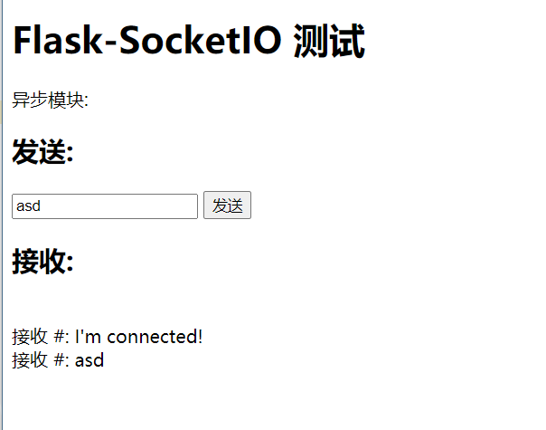

## 消息通知

### 需求

比如，当甲用户给乙用户发送消息，如何能够在乙用户不刷新页面的情况下，获取消息通知的提示，从而阅读消息？

### 解决

通过使用`websocket`就能够在服务端主动推送一些数据给客户端。

### 安装

```
pip install flask_socketio
```

### 导入模块并配置

```
from flask import Flask, render_template
from flask_socketio import SocketIO,emit
import os

app = Flask(__name__)
app.config['SECRET_KEY'] = os.urandom(24)
socketio = SocketIO(app)

if __name__ == '__main__':
    socketio.run(app, host='0.0.0.0', debug=True)
```

`socketio.run()`函数封装了 Web 服务器的启动，并替换了`app.run()`标准的 Flask 开发服务器启动。

当应用程序处于调试模式时，Werkzeug 开发服务器仍然在内部使用和配置正确`socketio.run()`。

### 连接事件

Flask-SocketIO 调度连接和断开事件。以下示例显示如何为它们注册处理程序：

```
@socketio.on('connect', namespace='/test')
def test_connect():
    emit('my response', {'data': 'Connected'})

@socketio.on('disconnect', namespace='/test')
def test_disconnect():
    print('Client disconnected')
```

连接事件处理程序可以选择返回`False`以拒绝连接。这样就可以在此时对客户端进行身份验证。

请注意，连接和断开连接事件将在使用的每个命名空间上单独发送。

### 接收消息

使用 SocketIO 时，双方都会将消息作为事件接收。在客户端使用 Javascript 回调。使用 Flask-SocketIO，服务器需要为这些事件注册处理程序，类似于视图函数处理路由的方式。

以下示例为未命名的事件创建服务器端事件处理程序：

```
@socketio.on('message')
def handle_message(message):
    print('received message: ' + message)
```

上面的示例使用字符串消息。另一种类型的未命名事件使用 JSON 数据：

```
@socketio.on('json')
def handle_json(json):
    print('received json: ' + str(json))
```

最灵活的方式是使用自定义事件名称，在开发过程中最常用的也是这种方式。事件的消息数据可以是字符串，字节，整数或 JSON：

自定义命名事件也可以支持多个参数：

```
@socketio.on('my event')
def handle_my_custom_event(arg1, arg2, arg3):
    print('received args: ' + arg1 + arg2 + arg3)
```

如果未指定名称空间，`'/'`则使用具有名称的默认全局名称空间 。

对于装饰器语法不方便的情况，`on_event`可以使用该方法：

```
def my_function_handler(data):
    pass

socketio.on_event('my event', my_function_handler, namespace='/test')
```

客户端可以请求确认回叫，确认收到他们发送的消息。处理函数返回的任何值都将作为回调函数中的参数传递给客户端：

```
@socketio.on('my event')
def handle_my_custom_event(json):
    print('received json: ' + str(json))
    return 'one', 1
```

在上面的示例中，将使用两个参数调用客户端回调函数，`'one'`和`1`。如果处理程序函数未返回任何值，则将调用客户端回调函数而不带参数。

### 发送消息

如上一节所示定义的 SocketIO 事件处理程序可以使用`send()`和`emit()` 函数将回复消息发送到连接的客户端。

以下示例将收到的事件退回给发送它们的客户端：

```
from flask_socketio import send, emit

@socketio.on('message')
def handle_message(message):
    send(message)

@socketio.on('json')
def handle_json(json):
    send(json, json=True)

@socketio.on('my event')
def handle_my_custom_event(json):
    emit('my response', json)
```

注意如何`send()`和`emit()`分别用于无名和命名事件。

当有命名空间的工作，`send()`并`emit()`默认使用传入消息的命名空间。可以使用可选`namespace`参数指定不同的命名空间：

```
@socketio.on('message')
def handle_message(message):
    send(message, namespace='/chat')

@socketio.on('my event')
def handle_my_custom_event(json):
    emit('my response', json, namespace='/chat')
```

要发送具有多个参数的事件，请发送元组：

```
@socketio.on('my event')
def handle_my_custom_event(json):
    emit('my response', ('foo', 'bar', json), namespace='/chat')
```

SocketIO 支持确认回调，确认客户端收到了一条消息：

```
def ack():
    print 'message was received!'

@socketio.on('my event')
def handle_my_custom_event(json):
    emit('my response', json, callback=ack)
```

使用回调时，Javascript 客户端会收到一个回调函数，以便在收到消息时调用。客户端应用程序调用回调函数后，服务器将调用相应的服务器端回调。如果使用参数调用客户端回调，则这些回调也作为服务器端回调的参数提供。

### 广播

SocketIO 的另一个非常有用的功能是广播消息。SocketIO 支持通过此功能`broadcast=True`可选参数`send()`和`emit()`：

```
@socketio.on('my event')
def handle_my_custom_event(data):
    emit('my response', data, broadcast=True)
```

在启用广播选项的情况下发送消息时，连接到命名空间的所有客户端都会接收它，包括发件人。如果未使用名称空间，则连接到全局名称空间的客户端将收到该消息。请注意，不会为广播消息调用回调。

在此处显示的所有示例中，服务器响应客户端发送的事件。但对于某些应用程序，服务器需要是消息的发起者。这对于向客户端发送通知在服务器中的事件（例如在后台线程中）非常有用。`socketio.send()`和`socketio.emit()`方法可用于广播到所有连接的客户端：

```
def some_function():
    socketio.emit('some event', {'data': 42})
```

请注意，`socketio.send()`与`socketio.emit()`在上下文理解上和`send()`与`emit()`功能不同。另请注意，在上面的用法中没有客户端上下文，因此`broadcast=True`是默认的，不需要指定。

### 房间

对于许多应用程序，有必要将用户分组为可以一起寻址的子集。最好的例子是具有多个房间的聊天应用程序，其中用户从他们所在的房间接收消息，而不是从其他用户所在的其他房间接收消息。SocketIO 支持通过房间的概念`join_room()`和`leave_room()`功能：

```
from flask_socketio import join_room, leave_room

@socketio.on('join')
def on_join(data):
    username = data['username']
    room = data['room']
    join_room(room)
    send(username + ' has entered the room.', room=room)

@socketio.on('leave')
def on_leave(data):
    username = data['username']
    room = data['room']
    leave_room(room)
    send(username + ' has left the room.', room=room)
```

在`send()`和`emit()`函数接受一个可选`room`导致被发送到所有的都在定房客户端的消息的说法。

所有客户端在连接时都会被分配一个房间，以连接的会话ID命名，可以从中获取`request.sid`。给定的客户可以加入任何房间，可以给出任何名称。当客户端断开连接时，它将从其所在的所有房间中删除。无上下文`socketio.send()` 和`socketio.emit()`函数也接受一个`room`参数，以广播给房间中的所有客户端。

由于为所有客户端分配了个人房间，为了向单个客户端发送消息，客户端的会话 ID 可以用作房间参数。

### 错误处理

Flask-SocketIO还可以处理异常：

```
@socketio.on_error()        # Handles the default namespace
def error_handler(e):
    pass

@socketio.on_error('/chat') # handles the '/chat' namespace
def error_handler_chat(e):
    pass

@socketio.on_error_default  # handles all namespaces without an explicit error handler
def default_error_handler(e):
    pass
```

错误处理函数将异常对象作为参数。

还可以使用`request.event`变量检查当前请求的消息和数据参数，这对于事件处理程序外部的错误记录和调试很有用：

```
from flask import request

@socketio.on("my error event")
def on_my_event(data):
    raise RuntimeError()

@socketio.on_error_default
def default_error_handler(e):
    print(request.event["message"]) # "my error event"
    print(request.event["args"])    # (data,)
```

### 基于类的命名空间

作为上述基于装饰器的事件处理程序的替代，属于命名空间的事件处理程序可以创建为类的方法。[`flask_socketio.Namespace`](https://flask-socketio.readthedocs.io/en/latest/#flask_socketio.Namespace)作为基类提供，用于创建基于类的命名空间：

```
from flask_socketio import Namespace, emit

class MyCustomNamespace(Namespace):
    def on_connect(self):
        pass

    def on_disconnect(self):
        pass

    def on_my_event(self, data):
        emit('my_response', data)

socketio.on_namespace(MyCustomNamespace('/test'))
```

使用基于类的命名空间时，服务器接收的任何事件都将调度到名为带有`on_`前缀的事件名称的方法。例如，事件`my_event`将由名为的方法处理`on_my_event`。如果收到的事件没有在命名空间类中定义的相应方法，则忽略该事件。基于类的命名空间中使用的所有事件名称必须使用方法名称中合法的字符。

为了方便在基于类的命名空间中定义的方法，命名空间实例包括类中的几个方法的版本，[`flask_socketio.SocketIO`](https://flask-socketio.readthedocs.io/en/latest/#flask_socketio.SocketIO)当`namespace`没有给出参数时，这些方法 默认为正确的命名空间。

如果事件在基于类的命名空间中具有处理程序，并且还有基于装饰器的函数处理程序，则仅调用修饰的函数处理程序。

### 测试

以上是作为官网文档的翻译，下面来说说写完了代码之后，应该怎么来调试。

```
<script type="text/javascript" src="//cdnjs.cloudflare.com/ajax/libs/socket.io/1.3.6/socket.io.min.js"></script>
<script type="text/javascript" charset="utf-8">
    var socket = io.connect('http://' + document.domain + ':' + location.port);
    socket.on('connect', function() {
        socket.emit('my event', {data: 'I\'m connected!'});
    });
</script>
```

使用 JavaScript 来连接服务端。

**index.html**

```
<!DOCTYPE HTML>
<html>
<head>
    <title>Flask-SocketIO Test</title>
    <script type="text/javascript" src="//code.jquery.com/jquery-1.4.2.min.js"></script>
    <script type="text/javascript" src="//cdnjs.cloudflare.com/ajax/libs/socket.io/1.3.5/socket.io.min.js"></script>
    <script type="text/javascript" charset="utf-8">
        $(document).ready(function() {
            namespace = '/test';
            var socket = io.connect(location.protocol + '//' + document.domain + ':' + location.port + namespace);
            socket.on('connect', function() {
                socket.emit('my_event', {data: 'I\'m connected!'});
            });

            socket.on('my_response', function(msg) {
                $('#log').append('<br>' + $('<div/>').text('接收 #: ' + msg.data).html());
            });

            $('form#emit').submit(function(event) {
                socket.emit('my_event', {data: $('#emit_data').val()});
                return false;
            });
        });
    </script>
</head>
<body>
    <h1>Flask-SocketIO 测试</h1>
    <p>异步模块: <b>{{ async_mode }}</b></p>
    <h2>发送:</h2>
    <form id="emit" method="POST" action='#'>
        <input type="text" name="emit_data" id="emit_data" placeholder="消息">
        <input type="submit" value="发送">
    </form>
    <h2>接收:</h2>
    <div id="log"></div>
</body>
</html>
```

有了这个页面之后，就可以直接在浏览器中输入 http://127.0.0.1:5000 访问服务端了。

**app.py**

```
from flask import Flask, render_template
from flask_socketio import SocketIO,emit,Namespace,send
import os

app = Flask(__name__)
app.config['SECRET_KEY'] = os.urandom(24)
socketio = SocketIO(app)

@socketio.on('connect', namespace='/test')
def test_connect():
    emit('my response', {'data': 'Connected'})

@socketio.on('disconnect', namespace='/test')
def test_disconnect():
    print('Client disconnected')

@socketio.on('message')
def handle_message(message):
    print('received message: ' + message)

@socketio.on('json')
def handle_json(json):
    print('received json: ' + str(json))

@socketio.on('my_event',namespace='/test')
def handle_my_custom_event(data):
    print('data: ' + str(data))
    emit('my_response', data)

# class MyCustomNamespace(Namespace):
#     def on_connect(self):
#         pass
#
#     def on_disconnect(self):
#         pass
#
#     def on_my_event(self, data):
#         emit('my_response', data)
# socketio.on_namespace(MyCustomNamespace('/test'))


@app.route('/')
def index():
    return render_template("index.html")

if __name__ == '__main__':
    socketio.run(app, host='0.0.0.0', debug=True)
```



### redis订阅+websocket

通过将消息推送到redis订阅中，然后redis实时的将信息推送出来。