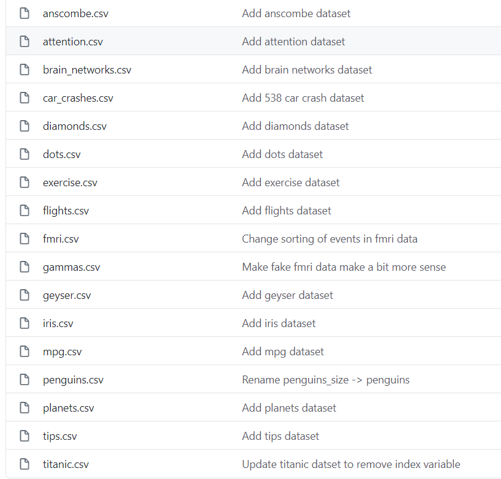
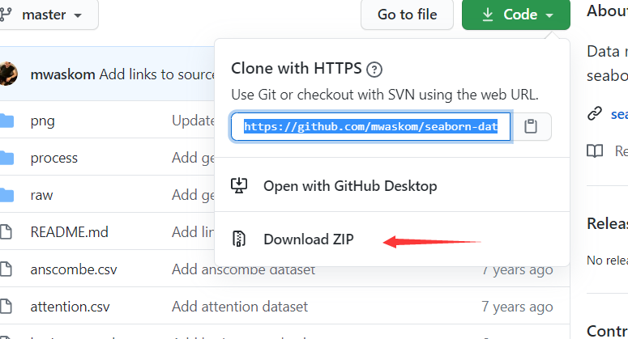
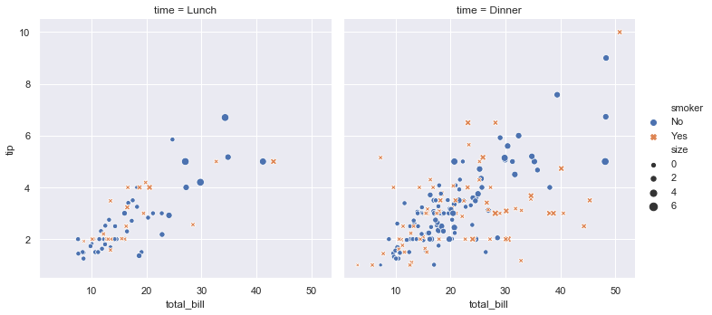

## Seaborn

### 介绍

#### 中文文档

[在线阅读](https://www.cntofu.com/book/172/index.html)

#### 作用

- 计算多变量间关系的面向数据集接口
- 可视化类别变量的观测与统计
- 可视化单变量或多变量分布并与其子数据集比较
- 控制线性回归的不同因变量并进行参数估计与作图
- 对复杂数据进行易行的整体结构可视化
- 对多表统计图的制作高度抽象并简化可视化过程
- 提供多个内建主题渲染 matplotlib 的图像样式
- 提供调色板工具生动再现数据
- 可视化单变量或多变量分布并与其子数据集比较
- 控制线性回归的不同因变量并进行参数估计与作图
- 对复杂数据进行易行的整体结构可视化
- 对多表统计图的制作高度抽象并简化可视化过程
- 提供多个内建主题渲染 matplotlib 的图像样式
- 提供调色板工具生动再现数据

> Seaborn 框架旨在以数据可视化为中心来挖掘与理解数据。它提供的面向数据集制图函数主要是对行列索引和数组的操作，包含对整个数据集进行内部的语义映射与统计整合，以此生成富于信息的图表。

#### 问题

seaborn模块中sns.load_dataset加载文件错误解决方法：

```python
import seaborn as sns
data = sns.load_dataset("tips")
```



出现错误：

```
URLError: <urlopen error [Errno 11004] getaddrinfo failed>
```

出现原因：

```
seaborn-data文件夹里面是空的，可以另外下载该文件夹的内容复制到该文件夹中
```

下载地址：

* [数据集](https://github.com/mwaskom/seaborn-data)

下载位置：



电脑上搜索seaborn-data文件夹，将下载下来的文件解压后全部放进seaborn-data文件夹，重新运行代码，出现结果。

seaborn-data文件夹一般位于C:\Users\xxx目录下

#### 演示

In [1]:

```
import seaborn as sns

# 设置并使用seaborn默认的主题，尺寸大小以及调色板
sns.set()
tips = sns.load_dataset("tips")
tips.head()
```

Out[1]:

|      | total_bill |  tip |    sex | smoker |  day |   time | size |
| ---: | ---------: | ---: | -----: | -----: | ---: | -----: | ---: |
|    0 |      16.99 | 1.01 | Female |     No |  Sun | Dinner |    2 |
|    1 |      10.34 | 1.66 |   Male |     No |  Sun | Dinner |    3 |
|    2 |      21.01 | 3.50 |   Male |     No |  Sun | Dinner |    3 |
|    3 |      23.68 | 3.31 |   Male |     No |  Sun | Dinner |    2 |
|    4 |      24.59 | 3.61 | Female |     No |  Sun | Dinner |    4 |

In [2]:

```
sns.relplot(
    x='total_bill',
    y='tip',
    col='time',
    hue='smoker',
    style='smoker',
    size='size',
    data=tips
)
```

Out[2]:

```
<seaborn.axisgrid.FacetGrid at 0x279c8421188>
```



#### 参数详解

- 设置并使用seaborn默认的主题，尺寸大小

  ```
  sns.set()
  ```

- 加载数据

  ```
  sns.load_dataset('tips')
  ```

- 多子图散点图 

```
seaborn.relplot(x=None, y=None, hue=None, size=None, style=None, data=None, row=None, col=None, col_wrap=None, row_order=None, col_order=None, palette=None, hue_order=None, hue_norm=None, sizes=None, size_order=None, size_norm=None, markers=None, dashes=None, style_order=None, legend='brief', kind='scatter', height=5, aspect=1, facet_kws=None, **kwargs)
```

1. 'x'与'y'：分别为x，y轴的对应数值变量，即一个点的位置1
2. 'size'：表示影响出现的点的大小
3. 'time：'表示类别，将散点图分为两个子图，
4. 'smoker'：表示决定点的形状
5. 'hue'：分组变量将产生具有不同颜色的元素。可以是分类的也可以是数字的，尽管颜色映射在后一种情况下的行为会有所不同。
6. 'style'：分组变量将产生具有不同样式的元素。可以具有数字dtype，但始终将其视为分类的。
7. row, col：分类变量，将确定网格的构面。
8. kind：绘制的情节类型，对应于以往的关系情节。选项为{ scatter和line}。
9. data：整齐（“长格式”）数据帧，其中每一列都是变量，每一行都是观察值。
10. legend：如何绘制图例。如果为“简要”，则数字hue和size变量将以均匀间隔的值的样本表示。如果“已满”，每个组将在图例中获得一个条目。如果为False，则不会添加图例数据，也不会绘制图例。
11. facet_kws：要传递给的其他关键字参数的字典FacetGrid。

### 安装

```py
pip install seaborn
```

or

```py
conda install seaborn
```

### 可视化统计关系

### 用分类数据绘图

### 可视化数据集的分部

### 可视化线性关系

### 建立结构化的多图网络