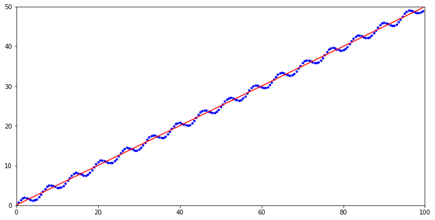

## 线性回归

### 最小二乘法

#### 前提

假设数据集$$\mathcal{D}=\{(x_1, y_1),(x_2, y_2),\cdots,(x_N, y_N)\}$$，$$x_i\in\mathbb{R},y_i\in\mathbb{R},i=1,2,\cdots,N$$,记为：
$$
\begin{align}
X&=(x_1,x_2,\cdots,x_N)^T \\
 &= 
    \begin{bmatrix}
         x_{1}^T  \\
         x_{2}^T  \\
         \vdots  \\
         x_{N}^T  \\
    \end{bmatrix}_{N\times p} \\
     & =
    \begin{bmatrix}
         x_{11} &  x_{12} & \cdots & x_{1p} \\
         x_{21} &  x_{22} & \cdots & x_{2p} \\
         \vdots &  \vdots  & \ddots  & \vdots \\
         x_{N1} &  x_{N2} & \cdots & x_{Np} \\
    \end{bmatrix}_{N\times p} \\
\end{align}
$$

$$
\begin{align}
Y&=(y_1,y_2,\cdots,y_N)^T \\
  &= 
    \begin{bmatrix}
         y_{1}^T  \\
         y_{2}^T  \\
         \vdots  \\
         y_{N}^T  \\
    \end{bmatrix}_{N\times p} \\
     & =
    \begin{bmatrix}
         y_{11} &  y_{12} & \cdots & y_{1p} \\
         y_{21} &  y_{22} & \cdots & y_{2p} \\
         \vdots &  \vdots  & \ddots  & \vdots \\
         y_{N1} &  y_{N2} & \cdots & y_{Np} \\
    \end{bmatrix}_{N\times p} \\
\end{align}
$$

线性回归假设：
$$
f(w)=w^Tx
$$

如图：

#### 定义

采用二范数定义的平方误差来定义损失函数：
$$
\begin{align}

L(w)&=\sum\limits_{i=1}^N||w^Tx_i-y_i||^2_2 \\
& = \sum\limits_{i=1}^N(w^Tx_i-y_i)^2 \\
&=(w^Tx_1-y_1,\cdots,w^Tx_N-y_N)\cdot (w^Tx_1-y_1,\cdots,w^Tx_N-y_N)^T\nonumber \\
&=(w^TX^T-Y^T)\cdot (Xw-Y) \\
&=w^TX^TXw-Y^TXw-w^TX^TY+Y^TY\nonumber \\
&=w^TX^TXw-2w^TX^TY+Y^TY
\end{align}
$$
最小化值$$ \hat{w}$$ ：
$$
\begin{align}
\hat{w}=\mathop{argmin}\limits_wL(w)&\longrightarrow\frac{\partial}{\partial w}L(w)=0\nonumber\\
&\longrightarrow2X^TX\hat{w}-2X^TY=0\nonumber\\
&\longrightarrow \hat{w}=(X^TX)^{-1}X^TY=X^+Y
\end{align}
$$

> $$(X^TX)^{-1}X^T$$记为$$X^+$$(伪逆)

这个式子中 $$(X^TX)^{-1}X^T$$ 又被称为伪逆。对于行满秩或者列满秩的 $$X$$，可以直接求解，但是对于非满秩的样本集合，需要使用奇异值分解（SVD）的方法，对 $$X$$ 求奇异值分解，得到：
$$
X=U\Sigma V^T
$$
于是：
$$
X^+=V\Sigma^{-1}U^T
$$

### 正则化

