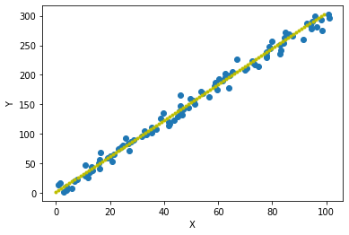
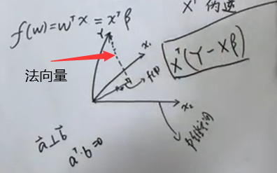

## 线性回归

### 最小二乘法

#### 前提

假设数据集$$\mathcal{D}=\{(x_1, y_1),(x_2, y_2),\cdots,(x_N, y_N)\}$$，$$x_i\in\mathbb{R},y_i\in\mathbb{R},i=1,2,\cdots,N$$,记为：
$$
\begin{align}
X&=(x_1,x_2,\cdots,x_N)^T \\
 &= 
    \begin{bmatrix}
         x_{1}^T  \\
         x_{2}^T  \\
         \vdots  \\
         x_{N}^T  \\
    \end{bmatrix}_{N\times p} \\
     & =
    \begin{bmatrix}
         x_{11} &  x_{12} & \cdots & x_{1p} \\
         x_{21} &  x_{22} & \cdots & x_{2p} \\
         \vdots &  \vdots  & \ddots  & \vdots \\
         x_{N1} &  x_{N2} & \cdots & x_{Np} \\
    \end{bmatrix}_{N\times p} \\
\end{align}
$$

$$
\begin{align}
Y&=(y_1,y_2,\cdots,y_N)^T \\
  &= 
    \begin{bmatrix}
         y_{1}^T  \\
         y_{2}^T  \\
         \vdots  \\
         y_{N}^T  \\
    \end{bmatrix}_{N\times p} \\
     & =
    \begin{bmatrix}
         y_{11} &  y_{12} & \cdots & y_{1p} \\
         y_{21} &  y_{22} & \cdots & y_{2p} \\
         \vdots &  \vdots  & \ddots  & \vdots \\
         y_{N1} &  y_{N2} & \cdots & y_{Np} \\
    \end{bmatrix}_{N\times p} \\
\end{align}
$$

线性回归假设：
$$
f(w)=w^Tx
$$

如图：

#### 定义

采用二范数定义的平方误差来定义损失函数：
$$
\begin{align}

L(w)&=\sum\limits_{i=1}^N||w^Tx_i-y_i||^2_2 \\
& = \sum\limits_{i=1}^N(w^Tx_i-y_i)^2 \\
&=(w^Tx_1-y_1,\cdots,w^Tx_N-y_N)\cdot (w^Tx_1-y_1,\cdots,w^Tx_N-y_N)^T\nonumber \\
&=(w^TX^T-Y^T)\cdot (Xw-Y) \\
&=w^TX^TXw-Y^TXw-w^TX^TY+Y^TY\nonumber \\
&=w^TX^TXw-2w^TX^TY+Y^TY
\end{align}
$$
最小化值$$ \hat{w}$$ ,，进行求导：
$$
\begin{align}
\hat{w}=\mathop{argmin}\limits_wL(w)&\longrightarrow\frac{\partial}{\partial w}L(w)=0\nonumber\\
&\longrightarrow2X^TX\hat{w}-2X^TY=0\nonumber\\
&\longrightarrow \hat{w}=(X^TX)^{-1}X^TY=X^+Y
\end{align}
$$

> $$(X^TX)^{-1}X^T$$记为$$X^+$$(伪逆)

这个式子中 $$(X^TX)^{-1}X^T$$ 又被称为伪逆。对于行满秩或者列满秩的 $$X$$，可以直接求解，但是对于非满秩的样本集合，需要使用奇异值分解（SVD）的方法，对 $$X$$ 求奇异值分解，得到：
$$
X=U\Sigma V^T
$$
于是：
$$
X^+=V\Sigma^{-1}U^T
$$

在几何上，最小二乘法相当于模型（这里就是直线）和试验值的距离的平方求和，假设我们的试验样本张成一个 $p$ 维空间（满秩的情况）：$$X=Span(x_1,\cdots,x_N)$$，而模型可以写成 $$f(w)=w^Tx=X^T\beta$$，反过来看，也就是 $$x_1,\cdots,x_N$$ 的某种组合，而最小二乘法就是说希望 $$Y$$ 和这个模型距离越小越好，于是它们的差应该与这个张成的空间垂直：

$$
X^T\cdot(Y-X\beta)=0\longrightarrow\beta=(X^TX)^{-1}X^TY
$$

> 提示：$$ \vec a \perp\vec b => a^T \cdot b = 0 $$

### 噪声为高斯分布的 MLE

对于一维的情况，记  $$y=w^Tx+\epsilon,\epsilon\sim\mathcal{N}(0,\sigma^2)$$，那么 $$y\sim\mathcal{N}(w^Tx,\sigma^2) $$。代入极大似然估计中：

其中正态分布函数的概率密度为$$p(y|x_iw)=\frac{1}{\sqrt{2\pi\sigma}}e^{-\frac{(y_i-w^Tx_i)^2}{2\sigma^2}}$$
$$
\begin{align}
L(w)=\log p(Y|X,w)&=\log\prod\limits_{i=1}^Np(y_i|x_i,w)\nonumber\\
&=\sum\limits_{i=1}^N\log(\frac{1}{\sqrt{2\pi\sigma}}e^{-\frac{(y_i-w^Tx_i)^2}{2\sigma^2}})\\
&=\sum\limits_{i=1}^N\big ( \log\frac{1}{\sqrt{2\pi\sigma}}+\log e^{-\frac{(y_i-w^Tx_i)^2}{2\sigma^2}} \big )\\
&=\sum\limits_{i=1}^N \big ( \log\frac{1}{\sqrt{2\pi\sigma}}- \frac{(y_i-w^Tx_i)^2}{2\sigma^2} \big )\\

\mathop{argmax}\limits_wL(w)&=\mathop{argmin}\limits_w\sum\limits_{i=1^N}(y_i-w^Tx_i)^2
\end{align}
$$
