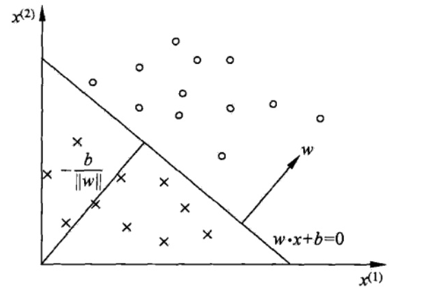

## 线性分类

对于分类任务，线性回归模型就无能为力了，但是可以在线性模型的函数进行后再加入一层激活函数，这个函数是非线性的，激活函数的反函数叫做链接函数。有两种线性分类的方式：

1.  硬分类，直接需要输出观测对应的分类。这类模型的代表为：
    1.  线性判别分析（Fisher 判别）（Filsher Discriminant Analysis）
    2.  感知机 （Perception）
2.  软分类，产生不同类别的概率，这类算法根据概率方法的不同分为两种
    1.  生成式（根据贝叶斯定理先计算参数后验，再进行推断）（概率生成模型）：高斯判别分析（GDA）和朴素贝叶斯等为代表
        1.  GDA（连续）
        2.  Naive Bayes (离散)
    2.  判别式（直接对条件概率进行建模）（概率判别模型）：逻辑回归（Logistic Regression）

### 感知机（1957）

模型：$$f(x)=sign(w^Tx)，x_i\in\mathbb{R},y_i\in\mathbb{R},i=1,2,\cdots,N $$
$$
\begin{align}
sign(a)&= \left\{  
    \begin{array}{**lr**}  
        +1, & a<0\\ 
        -1, & a>0\\  
    \end{array}  
\right. \\
\end{align}
$$

这样可以将线性回归的结果映射到两分类的结果上。

定义损失函数为错误分类的数目，比较直观的方式是使用指示函数，但是指示函数不可导，因此可以定义：
$$
\begin{align}
L(w)&=\sum\limits_{i=1}^NI\{y_iw^Tx_i<0\}\\
&=\sum\limits_{x_i\in\mathcal{D}_{wrong}}-y_iw^Tx_i
\end{align}
$$
其中，$$\mathcal{D}_{wrong} $$是错误分类集合，实际在每一次训练的时候，我们采用梯度下降(SGD)的算法。损失函数对 $w$ 的偏导为：
$$
\frac{\partial}{\partial w}L(w)=\sum\limits_{x_i\in\mathcal{D}_{wrong}}-y_ix_i
$$
但是如果样本非常多的情况下，计算复杂度较高，但是，实际上并不需要绝对的损失函数下降的方向，只需要损失函数的期望值下降，但是计算期望需要知道真实的概率分布，实际只能根据训练数据抽样来估算这个概率分布（经验风险）：
$$
\mathbb{E}_{\mathcal D}[\mathbb{E}_\hat{p}[\nabla_wL(w)]]=\mathbb{E}_{\mathcal D}[\frac{1}{N}\sum\limits_{i=1}^N\nabla_wL(w)]
$$
 $$N $$ 越大，样本近似真实分布越准确，但是对于一个标准差为 $\sigma$ 的数据，可以确定的标准差仅和 $$\sqrt{N} $$ 成反比，而计算速度却和 $$N$$ 成正比。因此可以每次使用较少样本，则在数学期望的意义上损失降低的同时，有可以提高计算速度，如果每次只使用一个错误样本，有下面的更新策略（根据泰勒公式，在负方向）：
$$
w^{t+1}\leftarrow w^{t}+\lambda y_ix_i
$$
是可以收敛的，同时使用单个观测更新也可以在一定程度上增加不确定度，从而减轻陷入局部最小的可能。在更大规模的数据上，常用的是小批量随机梯度下降法。

### 线性判别分析 LDA

假设，
$$
\begin{align}
X&=(x_1,x_2,\cdots,x_N)^T 
 = 
    \begin{bmatrix}
         x_{1}^T  \\
         x_{2}^T  \\
         \vdots  \\
         x_{N}^T  \\
    \end{bmatrix}_{N\times p} \\
    Y & =   
    \begin{bmatrix}
         y_{1}  \\
         y_{2}  \\
         \vdots \\
         y_{N}  \\
    \end{bmatrix}_{N\times 1} \\
    &\\
    & \{(x_i,y_I) \}^N_{i+1}，x_i\in\mathbb{R}^p,y_i\in
    \{+1 ,-1\}，其中+1\rightarrow c1,-1\rightarrow c2 \\\\
    & x_{c1} = \{x_i|y_i=+1\},x_{c2} = \{x_i|y_i=-1\} \\\\
    &|x_{c1}| = N_1,|x_{c2}|=N2,N=N_1+N_2
    
\end{align}
$$
在 LDA 中，基本想法是选定一个方向，将试验样本顺着这个方向投影，投影后的数据需要满足两个条件，从而可以更好地分类：

1.  相同类内部的试验样本距离接近。
2.  不同类别之间的距离较大。

首先是投影，假定原来的数据是向量 $$x $$，那么顺着 $$w$$ 方向的投影就是标量：
$$
z=w^T\cdot x(=|w|\cdot|x|\cos\theta)=>z_i = w^Tx_i
$$

方差为：
$$
\begin{align}
z_i & = w^Tx_i\\
\overline{z}&=\frac{1}{N}\sum\limits_{i=1}^{N}z_i=\frac{1}{N}\sum\limits_{i=1}^{N}w^Tx_i
\\
S_z&=\frac{1}{N}\sum\limits_{i=1}^{N}(z_i-\overline{z})(z_i-\overline{z})^T\nonumber\\
&=\frac{1}{N}\sum\limits_{i=1}^{N}(w^Tx_i-\overline{z})(w^Tx_i-\overline{z})^T\nonumber
\end{align}
$$
对第一点，相同类内部的样本更为接近，假设属于两类的试验样本数量分别是 $$N_1 $$和 $$N_2$$，那么采用方差矩阵来表征每一个类内的总体分布，这里使用了协方差的定义，用 $$S$$ 表示原数据的协方差：
$$
\begin{align}
C_1:Var_z[C_1]&=\frac{1}{N_1}\sum\limits_{i=1}^{N_1}(z_i-\overline{z_{c1}})(z_i-\overline{z_{c1}})^T\nonumber\\
&=\frac{1}{N_1}\sum\limits_{i=1}^{N_1}(w^Tx_i-\frac{1}{N_1}\sum\limits_{i=1}^{N_1}w^Tx_i)(w^Tx_i-\frac{1}{N_1}\sum\limits_{i=1}^{N_1}w^Tx_i)^T\nonumber\\
&=w^T\frac{1}{N_1}\sum\limits_{i=1}^{N_1}(x_i-\overline{x_{c1}})(x_i-\overline{x_{c1}})^Tw\nonumber\\
&=w^TS_1w\\
C_2:Var_z[C_2]&=\frac{1}{N_2}\sum\limits_{i=1}^{N_2}(z_i-\overline{z_{c2}})(z_i-\overline{z_{c2}})^T\nonumber\\
&=w^TS_2w
\end{align}
$$
所以类内距离可以记为：
$$
\begin{align}
Var_z[C_1]+Var_z[C_2]=w^T(S_1+S_2)w
\end{align}
$$
对于第二点，可以用两类的均值表示这个距离：
$$
\begin{align}
(\overline{z_{c1}}-\overline{z_{c2}})^2&=(\frac{1}{N_1}\sum\limits_{i=1}^{N_1}w^Tx_i-\frac{1}{N_2}\sum\limits_{i=1}^{N_2}w^Tx_i)^2\nonumber\\
&=(w^T(\overline{x_{c1}}-\overline{x_{c2}}))^2\nonumber\\
&=w^T(\overline{x_{c1}}-\overline{x_{c2}})(\overline{x_{c1}}-\overline{x_{c2}})^Tw
\end{align}
$$
综合这两点，由于协方差是一个矩阵，于是将这两个值相除来得到**损失函数**，并最大化这个值：
$$
\begin{align}
\hat{w}=\mathop{argmax}\limits_wJ(w)&=\mathop{argmax}\limits_w\frac{(\overline{z_{c1}}-\overline{z_{c2}})^2}{Var_z[C_1]+Var_z[C_2]}\nonumber\\
&=\mathop{argmax}\limits_w\frac{w^T(\overline{x_{c1}}-\overline{x_{c2}})(\overline{x_{c1}}-\overline{x_{c2}})^Tw}{w^T(S_{c1}+S_{c2})w}\nonumber\\
&=\mathop{argmax}\limits_w\frac{w^TS_bw}{w^TS_ww}
\end{align}
$$

> 其中$$S_b:betwwen-class$$ 类间方差，$$S_w:with-class$$ 类内方差
>
> $$S_b=(\overline{x_{c1}}-\overline{x_{c2}})(\overline{x_{c1}}-\overline{x_{c2}})$$
>
> $$S_w=S_{c1}+S_{c2}$$

这样，就把损失函数和原数据集以及参数结合起来了。下面对这个损失函数求偏导，注意其实对 $$ w $$ 的绝对值没有任何要求，只对方向有要求，因此只要一个方程就可以求解了：
$$
\begin{align}
&\frac{\partial}{\partial w}J(w)=2S_bw(w^TS_ww)^{-1}-2w^TS_bw(w^TS_ww)^{-2}S_ww=0\nonumber\\

&\Longrightarrow S_bw(w^TS_ww)=(w^TS_bw)S_ww\nonumber\\
&\Longrightarrow S_ww=\frac {w^TS_ww}{w^TS_bww} S_bw\nonumber\\

&\Longrightarrow w=\frac {w^TS_ww}{w^TS_bww} S_w^{-1}S_bw\\
&\Longrightarrow w=\propto S_w^{-1}S_bw=S_w^{-1}(\overline{x_{c1}}-\overline{x_{c2}})(\overline{x_{c1}}-\overline{x_{c2}})^Tw\propto S_w^{-1}(\overline{x_{c1}}-\overline{x_{c2}})
\end{align}
$$

> $$
> w：p\times 1\\w^T：1\times p\\S_w：p\times p\\S_b:p\times p \\
> w^TS_ww:1 \times p - p \times p - p \times 1 =>1 \times 1 ==> 一个常数 \\
> w^TS_bw:1 \times p - p \times p - p \times 1 =>1 \times 1 ==> 一个常数
> $$

于是 $$ S_w^{-1}(\overline{x_{c1}}-\overline{x_{c2}}) $$ 就是需要寻找的方向。最后可以归一化求得单位的 $$w$$ 值。

### 概率判别模型-Logistic 回归

假设，$$Data:\{(x_i,y_i)\}^N_{i=1}x_i\in\mathbb{R^p},y_i\in\{0,1\}$$

有时候只要得到一个类别的概率，那么需要一种能输出 $$[0,1]$$ 区间的值的函数。考虑两分类模型，利用判别模型，希望对 $$p(C|x)$$ 建模，利用贝叶斯定理：

$$
p(C_1|x)=\frac{p(x|C_1)p(C_1)}{p(x|C_1)p(C_1)+p(x|C_2)p(C_2)}
$$
取 $$z=\ln\frac{p(x|C_1)p(C_1)}{p(x|C_2)p(C_2)}$$，于是：
$$
p(C_1|x)=\frac{1}{1+e^{-z}}
$$
即，
$$
sigmod \ function：Sigmod(z) = \frac{1}{1+e^{-z}},

\left\{  
    \begin{array}{**lr**}  
        当z\rightarrow \infty  , lim Sigmod(z) = 1 \\
        当z\rightarrow 0  , lim Sigmod(z) = \frac{1}{2} \\
        当z\rightarrow -\infty  , lim Sigmod(z) = 0 \\
    \end{array} 
\right. \\
$$

上面的式子叫 `Logistic Sigmoid` 函数，其参数表示了两类联合概率比值的对数。在判别式中，不关心这个参数的具体值，模型假设直接对 $a$ 进行。

`Logistic `回归的模型假设是：
$$
z=w^Tx
$$
于是，通过寻找 $$w$$ 的最佳值可以得到在这个模型假设下的最佳模型。概率判别模型常用最大似然估计的方式来确定参数。

对于一次观测，获得分类 $$y $$ 的概率为（假定$$C_1=1,C_2=0$$）：

有，
$$
p_1 = p(y=1|x) = Sigmod(w^Tx) = \frac{1} {1+e^{-w^Tx}},y=1 \\
p_0 = p(y=0|x) = 1-p(y=1|x)   = \frac{e^{-w^Tx}} {1+e^{-w^Tx}},y=0 \\
$$
于是，综合表达：
$$
\begin{align}
p(y|x)&=p_1^yp_0^{1-y} \\
&=> log \ p(y|x) = y log \ p_1+(1-y)log \ p_2
\end{align}
$$
那么对于 $$N$$ 次独立全同的观测 `MLE(极大似然估计)`为：
$$
\begin{align}
MLE:\hat{w}
&=\mathop{argmax}_wJ(w)\\
&=\mathop{argmax}_wlog \ p(Y|X)\\
&=\mathop{argmax}_wlog\prod_{i=1}^N  \ p(y_i|x_i)\\
&=\mathop{argmax}_w\sum\limits_{i=1}^N log \ p(y_i|x_i)\\

&=\mathop{argmax}_w\sum\limits_{i=1}^N(y_i\log p_1+(1-y_i)\log p_0)
\end{align}
$$
对这个函数求导数，注意到：
$$
p_1'=(\frac{1}{1+\exp(-z)})'=p_1(1-p_1)
$$

则：
$$
\begin{align}
J'(w)&=\sum\limits_{i=1}^N[y_i(1-p_1)x_i-p_1x_i+y_ip_1x_i] \\

&=\sum\limits_{i=1}^N(y_i-p_1)x_i
\end{align}
$$
由于概率值的非线性，放在求和符号中时，这个式子无法直接求解。于是在实际训练的时候，和感知机类似，也可以使用不同大小的批量随机梯度上升（对于最小化就是梯度下降）来获得这个函数的极大值。

> $$MLE^{max}$$=>$$loss \ function (min \ cross \ entropy)$$

### 概率生成模型-高斯判别分析 GDA

#### 模型定义

#### 模型求解

##### 求期望

##### 求协方差

### 概率生成模型-朴素贝叶斯

