## Fiddler

### 安装

[下载地址](https://www.telerik.com/fiddler)

### 介绍

#### 描述

Fiddler是位于客户端和服务器端的HTTP代理。目前最常用的http抓包工具之一，其功能非常强大，是web调试的利器。

#### 功能

- 监控浏览器所有的HTTP/HTTPS流量
- 查看. 分析请求内容细节
- 伪造客户端请求
- 测试网站的性能
- 解密HTTPS的web会话
- 全局. 局部断点功能
- 第三方插件

#### 使用场景

- 接口调试. 接口测试. 线上环境调试. web性能分析
- 判断前后端bug. 开发环境hosts配置. mock. 弱网断网测

### 配置详解

#### 汉化

* [汉化版Fiddler](https://www.lanzoux.com/i5jt5ud)
* （提取码：afl7）
* [汉化补丁](https://pan.baidu.com/s/1Hp3GAi80VhuK1DmvtN7E9Q )（5ifv）

```
将FdToChinese.dll 放在fiddler安装目录下的Scripts目录中
将FiddlerTexts.txt放置在fiddler的目录下即可
```

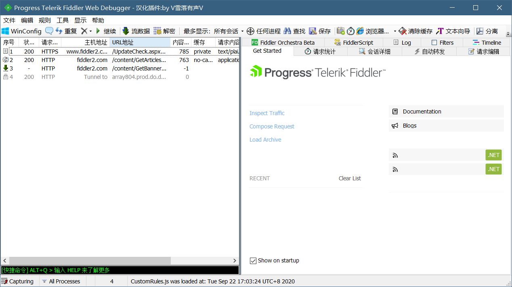

#### fiddler菜单栏

**File菜单**

1. Capture Traffic（捕获请求）：可以控制是否把Fiddler注册为系统代理。

2. New Viewer（新建会话窗口）：打开一个新的fiddler窗口

3. Load Archive（载入）：用于重新加载之前捕获的以SAZ文件格式保存的数据包。

4. Save（保存）：支持以多种方式把数据包保存到文件中。

5. Import Sessions...（导入会话）：支持导入从其他工具捕获的数据包，也支持导入以其他格式存储的数据包。

6. Export Sessions...（导出会话）：把Fiddler捕捉到的回话以多种文件格式保存。

7. Exit（退出）：取消把Fiddler注册为系统代理，并关闭Fiddler。

**Edit菜单**

1. Copy（复制）：复制会话。

2. Remove（删除）：删除会话。

3. Select All（选中所有）：选择所有会话。

4. Undelete（撤销删除）：撤销删除会话。

5. Paste as Session把剪贴板上的内容粘贴成一个或多个模拟的会话。

6. Mark（标记）：选择一种颜色标记选中会话。

7. Unlock for Editing （解锁编辑锁定）：解锁会话。

8. Find Session...（查找会话）：打开Find Session窗口，搜索捕获到的数据包。

**Rules菜单**

1. Hide Image Request：隐藏图片回话。

2. Hide CONNECTS：隐藏连接通道回话。

3. Automatic Breakpoints：自动在[请求前]或[响应后]设置断点。Ignore Image触发器控制这些断点是否作用于图片请求。

4. Customize Rules...：打开Fiddler脚本编辑窗口。

5. Require Proxy Authentication：，要求客户端安装证书。该规则可以用于测试HTTP客户端，确保所有未提交Proxy-Authorization请求头的请求会返回HTTP/407响应码。

6. Apply GZIP Encoding：只要请求包含具有gzip标识的Accept-Encoding请求头，就会对所有响应使用GZIP HTTP进行压缩（图片请求除外）。

7. Remove All Encoding：删除所有请求和响应的HTTP内容编码和传输编码

8. Hide 304s：隐藏响应为HTTP/304 Not Modified状态的所有回话。

9. Request Japanese Content：选项会把所有请求的Accept-Encoding请求头设置或替换为ja标识，表示客户端希望响应以日语形式发送。

10. User-Agents：把所有请求的User-Agent请求头设置或替换成指定值。

11. performance：模拟弱网测试速度。

**Tools菜单**

1. Options...：打开Fiddler选项窗口。

2. WinINET Options...打开IE的Internet属性窗口

3. Clear WinINET Cache：清空IE和其他应用中所使用的WinINET缓存中的所有文件。
4. Clear WinINET Cookies：清空IE和其他应用中所发送的WinINET Cookie

5. TextWizard...：选项会启动TextWizard窗口，对文本进行编码和解码。

6. Compare Session：比较回话。

7. Reset Script：重置Fiddler脚本。

8. Sandbox：打开http://webdbg.com/sandbox/

9. View IE Cache:打开IE缓存窗口。

**View菜单**

1. Show Toolbar：控制Fiddler工具栏是否可见

2. Default Layout. Stacked Layout. Wide Layout三种界面布局

3. Minimize to Tray：最小化Fiddler到系统托盘（快捷键:CTRL+M ）

4. Squish Session List：控制回话列表是否水平收缩。

5. AutoScroll Session list：添加新的回话时，自动滚动到回话列表底部

#### fiddler工具

****

1. 备注功能

2. 重新发送请求，快捷键：R键。

3. 删除请求

4. 当有请求前断点时，点击去发送请求。

5. 流模式。(默认是缓冲模式)

6. 解码

7. 保持回话的数量。

8. 选择你想要抓包或者监听的程序

9. 查找

10. 保存所有会话，文件名以.saz为扩展名

11. 截图

12. 计时器

13. 快捷的打开IE浏览器

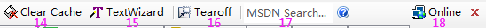

14. 清除IE缓存

15. 文本的编码解码工具

16. 分离面板

17. MSDN查询

18. 本机的信息

#### 会话列表

- Fiddler抓取到的每条http请求(每一条称为一个session)
- 主要包含了请求的ID编号. 状态码. 协议. 主机名. URL. 内容类型. body大小. 进程信息. 自定义备注等信息

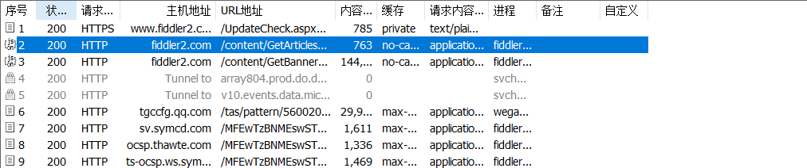

#### 辅助标记和工具

* **Statistics页签**

  通过该页签，用户可以通过选择多个会话来得到这几个会话的总的信息统计，比如多个请求传输的字节数。访问页面时选择第一个请求和最后一个请求，可获得整个页面加载所消耗的总体时间。从条形图表中还可以分别出哪些请求耗时最多，从而对页面的访问进行速度性能优化

*  **inspectors页签（常用页签）**

  它提供headers、textview、hexview,Raw等多种方式查看一条http请求的请求和响应，它分为上下两部分：上部分为请求展示，下部分为响应展示。

* **AutoResponse页签（常用页签）**

  它可以抓取在线页面保存到本地进行调试，大大减少了在线调试的困难，可以让我们修改服务器端返回的数据，例如让返回都是404的数据包读取本地文件作为返回内容。

* **composer页签（常用页签）**

  支持手动构建和发送HTTP，HTTPS和FTP请求，我们还可以从回话列表中拖曳回话，把它放到composer选项卡中，当我们点击Execute按钮时则把请求发送到服务器端。

* **FiddlerScripts页签**

  打开Fiddler脚本编辑。

*  **log页签**：

  打印日志

* **Filters页签（常用页签）**

  过滤器可以对左侧的数据流列表进行过滤，我们可以标记、修改或隐藏某些特征的数据流。

* **Timeline页签**

  时间轴，也称为Fiddler的瀑布图，展示网络请求时间的功能。每个网络请求都会经历域名解析、建立连接、发送请求、接受数据等阶段。把多个请求以时间作为X轴，用图表的形式展现出来，就形成了瀑布图。在左侧会话窗口点击一个或多个回话，Timeline 便会显示指定内容从服务端传输到客户端的时间。

#### 命令行工具详解

**Fiddler命令行可以输入命令操作回话列表,常见命令有：**

- help   打开官方的使用页面介绍，所有的命令都会列出来。
- cls    清屏 (Ctrl+x 也可以清屏)
- select  选择所有相应类型的回话(如select image或select css)。
- ?sometext 查找字符串并高亮显示查找到的会话。
- \>size   选择请求响应大小小于size字节的会话。
- =status/=method/@host 查找状态、方法、主机相对应的会话
- 1uit    退出fiddler
- bpafter xxx 中断URL包含指定字符的全部回话响应
- bps xxx   中断HTTP响应状态为指定字符的全部回话响应。
- bpv xxx   中断指定请求方式的全部回话响应
- bpm xxx   中断指定请求方式的全部回话响应。等同于bpv xxx
- bpu xxx:  与bpafter类似。

#### Fiddler状态栏详解

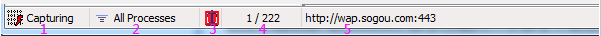

1. **显示的Fiddler是否处于捕捉状态(开启/关闭状态),可以点击该区域切换。**

2. 显示当前捕捉哪些进程。

- All Processes 捕获所有进程的请求
- Web Browsers 捕获 Web 浏览器的请求，应该特指 IE
- Non-Browser  捕获非 Web 浏览器的请求
- Hide All   隐藏所有请求

3. **显示当前断点设置状态，通过鼠标点击切换。有三种：**

- 不设置断点
- 所有请求在断点处被暂停
- 所有响应在断点处被暂停

4. 显示当前共捕获了多少回话(如：300，表示共捕获了300个会话，如：10/300，表示当前选择10个会话，共捕获300个会话)。

5. 第五区块，描述当前状态。

- 如果是刚打开Fiddler，会显示什么时间加载了CustomRules.js；如果选择了一个会话，会显示该会话的URL；如果在命令行输入一个命令，就会显示命令相关信息。

### fiddler抓取https流量

#### 配置HTTPS

* 点击Tools （工具）> Options（选项） > HTTPS
* 勾选Decrypt HTTPS Traffic

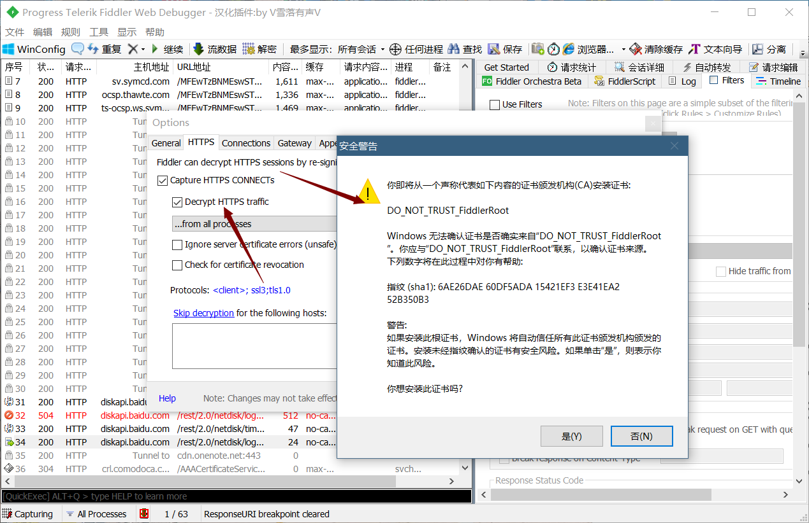

之后弹出一个窗口，需要进行安装证书

#### 配置浏览器证书

* 导出证书

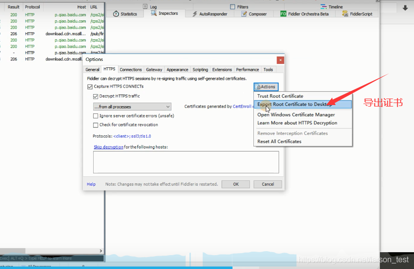

* 浏览器安装证书

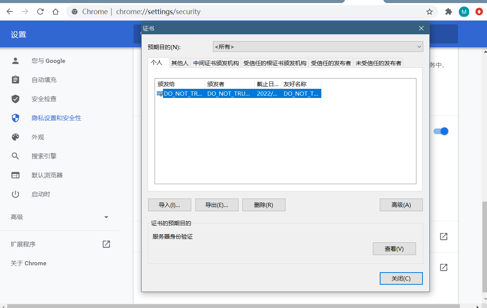

安装过程：

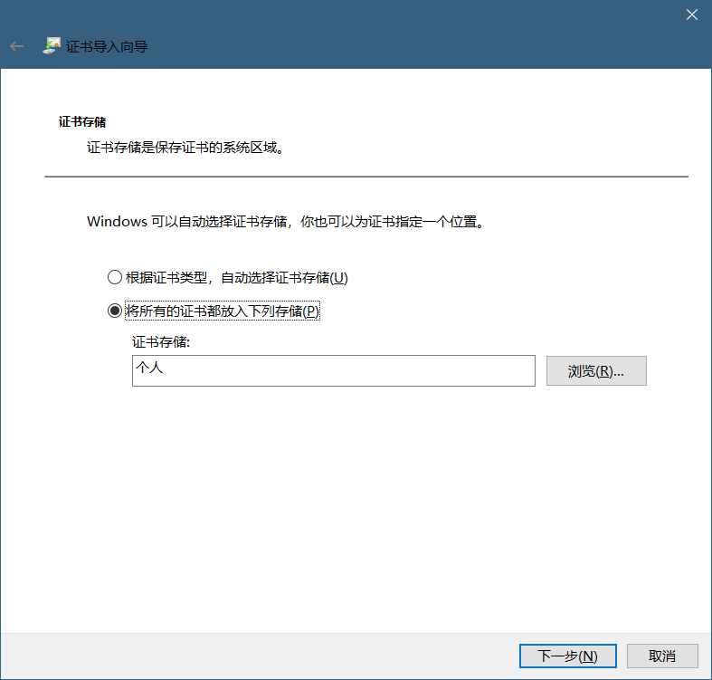

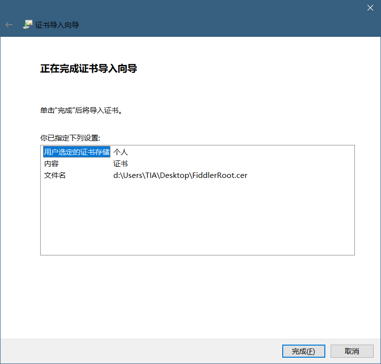

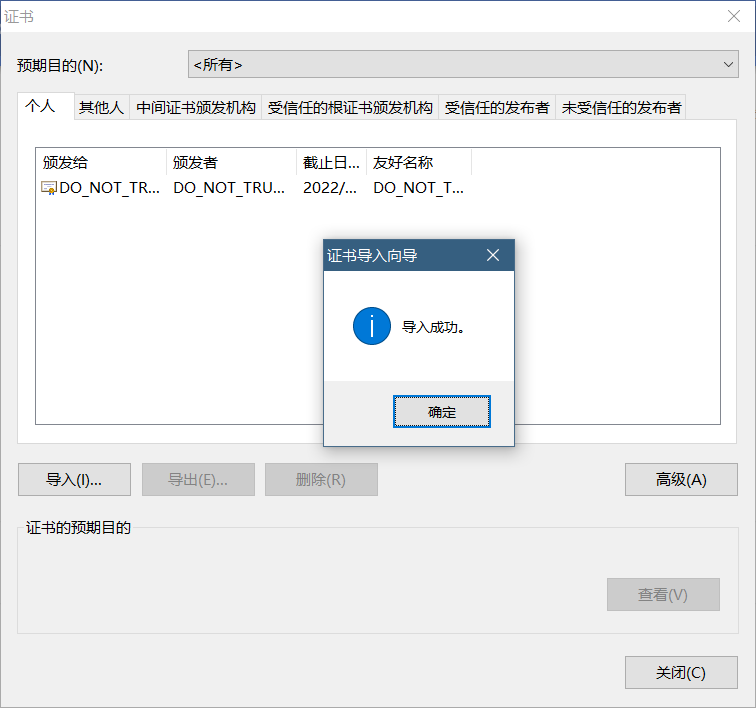

再次运行fiddler，依次点击Tools下的Options，然后点HTTPS选项卡，再点击actions下的Reset All Certificates，重置证书。

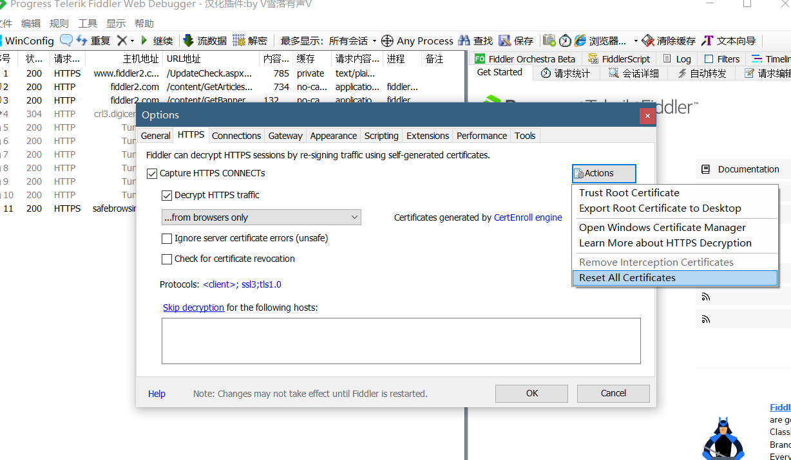

重启浏览器和fiddler，发现已经可以打开https页面了。

> chrome如果开启代理插件可能无法捕获。

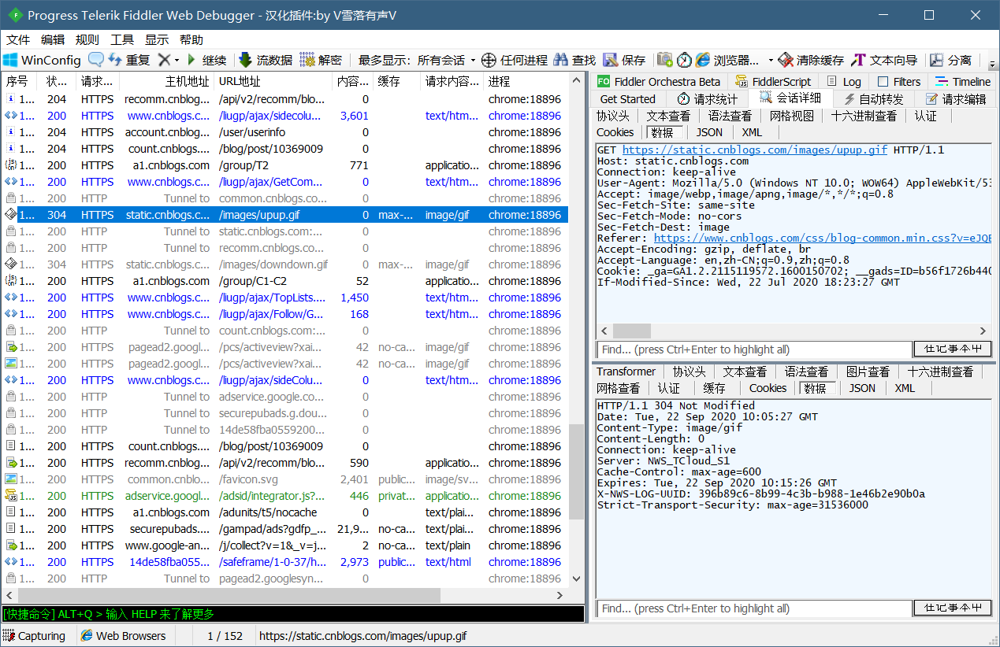

### fiddler抓取app

