## Wireshark

### 安装

[下载地址](https://www.wireshark.org/)

### 介绍

#### 什么是Wireshark？

Wireshark 是网络包分析工具（以前称为Ethereal）。

网络包分析工具的主要作用是尝试捕获网络包， 并尝试显示包的尽可能详细的情况。

#### 软件功能

1. 分析网络底层协议
2. 解决网络故障问题
3. 寻找网络安全问题

#### 相关工具

* Sniffer
* Omnipeek
* Fiddler
* Httpwatch
* 科来网络分析系统

### 打开wireshark

打开wireshark。

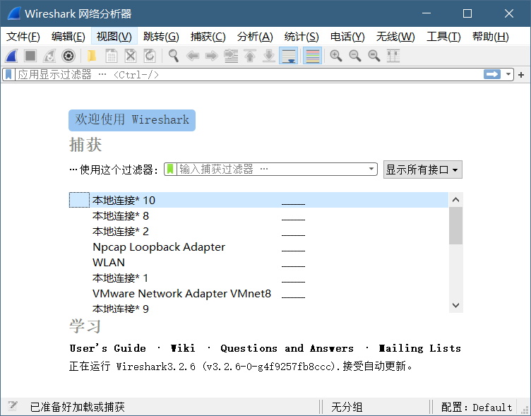

wireshark是捕获机器上的某一块网卡的网络包，当机器上有多块网卡的时候，需要选择一个网卡。或者，点击捕获->选项.. 出现下面对话框，选择正确的网卡。

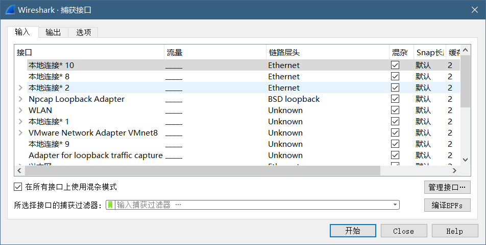

然后点击"Start"按钮, 开始抓包。

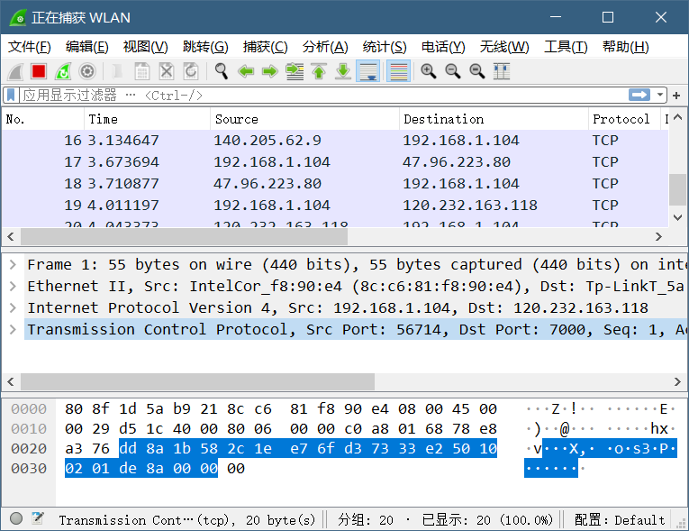

#### 配置

##### 修改着色规则

点击视图->着色规则，之后就根据喜好设置颜色，便于分析数据。

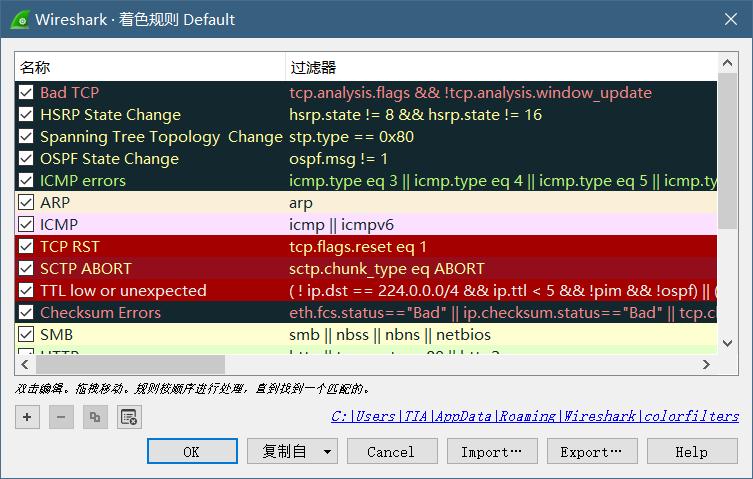

#### 认识界面

##### 过滤器

###### 封包列表-显示过滤器

显示过滤器就是在用来过滤封包列表的，它不影响捕获的日志文件，只是用来过滤显示列表中显示的项目用， 是在运行时设置的随时可以更改。

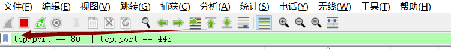

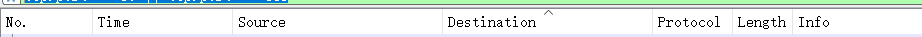

- No列编号
- Time列是开启监控后到接受包的时间
- Source是源IP
- Destination是目标IP
-  Protocal是协议
- Length是包长度
- Info是包信息

###### 捕捉过滤器

需要在开始捕捉前设置

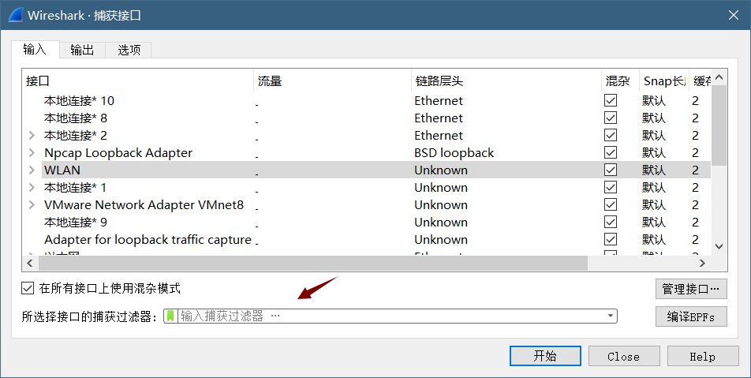

| Protocol | Direction | Host(s)       | Value | Logical Operations | Other expression      |
| :------- | :-------- | :------------ | :---- | :----------------- | :-------------------- |
| tcp      | dst       | 10.10.202.254 | 80    | and                | tcp dst 10.2.2.2 3128 |

1. **Protocol（协议）**可能的值: ether, fddi, ip, arp, rarp, decnet, lat, sca, moprc, mopdl, tcp and udp 如果没有特别指明是什么协议，则默认使用所有支持的协议。
2. **Direction（方向）**可能的值: src, dst, src and dst, src or dst 如果没有特别指明来源或目的地，则默认使用 “src or dst” 作为关键字。 例如，”host 10.2.2.2”与”src or dst host 10.2.2.2”是一样的。
3. **Host(s)**可能的值： net, port, host, portrange 如果没有指定此值，则默认使用”host”关键字。 例如，”src 10.1.1.1”与”src host 10.1.1.1”相同。
4. **Logical Operations（逻辑运算）**可能的值：not, and, or 否(“not”)具有最高的优先级。或(“or”)和与(“and”)具有相同的优先级，运算时从左至右进行。可能的值： net, port, host, portrange 如果没有指定此值，则默认使用”host”关键字。 例如，”src 10.1.1.1”与”src host 10.1.1.1”相同。


##### 封包详细信息

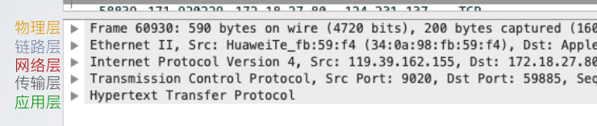

- Frame: 物理层的数据帧概况
- Ethernet II: 数据链路层以太网帧头部信息
- Internet Protocol Version 4:网络层IP包头部信息
- Transmission Control Protocol: 传输层的数据段头部信息，此处是TCP
- Hypertext Transfer Protocol: 应用层的信息，此处是HTTP协议
- User Datagram Protocol：同上，为upd协议。

##### 16进制数据

##### 地址栏

### 数据过滤

点击这个类似于标签的图标，能够自动生成匹配规则。

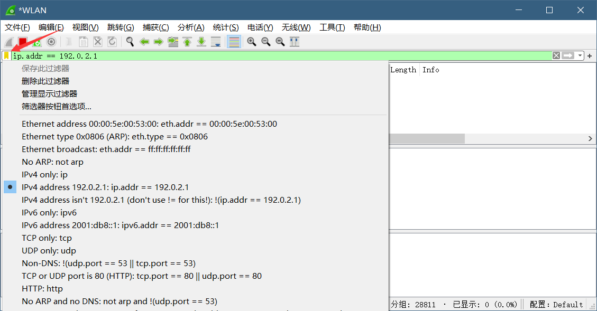

#### 运算规则

* `==`：筛选符合该条件的数据
* `or`或者`||`：筛选符合其中一个条件的数据
* `and`或者`&&`：筛选符合满足所有条件的数据
* `not`：不包含，否

#### 协议过滤

* http

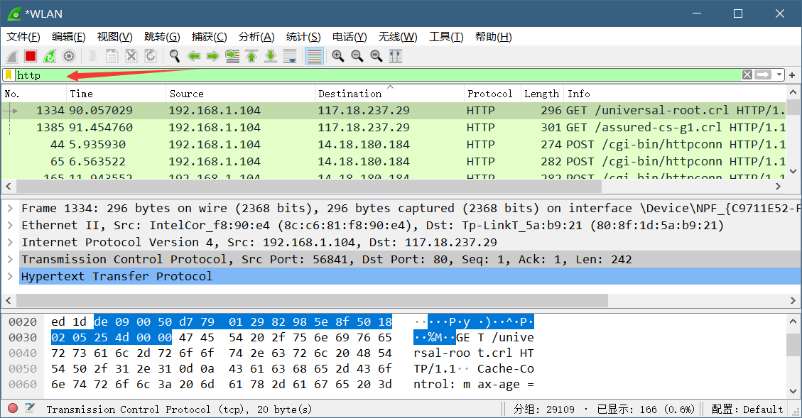

* tcp

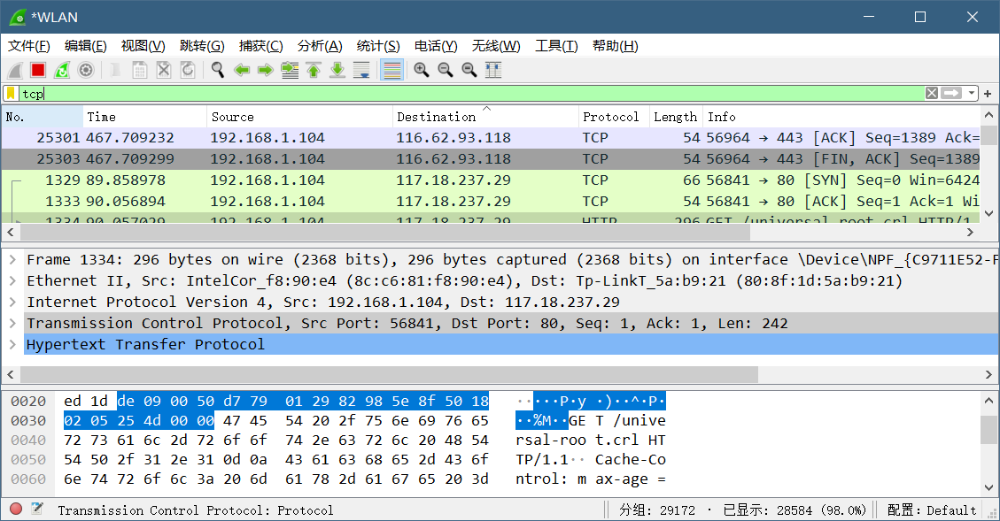

* udp

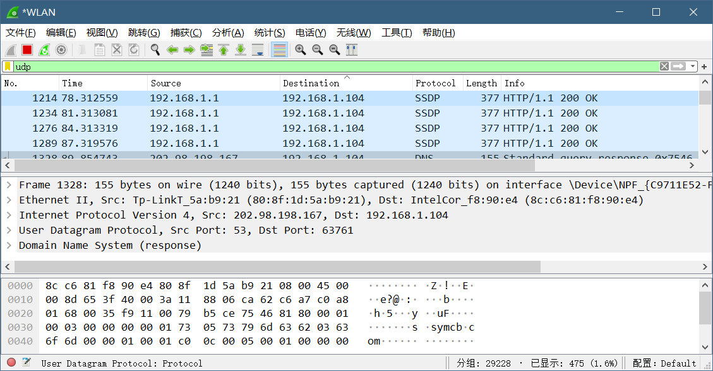

#### 端口过滤

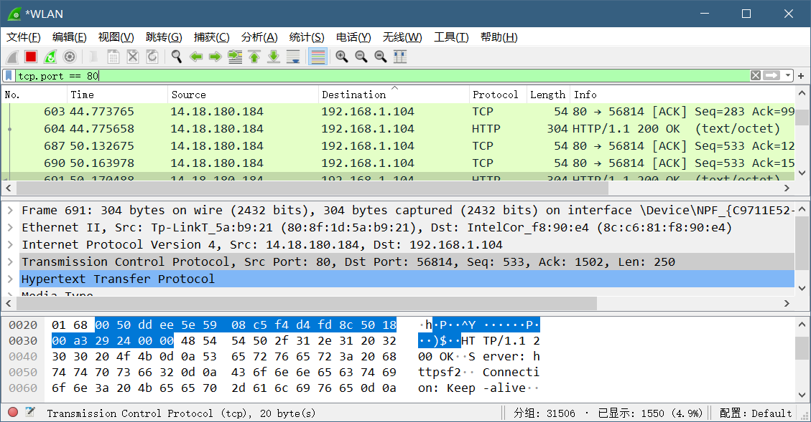

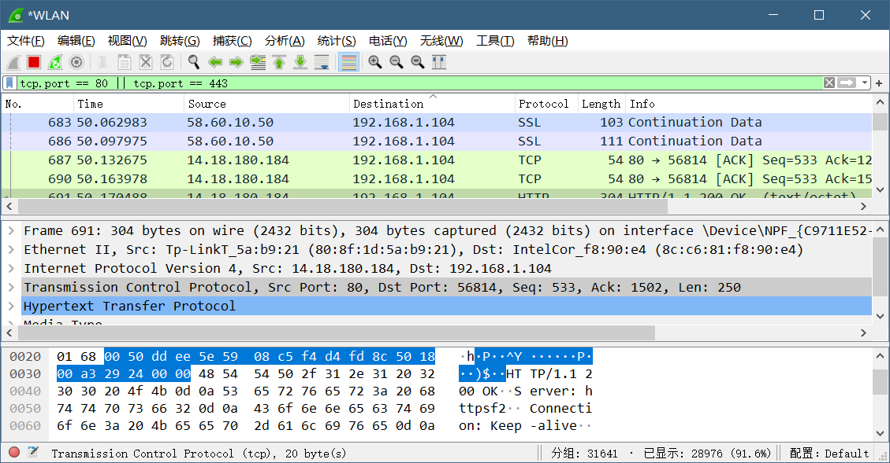

#### IP过滤

* ip.addr：IP

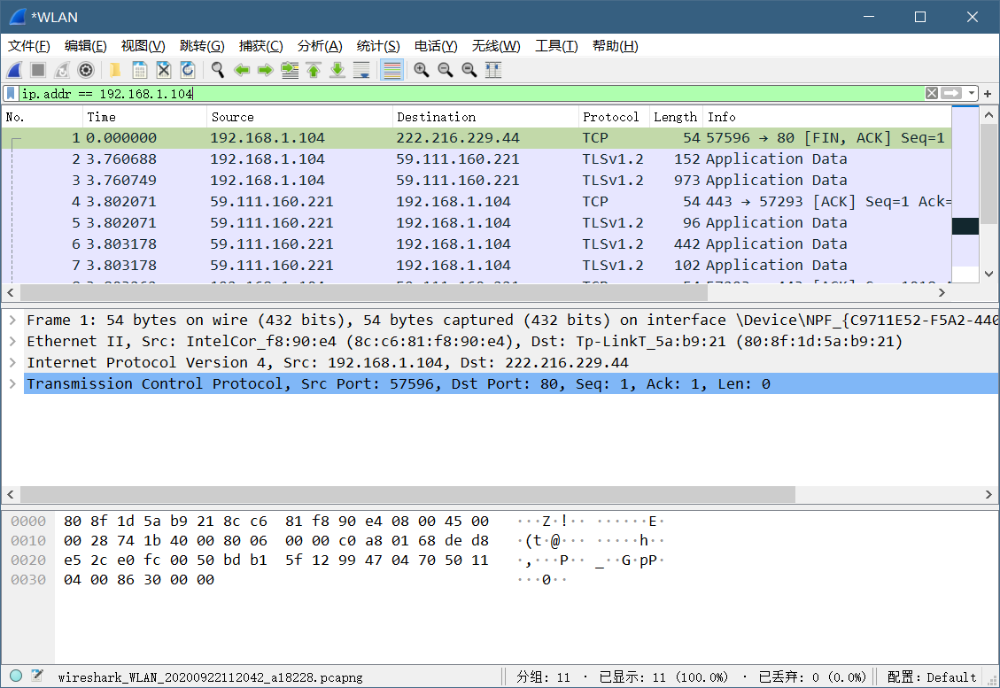

* ip.src：源IP

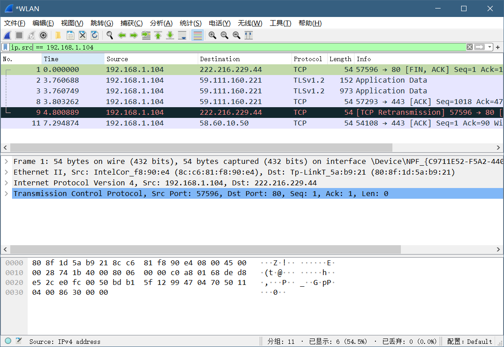

* ip.dst：目标IP

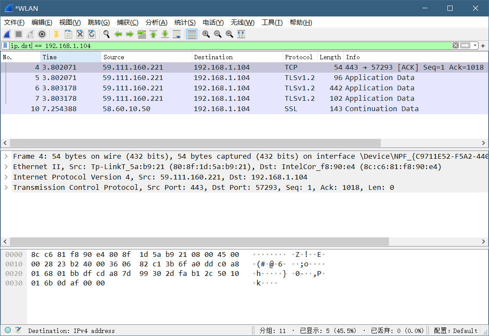

#### 标识符过滤

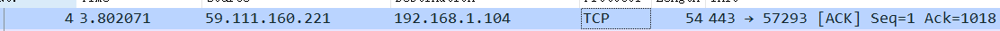

* 协议.flags.标识

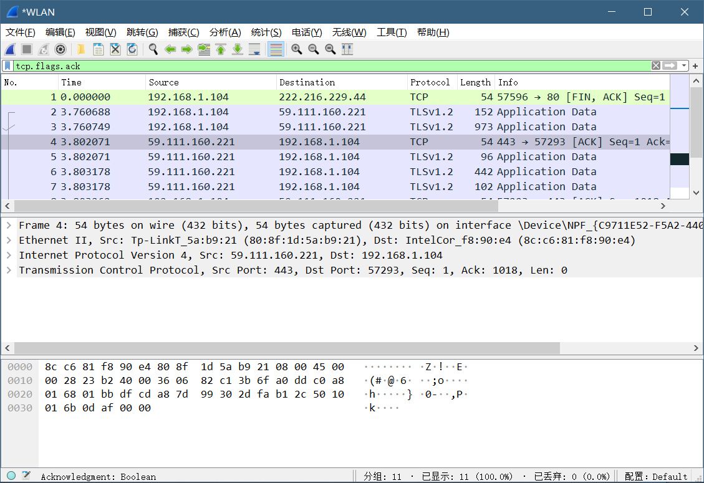

#### 长度过滤

* 协议.len

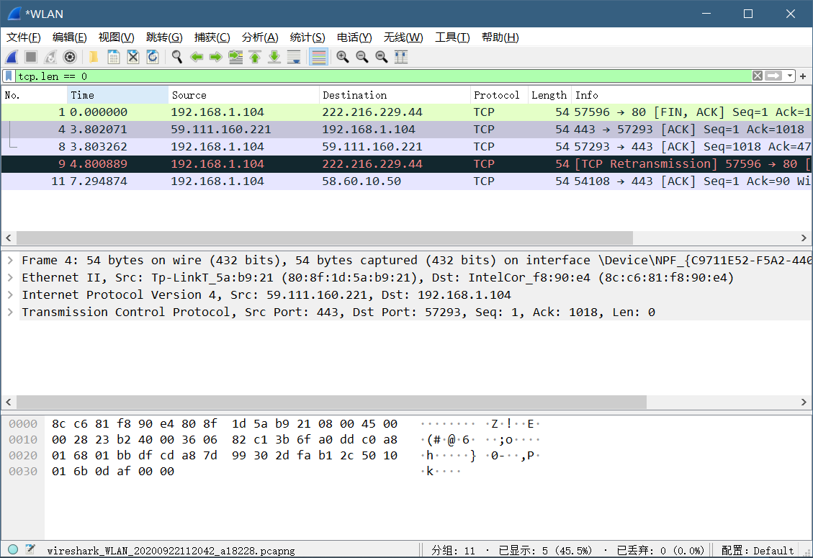

##### 过滤data

```
//过滤出包数据中含有”somethings“的内容 
data.data contains "somethings" 
```

### TCP三次握手

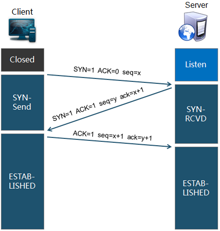

那么通过抓取一次HTTP访问例子来说明这个握手过程， 比如要访问https://www.baidu.com/，先通过ping命令拿到ip地址为`14.215.177.38`。

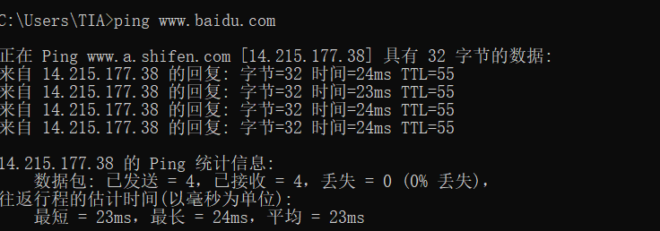

 然后新建一个捕捉过滤器（文件>关闭），规则为`host 14.215.177.38`，运行后网页访问这个链接。

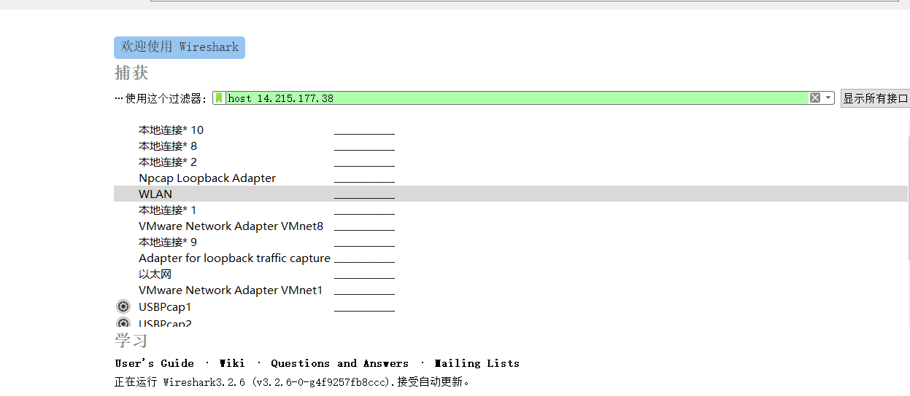

如果无法捕获，换个ip，可以在网页中查看

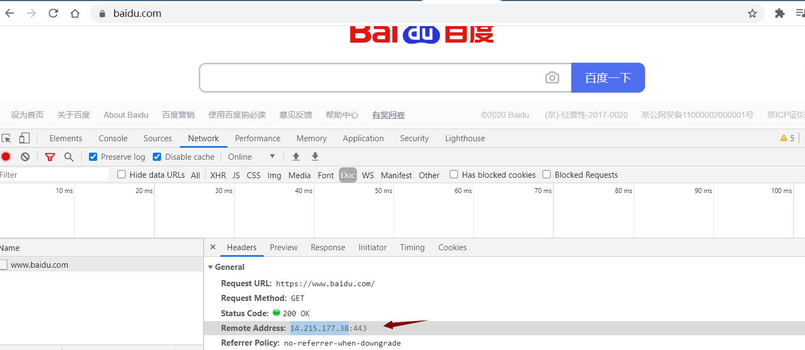

非常清楚的显示三次TCP握手过程。

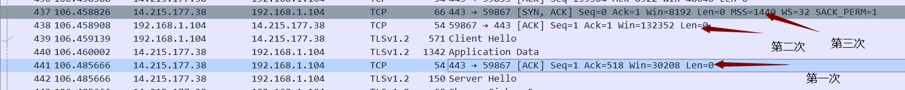

###  标识

* SYN：同步标志--表示建立连接
  同步序列编号(Synchronize Sequence Numbers)栏有效。
  该标志仅在三次握手建立TCP连接时有效。
  它提示TCP连接的服务端检查序列编号，该序列编号为TCP连接初始端(一般是客户端)的初始序列编号。
  在这里，可以把 TCP序列编号看作是一个范围从0到4，294，967，295的32位计数器。通过TCP连接交换的数据中每一个字节都经过序列编号。
  在TCP报头中的序列编号栏包括了TCP分段中第一个字节的序列编号。

* ACK：确认标志--表示响应
  确认编号(Acknowledgement Number)栏有效。大多数情况下该标志位是置位的。TCP报头内的确认编号栏内包含的确认编号(w+1，Figure-1)为下一个预期的序列编号，同时提示远端系统已经成功接收所有数据。

* PSH：推标志--表示有data数据传输
  该标志置位时，接收端不将该数据进行队列处理，而是尽可能快将数据转由应用处理。在处理 telnet 或 rlogin 等交互模式的连接时，该标志总是置位的。

* FIN：结束标志--表示关闭连接
  带有该标志置位的数据包用来结束一个TCP回话，但对应端口仍处于开放状态，准备接收后续数据。

* RST：复位标志--表示连接重置
  复位标志有效。用于复位相应的TCP连接。

* URG：紧急标志
  紧急(The urgent pointer) 标志有效。紧急标志置位，

### 跟踪一个请求

在wireshark中选中一条数据后，右键选中追踪流，样做的目的是为了得到与浏览器打开网站相关的数据包。

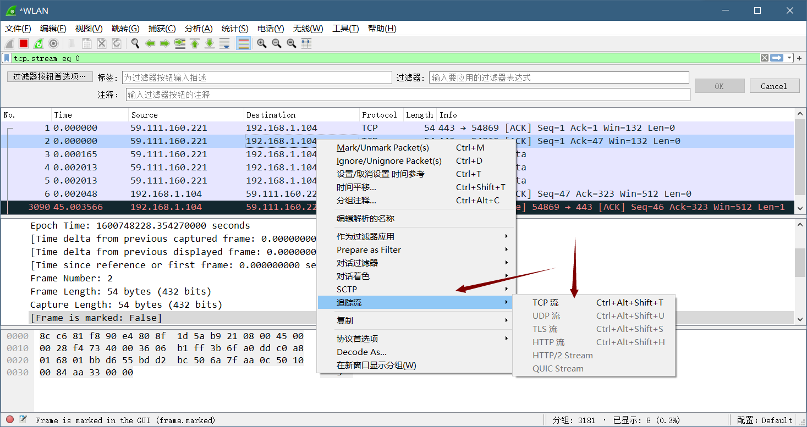

### 配置https

#### SSL/TLS协议

SSL/TLS 和 HTTPS 协议联系非常紧密，HTTPS 是在 SSL/TLS 协议基础之上建立起来的。数据包的加密使用对称加密算法，而对称加密算法的密钥采用非对称加密手段协商获取。

> HTTPS 中的 S ，指的就是 SSL/TLS 协议本身。

- 常用的对称加密算法有：`DES、3DES、Blowfish、IDEA、RC4、RC5、RC6和AES`
- 常用的非对称加密算法有：`RSA、ECC（移动设备用）、Diffie-Hellman、El Gamal、DSA（数字签名用）`
- 常用的数字签名算法有：`MAC、MD5、SHA1`

#### TLS 加密流程 

最后来回顾一下 TLS 的加密流程

TLS 是建立在 TCP 基础上的，因此必定需要先三次 TCP 握手建立 TCP 连接，然后再是建立 TLS

1. Client Hello
   1. **Client Hello** 报文：客户端对加密算法的支持度不同，因此需要向服务端发送客户端支持的 **加密套件（Cipher Suite）** ，同时还要生成一个 **随机数** 同时保存在客户端和发送给服务
2. Server Hello
   1. **ServerCertificate** 报文：服务端收到 Client Hello 之后，向客户端发送 **CA 认证的数字证书**，用来鉴别服务端身份信息，同时还要生成一个 **随机数** 同时保存在服务端和发送给客户端
   2. **Server Hello Done** 报文：表示服务端宣告第一阶段的客户端服务端握手协商结束
   3. 可选：**Certificate Request** 报文：必要情况下，要求客户端发送证书验证身份
   4. 可选：**Server Key Exchange** 报文：如果 CA 认证的数字证书提供的信息不够，服务端还可发送提供补充信息
3. Client Finish
   1. **Client Key Exchange** 报文：客户端收到 CA 数字证书并通过验证，然后通过 CA 公钥解密获取到 **服务端公钥**。Client Key Exchange 报文包括有一个随机数，这个随机数被称为 **Pre-master key/secret**；一个表示随后的信息使用双方协商好的加密方法和密钥发送的 **通知** ；还有一个通过协商好的 HASH 算法对前面所有信息内容的 **HASH 计算值**，用来提供服务端校验。这些信息都通过服务端公钥加密传送给服务端
   2. **ClientCipherSpec** 报文：该报文通知服务端，此后的通信都将使用协商好的加密算法计算对称密钥进行加密通信（也就是使用两个随机数以及第三个 Pre-master key/secret 随机数一起算出一个对称密钥 **session key/secret**）
   3. **Finished** 报文：该报文包括连接至此的所有报文的校验值，使用服务端公钥进行加密
   4. 可选：**ClientCertificate** 报文：如果服务端请求，客户端需要发送 CA 数字证书
   5. 可选：**CertificateVerify** 报文：服务端如果要求 CA 数字证书，那么需要通过 HASH 算法计算一个服务端发送来的信息摘要
4. Server Finish
   1. 服务端最后对客户端发送过来的 **Finished** 报文使用服务端私钥进行解密校验
   2. **ClientCipherSpec** 报文：报文通知服务端，此后的通信都将使用协商好的加密算法计算对称密钥 session key/secret 进行加密通信
   3. **Finished** 报文：标志 TLS 连接建立成功
5. TLS 握手成功此后通过对称密钥 session key/secret 加密通信

#### 配置环境变量

Firefox 和 Chrome 只会在系统环境变量中存在 SSLKEYLOGFILE 路径时才会生成该文件，先来加上这个环境变量。

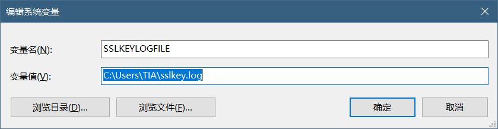

配置退出浏览器，重新打开，即可。

#### 配置 wireshark

打开 wireshark，点击配置信息指定 TLS 的 Pre-master key 路径为环境变量指定的那个文件路径

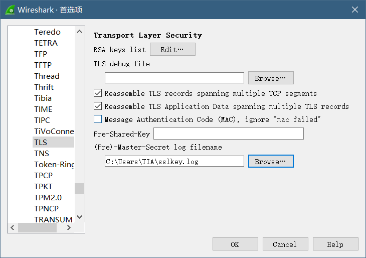

这样配置就算完成了，尝试一下打开 chrome 浏览器访问一个 https 网址，就可以见到http2刷新出来了。

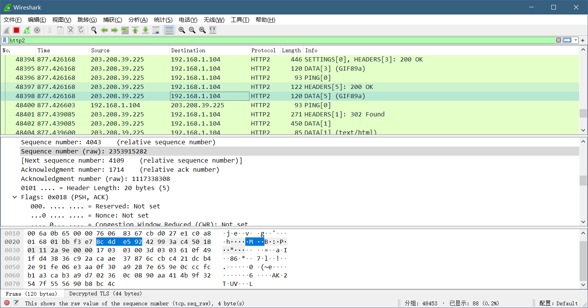