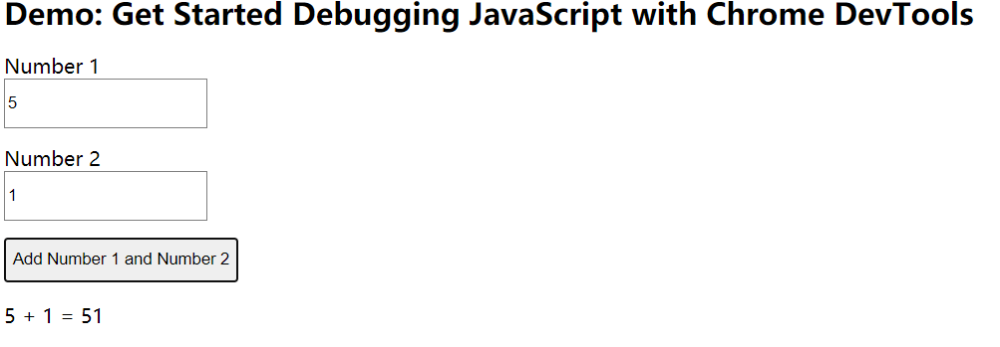
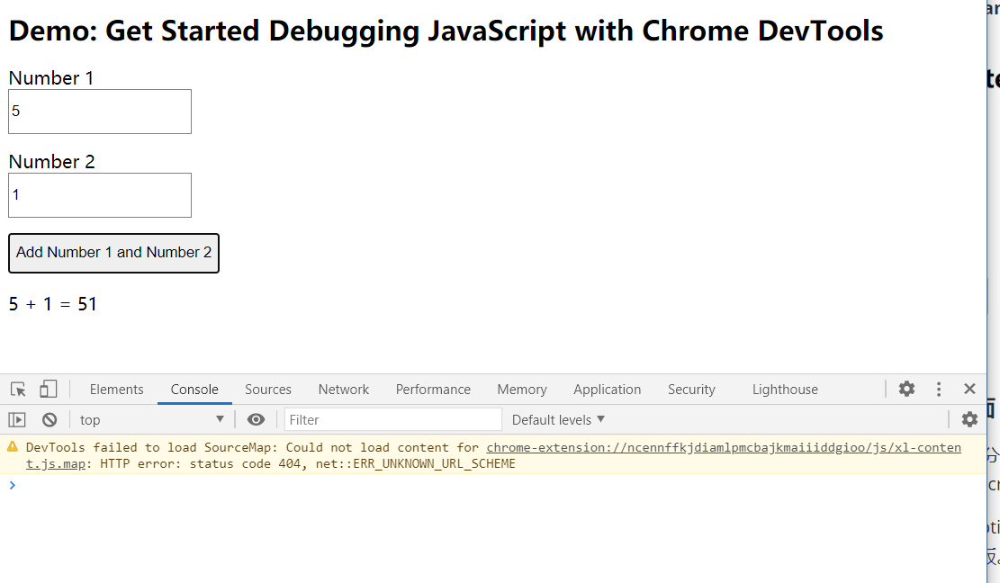
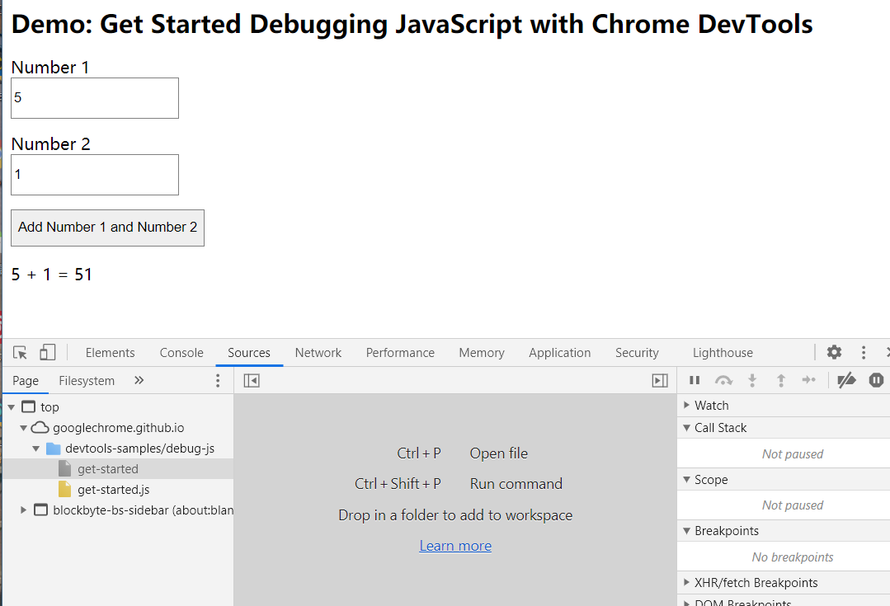
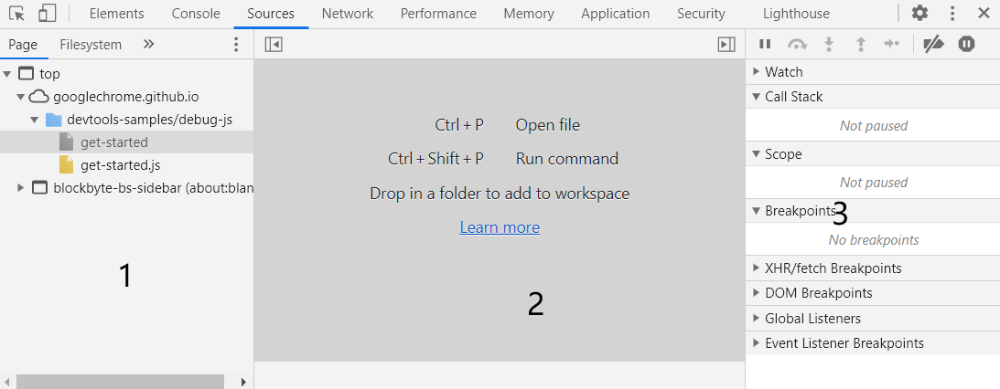
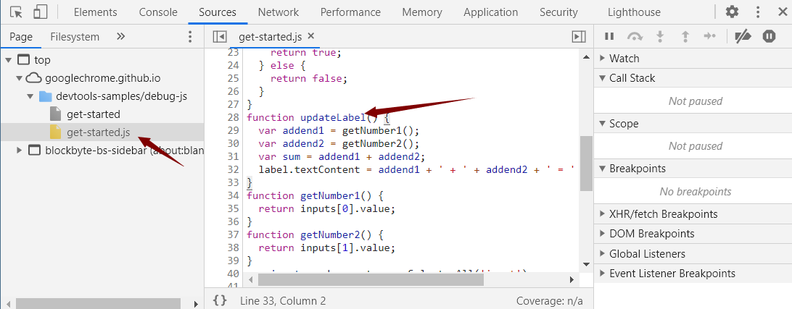
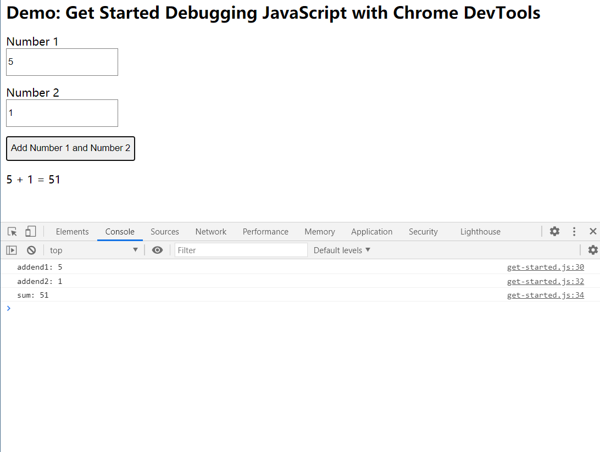
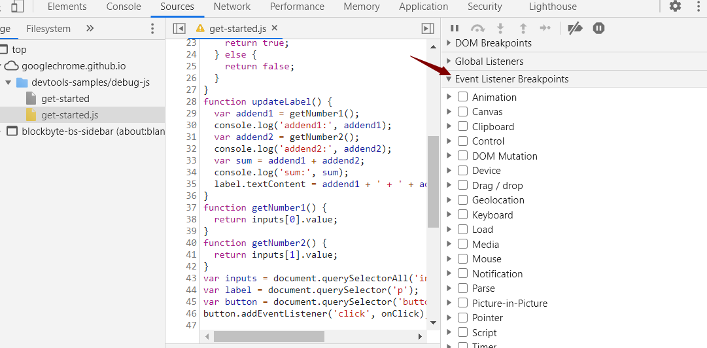
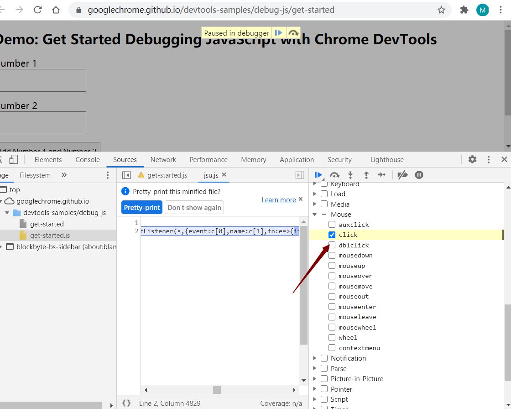
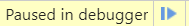

## 浏览器

### 概述

通过使用浏览器自带的开发者工具，进行调试网页或者查看网络请求的数据。

### 使用

#### 目标

[网页链接](https://googlechrome.github.io/devtools-samples/debug-js/get-started)

#### 重现错误

1. 在 **Number 1** 文本框中输入 `5`。
2. 在 **Number 2** 文本框中输入 `1`。
3. 点击 **Add Number 1 and Number 2**。 按钮下方的标签显示 `5 + 1 = 51`。 结果应为 `6`。 这就是需要修正的错误。



#### 熟悉sources面板界面

DevTools 可为更改 CSS、分析页面加载性能和监控网络请求等不同的任务提供许多不同的工具。 您可在 **Sources** 面板中调试 JavaScript。

1. 通过按 Command+Option+I (Mac) 或 Control+Shift+I（Windows、Linux），打开 DevTools。 此快捷方式可打开 **Console** 面板。

##### console面板



##### sources标签



分为三个部分



1. **File Navigator** 窗格。 此处列出页面请求的每个文件。
2. **Code Editor** 窗格。 在 **File Navigator** 窗格中选择文件后，此处会显示该文件的内容。
3. **JavaScript Debugging** 窗格。 检查页面 JavaScript 的各种工具。 如果 DevTools 窗口布局较宽，此窗格会显示在 **Code Editor** 窗格右侧。

#### 使用断点暂停代码

调试这种问题的常用方法是将多个 `console.log()` 语句插入代码，以便在执行脚本时检查相关值。 例如：

```
function updateLabel() {
  var addend1 = getNumber1();
  console.log('addend1:', addend1);
  var addend2 = getNumber2();
  console.log('addend2:', addend2);
  var sum = addend1 + addend2;
  console.log('sum:', sum);
  label.textContent = addend1 + ' + ' + addend2 + ' = ' + sum;
}
```



虽然 `console.log()` 方法可以完成任务，但**断点**可以更快完成此任务。 断点可让您在执行代码的过程中暂停代码，并在此时及时检查所有相关值。 与 `console.log()` 方法相比，断点具有一些优势：

- 使用 `console.log()`，需要手动打开源代码，查找相关代码，插入 `console.log()` 语句，然后重新加载此页面，才能在控制台中看到这些消息。 使用断点，无需了解代码结构即可暂停相关代码。
- 在 `console.log()` 语句中，需要明确指定要检查的每个值。 使用断点，DevTools 会在暂停时及时显示所有变量值。 有时在您不知道的情况下，有些变量会影响您的代码。

简言之，与 `console.log()` 方法相比，断点可帮助您更快地查找和修正错误。



如果退一步思考应用的运作方式，可以根据经验推测出，使用与 **Add Number 1 and Number 2** 按钮关联的 `click` 事件侦听器时计算的和不正确 (`5 + 1 = 51`)。 因此，可能需要在 `click` 侦听器运行时暂停代码。 **Event Listener Breakpoints** 可以完成此任务：

1. 在 **JavaScript Debugging** 窗格中，点击 **Event Listener Breakpoints** 以展开该部分。 DevTools 会显示 **Animation** 和 **Clipboard** 等可展开的事件类别列表。
2. 在 **Mouse** 事件类别旁，点击 **Expand** 。 DevTools 会显示 **click** 和 **mousedown** 等鼠标事件列表。 每个事件旁都有一个复选框。
3. 勾选 **click** 复选框。 DevTools 现在经过设置可以在任何`click` 事件侦听器运行时自动暂停。





返回至演示页面，再次点击 **Add Number 1 and Number 2**。 DevTools 会暂停演示并在 **Sources** 面板中突出显示一行代码。 DevTools 应在此代码行暂停：

```
function onClick() {
```

如果是在其他代码行暂停，请按 **Resume Script Execution** ，直到在正确的代码行暂停为止。

#### 单步调试代码

一个常见的错误原因是脚本执行顺序有误。 可以通过单步调试代码一次一行地检查代码执行情况，准确找到执行顺序异常之处。 立即尝试：

在 DevTools 的 **Sources** 面板上，点击 **Step into next function call** 

， 以便一次一行地单步调试 `onClick()` 函数的执行。 DevTools 突出显示下面这行代码：

点击 **Step over next function call**  {:.devtools-inline}。 DevTools 执行但不进入 `inputsAreEmpty()`。 请注意 DevTools 是如何跳过几行代码的。 这是因为 `inputsAreEmpty()` 求值结果为 false，所以 `if` 语句的代码块未执行。

