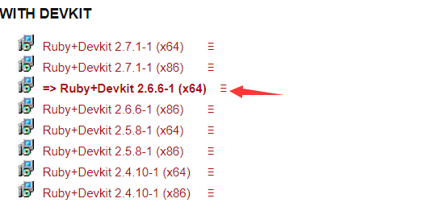
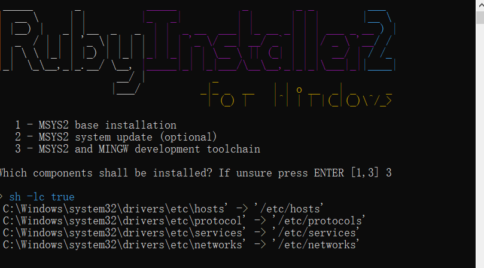
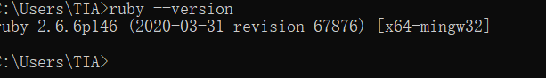
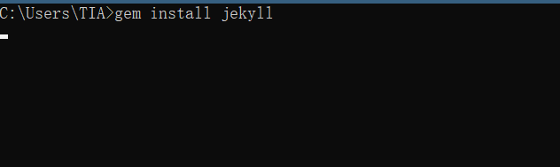
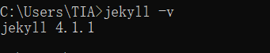
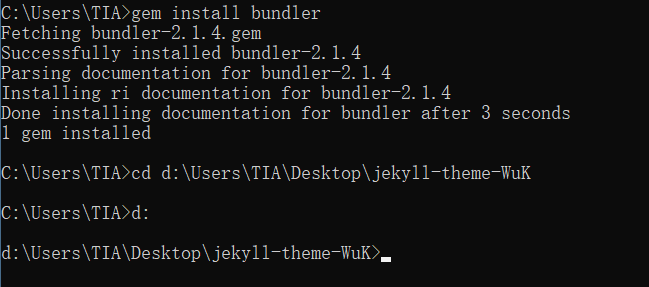

## 使用Github pages+jekyll搭建自己的博客（windows版）

### Github pages

### 安装jekyll

1. 安装git
2. 安装[ruby](https://rubyinstaller.org/downloads/)



ruby安装完，会出现有个选项，进行安装MSYS2，如果没有勾选，后面自己打开cmd，输入**ridk install**，进行MSYS2的安装，会出现然选择123，选3就行。这个过程会下载很多安装包什么的，耐心等待，一定要耐心，要完整装完才行，装好会让再做一次123选择，这个时候不需要选了，直接enter退出就行了。

> ---------------------------
> 但是有个注意点，安装的路径中，连同命名，不要出现空格！！！



**验证**



3. 安装jekyll

打开**DOS**，输入**gem install jekyll**，开始安装jekyll。



然后，耐心等待，安装。

之后出现了错误提示，如下：

```
Building native extensions. This could take a while...
ERROR:  Error installing jekyll:
        ERROR: Failed to build gem native extension.

    current directory: D:/Program Files/Ruby26-x64/lib/ruby/gems/2.6.0/gems/http_parser.rb-0.6.0/ext/ruby_http_parser
D:/Program\ Files/Ruby26-x64/bin/ruby.exe -I D:/Program\ Files/Ruby26-x64/lib/ruby/2.6.0 -r ./siteconf20200904-23432-12amvxq.rb extconf.rb
creating Makefile

current directory: D:/Program Files/Ruby26-x64/lib/ruby/gems/2.6.0/gems/http_parser.rb-0.6.0/ext/ruby_http_parser
make "DESTDIR=" clean
Makefile:269: *** 多个目标匹配。 停止。

current directory: D:/Program Files/Ruby26-x64/lib/ruby/gems/2.6.0/gems/http_parser.rb-0.6.0/ext/ruby_http_parser
make "DESTDIR="
Makefile:269: *** 多个目标匹配。 停止。

make failed, exit code 2

Gem files will remain installed in D:/Program Files/Ruby26-x64/lib/ruby/gems/2.6.0/gems/http_parser.rb-0.6.0 for inspection.
Results logged to D:/Program Files/Ruby26-x64/lib/ruby/gems/2.6.0/extensions/x64-mingw32/2.6.0/http_parser.rb-0.6.0/gem_make.out
```

原来是没有make指令，上面的步骤其实已经安装了msys2，所以不会出现问题。对于没有勾选，可以在cmd中输入下面命令来安装：

```
ridk install
```

如果没有解决，需要重新安装。之后安装**jekyll-paginate**

```
gem install jekyll-paginate
```

安装完jekyll之后，在dos里面输入**jekyll -v**，如果出现版本号，则说明jekyll安装成功。如图：



4. 下载[jekyll主题](http://jekyllthemes.org/)

比较好看的主题

[**jekyll-theme-WuK**](https://github.com/wu-kan/jekyll-theme-WuK)


[**Pinghsu theme**](https://github.com/lightfish-zhang/pinghsu-jekyll)


5. 安装bundle

在dos里面，输入 `gem install bundler`

出现这个就算安装好了。

然后进入clone或者下载的博客的文件中，鼠标右键git bash here，输入bundle install，再次安装bundle。



之后，依次输入：

```
bundle install
bundle exec jekyll s
```

即可进行预览。

> **_posts**文件夹放在根目录，md文件这个文件夹中，md文件命名方式为：YEAR-MONTH-DAY-title.md

6. 配置文件

相关配置都在_config.yml中。

